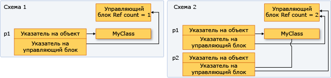

# <a name="how-to-create-and-use-shared_ptr-instances"></a>How to: Create and Use shared_ptr instances

Тип `shared_ptr` — это смарт-указатель в стандартной библиотеке C++, который предназначен для ситуаций, когда управлять временем существования объекта в памяти требуется нескольким владельцам. После инициализации указателя `shared_ptr` его можно копировать, передавать по значению в аргументах функций и присваивать другим экземплярам `shared_ptr`. Все экземпляры указывают на один и тот же объект и имеют общий доступ к одному "блоку управления", который увеличивает и уменьшает счетчик ссылок, когда указатель `shared_ptr` добавляется, выходит из области действия или сбрасывается. Когда счетчик ссылок достигает нуля, блок управления удаляет ресурс в памяти и самого себя.

На схеме ниже показано несколько экземпляров `shared_ptr`, указывающих на одно расположение в памяти.



## <a name="example-setup"></a>Пример конфигурации

Во всех примерах далее предполагается, что вы включили необходимые заголовки и объявили необходимые типы следующим образом:

```cpp
// shared_ptr-examples.cpp
// The following examples assume these declarations:
#include <algorithm>
#include <iostream>
#include <memory>
#include <string>
#include <vector>

struct MediaAsset
{
    virtual ~MediaAsset() = default; // make it polymorphic
};

struct Song : public MediaAsset
{
    std::wstring artist;
    std::wstring title;
    Song(const std::wstring& artist_, const std::wstring& title_) :
        artist{ artist_ }, title{ title_ } {}
};

struct Photo : public MediaAsset
{
    std::wstring date;
    std::wstring location;
    std::wstring subject;
    Photo(
        const std::wstring& date_,
        const std::wstring& location_,
        const std::wstring& subject_) :
        date{ date_ }, location{ location_ }, subject{ subject_ } {}
};

using namespace std;

int main()
{
    // The examples go here, in order:
    // Example 1
    // Example 2
    // Example 3
    // Example 4
    // Example 6
}
```

## <a name="example-1"></a>Пример 1

Когда ресурс в памяти создается впервые, по возможности используйте функцию [make_shared](../standard-library/memory-functions.md#make_shared) для создания указателя `shared_ptr`. Функция `make_shared` безопасна в отношении исключений. Для выделения памяти под блок управления и ресурс используется один вызов, что снижает накладные расходы. Если вы не используете функцию `make_shared`, то придется использовать явное выражение `new` для создания объекта, прежде чем передавать его в конструктор `shared_ptr`. В приведенном ниже примере представлены различные способы объявления и инициализации указателя `shared_ptr` вместе с новым объектом.

[!code-cpp[stl_smart_pointers#1](codesnippet/CPP/how-to-create-and-use-shared-ptr-instances_1.cpp)]

## <a name="example-2"></a>Пример 2

В приведенном ниже примере показано, как объявить и инициализировать экземпляры `shared_ptr`, которые будут совместно владеть объектом, память для которого уже выделена с помощью другого экземпляра `shared_ptr`. Предполагается, что `sp2` — это инициализированный указатель `shared_ptr`.

[!code-cpp[stl_smart_pointers#2](codesnippet/CPP/how-to-create-and-use-shared-ptr-instances_2.cpp)]

## <a name="example-3"></a>Пример 3

Указатели `shared_ptr` также полезны при использовании алгоритмов копирования элементов в контейнеры стандартной библиотеки C++. Элемент можно заключить в указатель `shared_ptr`, а затем копировать его в другие контейнеры, учитывая при этом, что выделенная область памяти доступна только до тех пор, пока она требуется. В приведенном ниже примере показано, как использовать алгоритм `remove_copy_if` применительно к экземплярам `shared_ptr` в векторе.

[!code-cpp[stl_smart_pointers#4](codesnippet/CPP/how-to-create-and-use-shared-ptr-instances_3.cpp)]

## <a name="example-4"></a>Пример 4

Для приведения указателя `shared_ptr` можно использовать функции `dynamic_pointer_cast`, `static_pointer_cast` и `const_pointer_cast`. Они похожи на операторы `dynamic_cast`, `static_cast` и `const_cast`. В приведенном ниже примере показано, как протестировать производный тип каждого элемента в векторе, содержащем указатель `shared_ptr` базовых классов, а затем скопировать элементы и отобразить сведения о них.

[!code-cpp[stl_smart_pointers#5](codesnippet/CPP/how-to-create-and-use-shared-ptr-instances_4.cpp)]

## <a name="example-5"></a>Пример 5

Указатель `shared_ptr` можно передать в другую функцию описанными ниже способами.

- Передача `shared_ptr` по значению. При этом вызывается конструктор копий, увеличивается счетчик ссылок, и вызываемый объект становится владельцем. С этой операцией связаны некоторые накладные расходы, которые зависят от количества передаваемых объектов `shared_ptr`. Используйте этот вариант, если в соответствии с неявным или явным контрактом кода между вызывающим и вызываемым объектами последний должен быть владельцем.

- Передача `shared_ptr` по ссылке или константной ссылке. В этом случае счетчик ссылок не увеличивается, а указатель доступен вызываемому объекту, пока вызывающий объект остается в области действия. Вызываемый объект может также создать указатель `shared_ptr` на основе ссылки и стать общим владельцем. Используйте этот вариант, когда вызываемый объект неизвестен вызывающему или когда необходимо передать указатель `shared_ptr`, избегая операции копирования из соображений производительности.

- Передача базового указателя или ссылки на базовый объект. Это позволяет вызываемому объекту использовать объект, но не становиться его общим владельцем и не продлять его время существования. Если вызываемая сторона создает указатель `shared_ptr` на основе необработанного указателя, новый указатель `shared_ptr` не зависит от исходного и не управляет базовым ресурсом. Используйте этот вариант, если в контракте между вызывающей и вызываемой сторонами явно указано, что вызывающая сторона сохраняет контроль над временем существования `shared_ptr`.

- При выборе способа передачи `shared_ptr`, установите, должна ли вызываемая сторона также быть владельцем базового ресурса. Владелец — это объект или функция, которые могут поддерживать существование базового ресурса до тех пор, пока он нужен. Если вызывающая сторона должна гарантировать, что вызываемая сторона может продлить существование указателя после того, как она перестанет существовать, используйте первый вариант. Если возможность продления времени существования вызываемой стороной не важна, передайте указатель по ссылке, чтобы вызываемая сторона скопировала его или не скопировала.

- Если нужно предоставить доступ к базовому указателю вспомогательной функции, которая использует его и возвращает управление до возврата управления вызывающей функцией, этой функции не требуется быть общим владельцем базового указателя. Ей просто необходим доступ к указателю в течение времени существования `shared_ptr` вызывающей стороны. В этом случае можно спокойно передать `shared_ptr` по ссылке либо передать необработанный указатель или ссылку на базовый объект. Это дает небольшой выигрыш в производительности и порой позволяет более ясно выразить назначение кода.

- Иногда, например в `std::vector<shared_ptr<T>>`, может быть необходимо передать каждый указатель `shared_ptr` в тело лямбда-выражения или в именованный объект функции. Если в лямбда-выражении или функции указатель не сохраняется, передайте `shared_ptr` по ссылке, чтобы не вызывать конструктор копий для каждого элемента.

## <a name="example-6"></a>Пример 6

В приведенном ниже примере показано, как `shared_ptr` перегружает различные операторы сравнения, чтобы обеспечить сравнение указателей в памяти, принадлежащей экземплярам `shared_ptr`.

[!code-cpp[stl_smart_pointers#3](codesnippet/CPP/how-to-create-and-use-shared-ptr-instances_6.cpp)]

## <a name="see-also"></a>См. также

[Интеллектуальные указатели (современный C++)](smart-pointers-modern-cpp.md)
