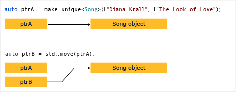

# Практическое руководство. Создание и использование экземпляров unique_ptr
Объект [unique_ptr](../standard-library/unique-ptr-class.md) общего доступа к указателю. Не может быть скопирован в другое `unique_ptr`, передаваемые по значению функции или использовать в любой алгоритм стандартной библиотеки C++, предполагающем создание копий будут сделаны. `unique_ptr` можно только переместить. Это означает, что владение ресурсов памяти переносится в другое `unique_ptr` и оригинал `unique_ptr` больше им не владеет. Рекомендуется ограничить объект одним владельцем, поскольку множественное владение усложняет логику программы. Таким образом, при необходимости интеллектуального указателя для простого объекта C++, используйте `unique_ptr`, и при построении `unique_ptr`, используйте [make_unique](../standard-library/memory-functions.md#make_unique) вспомогательную функцию.  
  
 Следующая схема иллюстрирует передачу прав собственности между двумя экземплярами `unique_ptr`.  
  
   
  
 `unique_ptr`определен в `<memory>` заголовка в стандартной библиотеке C++. Именно это эффективна, как и необработанный указатель и может использоваться в контейнеры стандартной библиотеки C++. Добавление `unique_ptr` экземпляров для контейнеров стандартной библиотеки C++ эффективна, так как конструктор перемещения `unique_ptr` избавляет от необходимости для операции копирования.  
  
## Пример  
 В следующем примере описывается порядок создания экземпляров `unique_ptr` и передачи их между функциями.  
  
 [!code-cpp[stl_smart_pointers#210](../cpp/codesnippet/CPP/how-to-create-and-use-unique-ptr-instances_1.cpp)]  
  
 В этих примерах демонстрируется эта базовая характеристика `unique_ptr`: ее можно изменить, но не для копирования. "Перемещение" перемещает владельца в новый `unique_ptr` и сбрасывает старый `unique_ptr`.  
  
## Пример  
 В следующем примере описывается порядок создания экземпляров `unique_ptr` и их использования в векторе.  
  
 [!code-cpp[stl_smart_pointers#211](../cpp/codesnippet/CPP/how-to-create-and-use-unique-ptr-instances_2.cpp)]  
  
 Обратите внимание, что в диапазоне для цикла `unique_ptr` передается по ссылке. При попытке передачи по значению компилятор выдаст ошибку, поскольку конструктор копирования `unique_ptr` удален.  
  
## Пример  
 В следующем примере показана инициализация `unique_ptr`, являющегося членом класса.  
  
 [!code-cpp[stl_smart_pointers#212](../cpp/codesnippet/CPP/how-to-create-and-use-unique-ptr-instances_3.cpp)]  
  
## Пример  
 Можно использовать [make_unique](../standard-library/memory-functions.md#make_unique) для создания `unique_ptr` в массив, но нельзя использовать `make_unique` для инициализации элементов массива.  
  
 [!code-cpp[stl_smart_pointers#213](../cpp/codesnippet/CPP/how-to-create-and-use-unique-ptr-instances_4.cpp)]  
  
 Дополнительные примеры см. в разделе [make_unique](../standard-library/memory-functions.md#make_unique).  
  
## См. также  
 [Интеллектуальные указатели](../cpp/smart-pointers-modern-cpp.md)   
 [make_unique](../standard-library/memory-functions.md#make_unique)