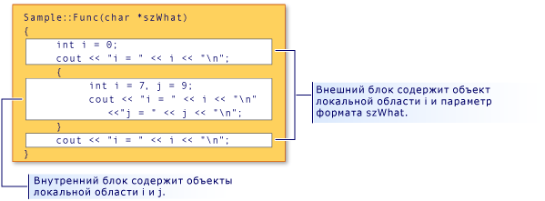

# <a name="scope-c"></a>Область (C++)

При объявлении программного элемента, например класс, функция или переменная, его имя можно только «увидела» и использовать в определенных частях программы. Контекст, в котором отображается имя вызывается его *область*. Например, если вы объявляете переменную `x` внутри функции, `x` отображается только в теле этой функции. Он имеет *локальной области*. Могут присутствовать другие факторы с тем же именем в приложении; пока они находятся в разных областях, они не нарушают правила одного определения, и не приводит к ошибке.

Для автоматических переменных нестатических область также определяет, когда они создаются и удаляются в памяти для программ.

Существует шесть типов области видимости.

- **Глобальная область** глобальное имя, которое объявляется за пределами любого класса, функции или пространства имен. Тем не менее в C++ даже эти имена существуют с неявное глобальное пространство имен. Область имен глобальных распространяется от точки объявления до конца файла, в котором они объявлены. Для имен глобальных видимость также подчиняется правилам [компоновка](program-and-linkage-cpp.md) которой определяется, виден ли имя в других файлах программы.

- **Область видимости пространства имен** имени, которое объявлено в [пространства имен](namespaces-cpp.md), за пределами любого определения класса или перечисления или блока функции видна с момента объявления до конца пространства имен. Пространства имен могут определяться в нескольких блоках в разных файлах.

- **Локальную область видимости** имя, объявленное в функции или лямбда-выражения, включая имена параметров имеют локальную область видимости. Часто они называются «локальные». Они видны только из соответствующей точки объявления до конца тела функции или лямбда-выражения. Локальная область представляет собой область видимости блока, который рассматривается далее в этой статье.

- **Область видимости класса** имена членов класса имеют область видимости класса, расширяющий в определении класса, независимо от точки объявления. Доступность члена класса дальнейшей управляется **открытый**, **частного**, и **защищенные** ключевые слова. Открытый или защищенный членов может осуществляться только с помощью операторов выбора члена (**.** или **->**) или операторов указателя на член (**.** <strong>\*</strong> или **->** <strong>\*</strong>).

- **Области оператора** имена, объявленные в **для**, **Если**, **хотя**, или **переключения** инструкции видны до конца блок операторов.

- **Область функций** объект [метка](labeled-statements.md) имеет область видимости функции, которая означает, что она распространяется на весь текст функции даже до момента объявления. Область действия функции делает возможным написание инструкций, такие как `goto cleanup` перед `cleanup` она объявлена.

## <a name="hiding-names"></a>Скрытие имен

Можно скрыть имя, объявив его в закрытом блоке. На следующем рисунке `i` повторно объявляется во внутреннем блоке, таким образом скрывая переменную, связанную с `i` во внешней области видимости блока.

 <br/>
Область видимости блока и скрытие имен

Выходные данные программы, представленной на рисунке, выглядят следующим образом.

```cpp
i = 0
i = 7
j = 9
i = 0
```

> [!NOTE]
> Считается, что аргумент `szWhat`, находится в области видимости функции. Поэтому он обрабатывается так, как если бы он был объявлен в крайнем блоке функции.

## <a name="hiding-class-names"></a>Скрытие имен классов

Имена классов можно скрыть, объявив функцию, объект, переменную или перечислитель в той же области. Однако имя класса можно по-прежнему можно получить при предшествует ключевое слово **класс**.

```cpp
// hiding_class_names.cpp
// compile with: /EHsc
#include <iostream>
using namespace std;

// Declare class Account at global scope.
class Account
{
public:
    Account( double InitialBalance )
        { balance = InitialBalance; }
    double GetBalance()
        { return balance; }
private:
    double balance;
};

double Account = 15.37;            // Hides class name Account

int main()
{
    class Account Checking( Account ); // Qualifies Account as
                                       //  class name

    cout << "Opening account with balance of: "
         << Checking.GetBalance() << "\n";
}
//Output: Opening account with balance of: 15.37
```

> [!NOTE]
> Любой поместите имя класса (`Account`) вызова, необходимо использовать ключевое слово class позволяет отличить ее от переменной Account, глобальной области. Это правило не применяется, если имя класса находится слева от оператора разрешения области действия (::). Имена слева от оператора разрешения области действия всегда считаются именами класса.

Следующий пример демонстрирует, как объявить указатель на объект типа `Account` с помощью **класс** ключевое слово:

```cpp
class Account *Checking = new class Account( Account );
```

`Account` В инициализаторе (в скобках) в предыдущей инструкции имеет глобальную область; он имеет тип **двойные**.

> [!NOTE]
> Повторное использование имен идентификаторов считается плохим стилем программирования, как показано в следующем примере.

Сведения об объявлении и инициализации объектов классов см. в разделе [классов, структур и объединений](../cpp/classes-and-structs-cpp.md). Дополнительные сведения об использовании **новый** и **удалить** операторов свободного хранилища, см. в разделе [новых и удаленных операторах](new-and-delete-operators.md).

## <a name="hiding-names-with-global-scope"></a>Скрытие имен в глобальной области видимости

Имена с глобальной областью действия можно скрыть, явно объявив тем же именем в области видимости блока. Тем не менее, глобальной области имен может осуществляться с помощью оператора разрешения области действия (`::`).

```cpp
#include <iostream>

int i = 7;   // i has global scope, outside all blocks
using namespace std;

int main( int argc, char *argv[] ) {
   int i = 5;   // i has block scope, hides i at global scope
   cout << "Block-scoped i has the value: " << i << "\n";
   cout << "Global-scoped i has the value: " << ::i << "\n";
}
```

```Output
Block-scoped i has the value: 5
Global-scoped i has the value: 7
```

## <a name="see-also"></a>См. также

[Основные понятия](../cpp/basic-concepts-cpp.md)
