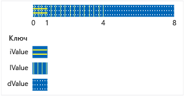

# <a name="unions"></a>Объединения
Объект **объединение** — это определяемый пользователем тип, в которой все члены имеют тот же адрес памяти. Это означает, что в любой момент времени объединение не может содержать больше одного объекта из списка своих членов. Независимо от количества членов объединения, оно использует лишь количество памяти, необходимое для хранения своего крупнейшего члена.  
  
 Объединения могут быть полезны для экономии памяти при наличии множества объектов и/или ограниченном количестве памяти. Однако для их правильного использования требуется повышенное внимание, поскольку нужно всегда сохранять уверенность, что используется последний записанный член. Если для каких-либо типов членов имеются нетривиальные конструкторы, необходимо написать дополнительный код, чтобы явным образом создавать и уничтожать таких членов. Перед использованием объединения следует рассмотреть возможность решения проблемы с помощью базового и производных классов.  
  
## <a name="syntax"></a>Синтаксис  
  
```cpp  
union [name]  { member-list };  
```  
  
### <a name="parameters"></a>Параметры  
 *name*  
 Имя типа, присваиваемое объединению.  
  
 *Список членов*  
 Члены, которые могут входить в объединение. См. заметки.  
  
## <a name="remarks"></a>Примечания  
  
## <a name="declaring-a-union"></a>Объявление объединения  
 Объявление объединения с начинается **объединение** ключевое слово и заключите его в список элементов в фигурные скобки:  
  
```cpp  
// declaring_a_union.cpp  
union RecordType    // Declare a simple union type  
{  
    char   ch;  
    int    i;  
    long   l;  
    float  f;  
    double d;  
    int *int_ptr;  
};   
int main()  
{  
    RecordType t;  
    t.i = 5; // t holds an int  
    t.f = 7.25 // t now holds a float   
}  
```  
  
## <a name="using-unions"></a>Использование объединений  
 В предыдущем примере для любого кода, который обращается к объединению, должно быть известно, в каком члене хранятся данные. Наиболее распространенное решение этой проблемы — заключить объединение в структуру вместе с дополнительным элементом перечисления, указывающим на тип данных, которые хранятся в объединении на текущий момент. Это называется *размеченные объединения* и в следующем примере показан базовый шаблон.  
  
```cpp  
#include "stdafx.h"  
#include <queue>  
  
using namespace std;  
  
enum class WeatherDataType  
{  
    Temperature, Wind  
};  
  
struct TempData  
{  
    int StationId;  
    time_t time;  
    double current;  
    double max;  
    double min;  
};  
  
struct WindData  
{  
    int StationId;  
    time_t time;  
    int speed;  
    short direction;  
};  
  
struct Input  
{  
    WeatherDataType type;  
    union  
    {  
        TempData temp;  
        WindData wind;  
    };  
};  
  
// Functions that are specific to data types  
void Process_Temp(TempData t) {}  
void Process_Wind(WindData w) {}  
  
// Container for all the data records  
queue<Input> inputs;  
void Initialize();  
  
int main(int argc, char* argv[])  
{  
    Initialize();  
    while (!inputs.empty())  
    {  
        Input i = inputs.front();  
        switch (i.type)  
        {  
        case WeatherDataType::Temperature:  
            Process_Temp(i.temp);  
            break;  
        case WeatherDataType::Wind:  
            Process_Wind(i.wind);  
            break;  
        default:  
            break;  
        }  
        inputs.pop();  
  
    }  
    return 0;  
}  
  
void Initialize()  
{  
    Input first, second;  
    first.type = WeatherDataType::Temperature;  
    first.temp = { 101, 1418855664, 91.8, 108.5, 67.2 };  
    inputs.push(first);  
  
    second.type = WeatherDataType::Wind;  
    second.wind = { 204,1418859354, 14, 27 };  
    inputs.push(second);  
}  
```  
  
 Обратите внимание, что в предыдущем примере объединение во входной структуре не имеет имени. Это анонимное объединение — его члены можно использовать, как будто они являются непосредственными членами структуры. Дополнительные сведения об анонимных объединениях см. ниже.  
  
 В предыдущем примере демонстрируется проблема, которую можно было бы решить, используя базовый класс и его производные классы, и выполнив ветвление кода на основе типа среды выполнения каждого объекта, входящего в контейнер. В результате может получиться более простой код, однако работающий медленнее, чем при использовании объединений. Кроме того, с помощью объединений вы можете хранить абсолютно несвязанные типы, динамически изменяя типы хранящихся значений без изменения типа самой переменной объединения. Таким образом, можно создать разнородный массив MyUnionType, в элементах которого будут храниться разные значения разных типов.  
  
 Обратите внимание, что в предыдущем примере можно легко ошибиться при использовании структуры `Input`. Задача пользователя — правильно использовать дискриминатор для доступа к члену, содержащему данные. Вы можете подстраховаться, сделав объединение закрытым и задействовав специальные функции доступа, как показано в следующем примере.  
  
## <a name="unrestricted-unions-c11"></a>Неограниченные объединения (C++11)  
 В C++03 и более ранних версиях нестатические элементы данных с типом класса могут входить в объединения, лишь если для типов отсутствуют пользовательские конструкторы, деструкторы или операторы присваивания. В C++11 эти ограничения отсутствуют. Если включить такой член в объединение, компилятор автоматически пометит все специальные функции-члены, не предоставленные пользователем, как удаленные. Если в класс или структуру входит анонимное объединение, все специальные функции-члены этого класса или структуры, не предоставленные пользователем, помечаются как удаленные. В следующем примере демонстрируется ситуация, когда один из членов объединения содержит член, требующий специальной обработки:  
  
```cpp  
// for MyVariant  
#include <crtdbg.h>  
#include <new>  
#include <utility>  
  
// for sample objects and output  
#include <string>  
#include <vector>  
#include <iostream>  
  
using namespace std;  
  
struct A   
{  
    A() = default;  
    A(int i, const string& str) : num(i), name(str) {}  
  
    int num;  
    string name;  
    //...  
};  
  
struct B   
{  
    B() = default;  
    B(int i, const string& str) : num(i), name(str) {}  
  
    int num;  
    string name;  
    vector<int> vec;  
    // ...  
};  
  
enum class Kind { None, A, B, Integer };  
  
#pragma warning (push)  
#pragma warning(disable:4624)  
class MyVariant  
{  
public:  
    MyVariant()  
        : kind_(Kind::None)  
    {  
    }  
  
    MyVariant(Kind kind)  
        : kind_(kind)  
    {  
        switch (kind_)  
        {  
        case Kind::None:  
            break;  
        case Kind::A:  
            new (&a_) A();  
            break;  
        case Kind::B:  
            new (&b_) B();  
            break;  
        case Kind::Integer:  
            i_ = 0;  
            break;  
        default:  
            _ASSERT(false);  
            break;  
        }  
    }  
  
    ~MyVariant()  
    {  
        switch (kind_)  
        {  
        case Kind::None:  
            break;  
        case Kind::A:  
            a_.~A();  
            break;  
        case Kind::B:  
            b_.~B();  
            break;  
        case Kind::Integer:  
            break;  
        default:  
            _ASSERT(false);  
            break;  
        }  
        kind_ = Kind::None;  
    }  
  
    MyVariant(const MyVariant& other)  
        : kind_(other.kind_)  
    {  
        switch (kind_)  
        {  
        case Kind::None:  
            break;  
        case Kind::A:  
            new (&a_) A(other.a_);  
            break;  
        case Kind::B:  
            new (&b_) B(other.b_);  
            break;  
        case Kind::Integer:  
            i_ = other.i_;  
            break;  
        default:  
            _ASSERT(false);  
            break;  
        }  
    }  
  
    MyVariant(MyVariant&& other)  
        : kind_(other.kind_)  
    {  
        switch (kind_)  
        {  
        case Kind::None:  
            break;  
        case Kind::A:  
            new (&a_) A(move(other.a_));  
            break;  
        case Kind::B:  
            new (&b_) B(move(other.b_));  
            break;  
        case Kind::Integer:  
            i_ = other.i_;  
            break;  
        default:  
            _ASSERT(false);  
            break;  
        }  
        other.kind_ = Kind::None;  
    }  
  
    MyVariant& operator=(const MyVariant& other)  
    {  
        if (&other != this)  
        {  
            switch (other.kind_)  
            {  
            case Kind::None:  
                this->~MyVariant();  
                break;  
            case Kind::A:  
                *this = other.a_;  
                break;  
            case Kind::B:  
                *this = other.b_;  
                break;  
            case Kind::Integer:  
                *this = other.i_;  
                break;  
            default:  
                _ASSERT(false);  
                break;  
            }  
        }  
        return *this;  
    }  
  
    MyVariant& operator=(MyVariant&& other)  
    {  
        _ASSERT(this != &other);  
        switch (other.kind_)  
        {  
        case Kind::None:  
            this->~MyVariant();  
            break;  
        case Kind::A:  
            *this = move(other.a_);  
            break;  
        case Kind::B:  
            *this = move(other.b_);  
            break;  
        case Kind::Integer:  
            *this = other.i_;  
            break;  
        default:  
            _ASSERT(false);  
            break;  
        }  
        other.kind_ = Kind::None;  
        return *this;  
    }  
  
    MyVariant(const A& a)  
        : kind_(Kind::A), a_(a)  
    {  
    }  
  
    MyVariant(A&& a)  
        : kind_(Kind::A), a_(move(a))  
    {  
    }  
  
    MyVariant& operator=(const A& a)  
    {  
        if (kind_ != Kind::A)  
        {  
            this->~MyVariant();  
            new (this) MyVariant(a);  
        }  
        else  
        {  
            a_ = a;  
        }  
        return *this;  
    }  
  
    MyVariant& operator=(A&& a)  
    {  
        if (kind_ != Kind::A)  
        {  
            this->~MyVariant();  
            new (this) MyVariant(move(a));  
        }  
        else  
        {  
            a_ = move(a);  
        }  
        return *this;  
    }  
  
    MyVariant(const B& b)  
        : kind_(Kind::B), b_(b)  
    {  
    }  
  
    MyVariant(B&& b)  
        : kind_(Kind::B), b_(move(b))  
    {  
    }  
  
    MyVariant& operator=(const B& b)  
    {  
        if (kind_ != Kind::B)  
        {  
            this->~MyVariant();  
            new (this) MyVariant(b);  
        }  
        else  
        {  
            b_ = b;  
        }  
        return *this;  
    }  
  
    MyVariant& operator=(B&& b)  
    {  
        if (kind_ != Kind::B)  
        {  
            this->~MyVariant();  
            new (this) MyVariant(move(b));  
        }  
        else  
        {  
            b_ = move(b);  
        }  
        return *this;  
    }  
  
    MyVariant(int i)  
        : kind_(Kind::Integer), i_(i)  
    {  
    }  
  
    MyVariant& operator=(int i)  
    {  
        if (kind_ != Kind::Integer)  
        {  
            this->~MyVariant();  
            new (this) MyVariant(i);  
        }  
        else  
        {  
            i_ = i;  
        }  
        return *this;  
    }  
  
    Kind GetKind() const  
    {  
        return kind_;  
    }  
  
    A& GetA()  
    {  
        _ASSERT(kind_ == Kind::A);  
        return a_;  
    }  
  
    const A& GetA() const  
    {  
        _ASSERT(kind_ == Kind::A);  
        return a_;  
    }  
  
    B& GetB()  
    {  
        _ASSERT(kind_ == Kind::B);  
        return b_;  
    }  
  
    const B& GetB() const  
    {  
        _ASSERT(kind_ == Kind::B);  
        return b_;  
    }  
  
    int& GetInteger()  
    {  
        _ASSERT(kind_ == Kind::Integer);  
        return i_;  
    }  
  
    const int& GetInteger() const  
    {  
        _ASSERT(kind_ == Kind::Integer);  
        return i_;  
    }  
  
private:  
    Kind kind_;  
    union  
    {  
        A a_;  
        B b_;  
        int i_;  
    };  
};  
#pragma warning (pop)  
  
int main()  
{  
    A a(1, "Hello from A");  
    B b(2, "Hello from B");  
  
    MyVariant mv_1 = a;  
  
    cout << "mv_1 = a: " << mv_1.GetA().name << endl;  
    mv_1 = b;  
    cout << "mv_1 = b: " << mv_1.GetB().name << endl;  
    mv_1 = A(3, "hello again from A");  
    cout << R"aaa(mv_1 = A(3, "hello again from A"): )aaa" << mv_1.GetA().name << endl;  
    mv_1 = 42;  
    cout << "mv_1 = 42: " << mv_1.GetInteger() << endl;  
  
    b.vec = { 10,20,30,40,50 };  
  
    mv_1 = move(b);  
    cout << "After move, mv_1 = b: vec.size = " << mv_1.GetB().vec.size() << endl;  
  
    cout << endl << "Press a letter" << endl;  
    char c;  
    cin >> c;  
}  
#include <queue>  
#include <iostream>  
using namespace std;  
  
enum class WeatherDataType  
{  
    Temperature, Wind  
};  
  
struct TempData  
{  
    TempData() : StationId(""), time(0), current(0), maxTemp(0), minTemp(0) {}  
    TempData(string id, time_t t, double cur, double max, double min)  
        : StationId(id), time(t), current(cur), maxTemp(max), minTemp(0) {}  
    string StationId;  
    time_t time = 0;  
    double current;  
    double maxTemp;  
    double minTemp;  
};  
  
struct WindData  
{  
    int StationId;  
    time_t time;  
    int speed;  
    short direction;  
};  
  
struct Input  
{  
    Input() {}  
    Input(const Input&) {}  
  
    ~Input()  
    {  
        if (type == WeatherDataType::Temperature)  
        {  
            temp.StationId.~string();  
        }  
    }  
  
    WeatherDataType type;  
    void SetTemp(const TempData& td)  
    {  
        type = WeatherDataType::Temperature;  
  
        // must use placement new because of string member!  
        new(&temp) TempData(td);  
    }  
  
    TempData GetTemp()  
    {  
        if (type == WeatherDataType::Temperature)  
            return temp;  
        else  
            throw logic_error("Can't return TempData when Input holds a WindData");  
    }  
    void SetWind(WindData wd)  
    {  
        // Explicitly delete struct member that has a   
        // non-trivial constructor  
        if (type == WeatherDataType::Temperature)  
        {  
            temp.StationId.~string();  
        }  
        wind = wd; //placement new not required.  
    }  
    WindData GetWind()  
    {  
        if (type == WeatherDataType::Wind)  
        {  
            return wind;  
        }  
        else  
            throw logic_error("Can't return WindData when Input holds a TempData");  
    }  
  
private:  
  
    union  
    {  
        TempData temp;  
        WindData wind;  
    };  
};  
```  
  
 В объединениях не могут храниться ссылки. Объединения не поддерживают наследование, поэтому они не могут использоваться в качестве базовых классов, наследовать от других классов или иметь виртуальные функции.  
  
## <a name="initializing-unions"></a>Инициализация объединений  
 Объединение можно объявить и инициализировать в одной и той же инструкции. Для этого необходимо присвоить ему выражение, заключенное в фигурные скобки. Выражение вычисляется и присваивается первому полю в объединении.  
  
```cpp  
#include <iostream>  
using namespace std;  
  
union NumericType  
{  
    short       iValue;  
    long        lValue;    
    double      dValue;    
};  
  
int main()  
{  
    union NumericType Values = { 10 };   // iValue = 10  
    cout << Values.iValue << endl;  
    Values.dValue = 3.1416;  
    cout << Values.dValue) << endl;  
}  
/* Output:  
 10  
 3.141600  
*/  
```  
  
 На следующем рисунке показана общая съема размещения объединения `NumericType` в памяти.  
  
   
Хранение данных в объединении NumericType  
  
## <a name="anonymous_unions"></a> Анонимные объединения  
 Анонимные объединения — это объединения, объявляемые без *имя_класса* или *список деклараторов*.  
  
```cpp  
union  {  member-list  }    
```  
  
Имена, объявленные в анонимном объединении, используются непосредственно подобно переменным, не являющимся членами. Таким образом, имена, объявленные в анонимных объединениях, должны быть уникальны для окружающей области видимости.  
  
Помимо ограничений для именованных объединений анонимные объединения могут иметь следующими дополнительными ограничениями:  
  
-   Они также должны быть объявлены как **статический** при объявлении в области видимости файла или пространства имен.  
  
-   Они могут иметь только **открытый** членов. **частного** и **защищенные** члены в анонимных объединениях выдают сообщения об ошибках.  
  
-   Они не могут иметь функций-членов.  
  
## <a name="see-also"></a>См. также  
 [Классы и структуры](../cpp/classes-and-structs-cpp.md)   
 [Ключевые слова](../cpp/keywords-cpp.md)   
 [class](../cpp/class-cpp.md)   
 [struct](../cpp/struct-cpp.md)