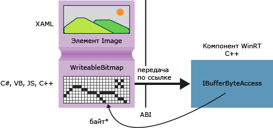

# <a name="obtaining-pointers-to-data-buffers-ccx"></a>Получение указателей на буферы данных (C++/CX)

В среде выполнения Windows интерфейс [Windows::Storage::Streams::IBuffer](/uwp/api/windows.storage.streams.ibuffer) предоставляет не зависящий от языка и основанный на потоках механизм доступа к буферам данных. В C++ можно получить необработанный указатель на базовый массив байтов с помощью интерфейса IBufferByteAccess библиотеки среды выполнения Windows, определенный в файле robuffer.h. Благодаря такому подходу можно изменить массив байтов на месте без создания лишний копий данных.

На следующей схеме показан элемент изображения XAML, источником которого является [Windows::UI::Xaml::Media::Imaging WriteableBitmap](/uwp/api/windows.ui.xaml.media.imaging.writeablebitmap). Клиентские приложения, написанные на любом языке, могут передавать ссылку на `WriteableBitmap` в код C++, а затем код C++ может использовать эту ссылку для обращения к соответствующему буферу. В универсальная платформа Windows приложении, написанном на C++, функцию можно использовать в следующем примере непосредственно в исходном коде, не упаковывая ее в компонент среда выполнения Windows.



## <a name="getpointertopixeldata"></a>GetPointerToPixelData

Следующий метод принимает [Windows::Storage::Streams::IBuffer](/uwp/api/windows.storage.streams.ibuffer) и возвращает необработанный указатель на соответствующий массив байтов. Чтобы вызвать функцию, передайте свойство [WriteableBitmap::PixelBuffer](/uwp/api/windows.ui.xaml.media.imaging.writeablebitmap.pixelbuffer) .

```cpp
#include <wrl.h>
#include <robuffer.h>
using namespace Windows::Storage::Streams;
using namespace Microsoft::WRL;
typedef uint8 byte;
// Retrieves the raw pixel data from the provided IBuffer object.
// Warning: The lifetime of the returned buffer is controlled by
// the lifetime of the buffer object that's passed to this method.
// When the buffer has been released, the pointer becomes invalid
// and must not be used.
byte* Class1::GetPointerToPixelData(IBuffer^ pixelBuffer, unsigned int *length)
{
    if (length != nullptr)
    {
        *length = pixelBuffer ->Length;
    }
    // Query the IBufferByteAccess interface.
    ComPtr<IBufferByteAccess> bufferByteAccess;
    reinterpret_cast<IInspectable*>( pixelBuffer)->QueryInterface(IID_PPV_ARGS(&bufferByteAccess));

    // Retrieve the buffer data.
    byte* pixels = nullptr;
    bufferByteAccess->Buffer(&pixels);
    return pixels;
}
```

## <a name="complete-example"></a>Пример целиком

Ниже показано, как создать приложение универсальная платформа Windows C#, которое передает в `WriteableBitmap` библиотеку DLL компонента C++ среда выполнения Windows. Код C++ получает указатель на буфер пикселя, выполняющий простое изменение изображения на месте. В качестве альтернативы можно создать клиентское приложение на языке Visual Basic, JavaScript или C++, а не на C#. При использовании C++ нет необходимости в компоненте DLL; можно просто добавить эти методы непосредственно в класс MainPage или в какие-либо другие классы.

#### <a name="create-the-client"></a>Создание клиента

1. Используйте шаблон пустого проекта приложения для создания приложения универсальная платформа Windows C#.

1. В файле MainPage.xaml

   - Используйте это XAML-файл, чтобы заменить элемент `Grid` :

        ```xml
        <Grid Background="{StaticResource ApplicationPageBackgroundThemeBrush}">
            <StackPanel HorizontalAlignment="Left" Margin="176,110,0,0" VerticalAlignment="Top" Width="932">
                <Image x:Name="Pic"/>
                <Button Content="Process Image" HorizontalAlignment="Stretch" VerticalAlignment="Stretch" Height="47" Click="Button_Click_1"/>
            </StackPanel>
        </Grid>
        ```

1. В файле MainPage.xaml.cs

   1. Добавьте следующие объявления пространств имен:

        ```csharp
        using Windows.Storage;
        using Windows.Storage.FileProperties;
        using Windows.UI.Xaml.Media.Imaging;
        using Windows.Storage.Streams;
        using Windows.Storage.Pickers;
        ```

   1. Добавьте переменную-член `WriteableBitmap` в класс `MainPage` и присвойте ей имя `m_bm`.

        ```csharp
        private WriteableBitmap m_bm;
        ```

   1. С помощью следующего кода замените заглушку метода `OnNavigatedTo` . В результате при запуске приложения будет открываться средство выбора файлов. (Обратите внимание, что в сигнатуру функции добавляется ключевое слово `async` ).

        ```csharp
        async protected override void OnNavigatedTo(NavigationEventArgs e)
        {
            FileOpenPicker openPicker = new FileOpenPicker();
            openPicker.ViewMode = PickerViewMode.Thumbnail;
            openPicker.SuggestedStartLocation = PickerLocationId.PicturesLibrary;
            openPicker.FileTypeFilter.Add(".jpg");
            openPicker.FileTypeFilter.Add(".jpeg");
            openPicker.FileTypeFilter.Add(".png");

            StorageFile file = await openPicker.PickSingleFileAsync();
            if (file != null)
            {
                // Get the size of the image for the WriteableBitmap constructor.
                ImageProperties props = await file.Properties.GetImagePropertiesAsync();
                m_bm = new WriteableBitmap((int)props.Height, (int)props.Width);
                m_bm.SetSource(await file.OpenReadAsync());
                Pic.Source = m_bm;
            }
            else
            {
                //  Handle error...
            }
        }
        ```

   1. Добавьте обработчик событий для нажатия кнопки. (Так как ссылка на пространство имен `ImageManipCPP` еще не создана, он может быть подчеркнут волнистой линией в окне редактора).

        ```csharp
        async private void Button_Click_1(object sender, RoutedEventArgs e)
        {
            ImageManipCPP.Class1 obj = new ImageManipCPP.Class1();
            await obj.Negativize(m_bm);
            Pic.Source = m_bm;
        }
        ```

#### <a name="create-the-c-component"></a>Создание компонента C++

1. Добавьте новый компонент C++ среда выполнения Windows в существующее решение и присвойте ему имя `ImageManipCPP` . Добавьте ссылку на него в проект C#, щелкнув этот проект правой кнопкой мыши в **Обозревателе решений** и выбрав **Добавить**, **Ссылка**.

1. В файле Class1.h

   1. Добавьте его **`typedef`** во вторую строку сразу после `#pragma once` :

        ```cpp
        typedef uint8 byte;
        ```

   1. Добавьте атрибут `WebHostHidden` перед началом объявления `Class1` .

        ```cpp
        [Windows::Foundation::Metadata::WebHostHidden]
        ```

   1. Добавьте следующую сигнатуру открытого метода в `Class1`:

        ```cpp
        Windows::Foundation::IAsyncAction^ Negativize(Windows::UI::Xaml::Media::Imaging::WriteableBitmap^ bm);
        ```

   1. Добавьте сигнатуру из метода `GetPointerToPixelData` , показанного в предыдущем фрагменте кода. Убедитесь, что этот метод является закрытым.

1. В файле Class1.cpp

   1. Добавьте следующие директивы `#include` и объявления пространств имен:

        ```cpp
        #include <ppltasks.h>
        #include <wrl.h>
        #include <robuffer.h>

        using namespace Windows::Storage;
        using namespace Windows::UI::Xaml::Media::Imaging;
        using namespace Windows::Storage::Streams;
        using namespace Microsoft::WRL;
        ```

   1. Добавьте реализацию `GetPointerToPixelData` из расположенного выше фрагмента кода.

   1. Добавьте реализацию `Negativize`. Этот метод создает эффект, похожий на фотонегатив, инвертируя каждое RGB-значение пикселя. Этот метод сделан асинхронным, поскольку на больших изображениях его выполнение может занять много времени.

        ```cpp
        IAsyncAction^ Class1::Negativize(WriteableBitmap^ bm)
        {
            unsigned int length;
            byte* sourcePixels = GetPointerToPixelData(bm->PixelBuffer, &length);
            const unsigned int width = bm->PixelWidth;
            const unsigned int height = bm->PixelHeight;

            return create_async([this, width, height, sourcePixels]
            {
                byte* temp = sourcePixels;
                for(unsigned int k = 0; k < height; k++)
                {
                    for (unsigned int i = 0; i < (width * 4); i += 4)
                    {
                        int pos = k * (width * 4) + (i);
                        temp[pos] = ~temp[pos];
                        temp[pos + 1] = ~temp[pos + 1] / 3;
                        temp[pos + 2] = ~temp[pos + 2] / 2;
                        temp[pos + 3] = ~temp[pos + 3];
                    }
                }
            });

        }
        ```

      > [!NOTE]
      > Этот метод может выполняться быстрее, если для параллелизации операции используется AMP или библиотека параллельных шаблонов.

1. Убедитесь, что в папке рисунков есть по крайней мере одно изображение, а затем нажмите клавишу F5, чтобы компилировать и выполнить программу.
