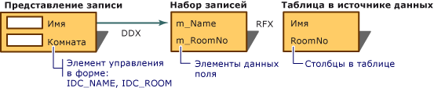

# Обмен данными в представлениях записей (доступ к данным MFC)
[!INCLUDE[vs2017banner](../assembler/inline/includes/vs2017banner.md)]

При использовании [добавление класса](../mfc/reference/adding-an-mfc-odbc-consumer.md) для сопоставления элементов управления в ресурсе шаблона диалоговых окон для просмотра записи полям набора записей, среда управляет обменом данных в обоих направлениях — из набора записей в элементы управления и из элементов управления в набор записей.  Использование механизма DDX означает, что нет необходимости писать код передачи данных туда и обратно самостоятельно.  
  
 DDX для представлений записей работает вместе с:  
  
-   [RFX](../data/odbc/record-field-exchange-rfx.md) для набора записей класса `CRecordset` \(ODBC\).  
  
-   DFX для набора записей класса `CDaoRecordset` \(DAO\).  
  
 Несмотря на то, что они отличаются в реализации, на уровне интерфейса RFX и DFX являются очень похожими механизмами обмена данными.  Версия DAO, DFX, очень похожа на более раннюю версию ODBC, RFX.  Если вы знаете, как использовать RFX, вы знаете, как работать с DFX.  
  
 RFX и DFX переносят данные между текущей записью в источнике данных и элементами данных полей объекта набора записей.  DDX перемещает данные из элементов данных полей в элементы управления в форме.  Данная комбинация заполняет элементы управления формы в начале и по мере того как пользователь перемещается от записи к записи.  Также может перемещать обновленные данные обратно в набор записей, а затем в источник данных.  
  
 На следующем рисунке показана связь между DDX и RFX \(или DFX\) для представлений записей.  
  
   
Обмен данными в диалоговом окне и обмен полями записи  
  
 Дополнительные сведения об DDX см [обмен данными окон и проверка](../mfc/dialog-data-exchange-and-validation.md).  Дополнительные сведения об RFX см [обмен полями записей \(RFX\)](../data/odbc/record-field-exchange-rfx.md).  
  
## См. также  
 [Представления записей \(доступ к данным MFC\)](../data/record-views-mfc-data-access.md)   
 [Список драйверов ODBC](../data/odbc/odbc-driver-list.md)