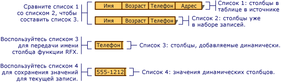

# <a name="recordset-dynamically-binding-data-columns-odbc"></a>Набор записей. Динамическая привязка столбцов данных (ODBC)

Этот раздел относится к классам ODBC библиотеки MFC.

Наборы записей управляют привязкой столбцов таблицы, заданной во время разработки. Однако иногда может требоваться привязать столбцы, которые не были известны во время разработки. В этом разделе рассматриваются следующие вопросы.

- [Ситуации, в которых может требоваться динамически привязывать столбцы к набору записей](#_core_when_you_might_bind_columns_dynamically)

- [Динамическая привязка столбцов во время выполнения](#_core_how_to_bind_columns_dynamically)

> [!NOTE]
> Этот раздел относится к объектам, производным от `CRecordset`, в которых пакетное получение строк не реализовано. Если вы используете пакетное получение строк, применять описанные в ней методы, как правило, не рекомендуется. Для получения дополнительной информации о массовом строке извлечения, см [Recordset: Извлечение записей в массовых (ODBC)](../../data/odbc/recordset-fetching-records-in-bulk-odbc.md).

## <a name="when-you-might-bind-columns-dynamically"></a><a name="_core_when_you_might_bind_columns_dynamically"></a> Ситуации, в которых применяется динамическая привязка столбцов

> [!NOTE]
> Мастер потребителя MFC ODBC недоступен в Visual Studio 2019 и более поздних версиях. При этом вы по-прежнему можете создать потребитель вручную.

Во время разработки мастер приложения MFC или [мастер объекта-получателя ODBC MFC](../../mfc/reference/adding-an-mfc-odbc-consumer.md) (доступен в диалоговом окне **Добавление класса**) создает классы наборов записей на основе известных таблиц и столбцов в источнике данных. Со времени разработки баз данных до момента их использования во время выполнения приложения их таблицы и столбцы могут меняться. Кто-либо из пользователей может добавить или удалить таблицу либо столбцы в таблице, с которой связан набор записей приложения. Такое случается не со всеми приложениями, обращающимися к данным, но если все же эта проблема возникла, то как решить ее, не прибегая к реструктуризации и повторной компиляции? Цель этой статьи — дать ответ на этот вопрос.

В этой статье описывается наиболее распространенный сценарий, в котором требуется использовать динамическую привязку столбцов: вы начинаете с набора записей на основе известной схемы базы данных, но во время выполнения появляются дополнительные столбцы. В статье предполагается, что дополнительные столбцы сопоставлены с элементами данных в полях типа `CString` (наиболее распространенный случай), однако приводятся рекомендации в отношении и других типов данных.

Добавив немного кода, вы можете:

- [определять доступные столбцы во время выполнения](#_core_how_to_bind_columns_dynamically);

- [динамически привязывать дополнительные столбцы к набору записей во время выполнения](#_core_adding_the_columns).

Ваш набор записей по-прежнему содержит элементы данных для столбцов, которые были известны во время разработки. Он также содержит небольшой объем дополнительного кода, который динамически определяет, были ли добавлены новые столбцы в целевую таблицу, и, если да, привязывает эти новые столбцы к динамически выделяемому хранилищу (а не к элементам данных в наборе записей).

Другие сценарии динамической привязки, такие как удаление таблиц или столбцов, в этой статье не рассматриваются. В таких случаях необходимо использовать вызовы API ODBC более непосредственным образом. Дополнительные сведения см. в *справочнике программиста* по пакету SDK ODBC на компакт-диске с библиотекой MSDN.

## <a name="how-to-bind-columns-dynamically"></a><a name="_core_how_to_bind_columns_dynamically"></a> Динамическая привязка столбцов

Для динамической привязки столбцов необходимо знать (или иметь возможность определить) имена дополнительных столбцов. Кроме того, необходимо выделить хранилище для дополнительных элементов данных полей, задать их имена и типы, а также указать количество добавляемых столбцов.

Далее будут упоминаться два разных набора записей. Первый — это главный набор записей, который выбирает записи из целевой таблицы. Второй — это специальный набор записей столбцов, который служит для получения сведений о столбцах в целевой таблице.

### <a name="general-process"></a><a name="_core_the_general_process"></a> Общий процесс

В самом общем виде процедура выглядит так.

1. Вы создаете объект главного набора записей.

   При необходимости можно передать указатель на открытый объект `CDatabase` или предоставить сведения о подключении в наборе записей столбцов каким-либо иным образом.

1. Столбцы добавляются динамически.

   См. раздел "Добавление столбцов" ниже.

1. Вы открываете главный набор записей.

   Набор записей выбирает записи и использует механизм обмена полями записей (RFX) для привязки как статических столбцов (сопоставленных с элементами данных полей в наборе записей), так и динамических столбцов (сопоставленных с дополнительным выделенным хранилищем).

### <a name="adding-the-columns"></a><a name="_core_adding_the_columns"></a> Добавление столбцов

Для динамической привязки добавленных столбцов во время выполнения необходимо выполнить указанные ниже действия.

1. Определите столбцы, имеющиеся в целевой таблице, во время выполнения. Извлеките из этих сведений список столбцов, которые были добавлены в таблицу с того момента, как был создан класс набора записей.

   Рекомендуется использовать класс набора записей столбцов, который запрашивает сведения о столбцах в целевой таблице (например, их имена и типы данных) из источника данных.

1. Предоставьте хранилище для новых элементов данных полей. Так как в классе главного набора записей нет элементов данных полей для неизвестных столбцов, необходимо предоставить место для хранения имен, итоговых значений и, возможно, сведений о типах данных (если столбцы имеют разные типы данных).

   Один из способов — создать один или несколько динамических списков: один для имен новых столбцов, другой для итоговых значений, а третий для типов данных (если необходимо). Эти списки, особенно список значений, предоставляют сведения и место для хранения, которые требуются для привязки. Построение списков показано на рисунке ниже.

   <br/>
   Построение списков столбцов для динамической привязки

1. Для каждого добавленного столбца добавьте вызов функции RFX в функции `DoFieldExchange` главного набора записей. Эти вызовы RFX выполняют всю работу по получению записи, включая дополнительные столбцы, и привязке столбцов к элементам данных набора записей или динамически выделяемому хранилищу.

   Один из подходов — добавить в функцию `DoFieldExchange` главного набора записей цикл, который перебирает новые столбцы и вызывает для каждого из них соответствующую функцию RFX. При каждом вызове RFX необходимо передавать имя столбца из списка имен столбцов и место хранения в соответствующем элементе списка итоговых значений.

### <a name="lists-of-columns"></a><a name="_core_lists_of_columns"></a> Списки столбцов

В таблице ниже представлены четыре списка, которые вам потребуются.

|||
|-|-|
|**Текущие столбцы таблицы**| (Список 1 на рисунке.) Список столбцов, которые имеются в настоящее время в таблице в источнике данных. Может совпадать со списком текущих привязанных столбцов в наборе записей.|
|**Привязанные столбцы набора записей**| (Список 2 на рисунке.) Список привязанных столбцов в наборе записей. Эти столбцы уже имеют инструкции RFX в функции `DoFieldExchange`.|
|**Столбцы для динамической привязки**| (Список 3 на рисунке.) Список столбцов, имеющихся в таблице, но отсутствующих в наборе записей. Это столбцы, которые необходимо привязать динамически.|
|**Значения из динамических столбцов**| (Список 4 на рисунке.) Список мест хранения значений, извлеченных из столбцов, которые привязываются динамически. Элементы этого списка соответствуют элементам в списке столбцов для динамической привязки в отношении "один к одному".|

### <a name="building-your-lists"></a><a name="_core_building_your_lists"></a> Построение списков

Получив общее представление, можно переходить к деталям. Далее в этой статье описываются процедуры создания списков, представленных в разделе [Списки столбцов](#_core_lists_of_columns). Приводятся инструкции по выполнению следующих задач.

- [Определение имен столбцов, отсутствующих в наборе записей](#_core_determining_which_table_columns_are_not_in_your_recordset)

- [Динамическое выделение хранилища для столбцов, добавляемых в таблицу](#_core_providing_storage_for_the_new_columns)

- [Динамическое добавление вызовов RFX для новых столбцов](#_core_adding_rfx_calls_to_bind_the_columns)

### <a name="determining-which-table-columns-are-not-in-your-recordset"></a><a name="_core_determining_which_table_columns_are_not_in_your_recordset"></a> Определение столбцов таблицы, отсутствующих в наборе записей

Создайте список столбцов, которые уже привязаны в главном наборе записей ("Привязанные столбцы набора записей", список 2 на рисунке). Затем создайте список ("Столбцы для динамической привязки", производный от "Текущие столбцы таблицы" и "Привязанные столбцы набора записей"), который содержит имена столбцов, имеющихся в таблице в источнике данных, но отсутствующих в главном наборе записей.

##### <a name="to-determine-the-names-of-columns-not-in-the-recordset-columns-to-bind-dynamically"></a>Определение имен столбцов, отсутствующих в наборе записей ("Столбцы для динамической привязки")

1. Создайте список столбцов, которые уже привязаны в главном наборе записей ("Привязанные столбцы набора записей").

   Один из подходов — создание этого списка во время разработки. Чтобы получить имена столбцов, можно просмотреть вызовы функций RFX в функции `DoFieldExchange` набора записей. Затем создайте список как массив, инициализированный с использованием имен.

   Например, на рисунке показан список "Привязанные столбцы набора записей" (список 2) с тремя элементами. В списке "Привязанные столбцы набора записей" отсутствует столбец Phone, имеющийся в списке "Текущие столбцы таблицы" (список 1).

1. Сравните списки "Текущие столбцы таблицы" и "Привязанные столбцы набора записей", чтобы сформировать список столбцов, которые еще не привязаны в главном наборе записей ("Столбцы для динамической привязки").

   Один из подходов — выполнить параллельный перебор списка столбцов в таблице ("Текущие столбцы таблицы") и списка столбцов, уже привязанных в наборе записей ("Привязанные столбцы набора записей"), во время выполнения. Поместите в список "Столбцы для динамической привязки" имена из списка "Текущие столбцы таблицы", которых нет в списке "Привязанные столбцы набора записей".

   Например, на рисунке показан список "Столбцы для динамической привязки" (список 3) с одним элементом — столбцом Phone, который есть в списке "Текущие столбцы таблицы" (список 1), но которого нет в списке "Привязанные столбцы набора записей" (список 2).

1. Создайте список "Значения из динамических столбцов" (список 4 на рисунке), в котором будут храниться значения, соответствующие каждому имени столбца в списке "Столбцы для динамической привязки".

   Элементы этого списка выступают в качестве новых элементов данных полей в наборе записей. Они представляют собой места хранения, к которым привязаны динамические столбцы. Описание списков см. в разделе [Списки столбцов](#_core_lists_of_columns).

### <a name="providing-storage-for-the-new-columns"></a><a name="_core_providing_storage_for_the_new_columns"></a> Предоставление хранилища для новых столбцов

Далее настройте места для хранения столбцов, которые будут привязываться динамически. Для этого нужно предоставить элемент списка, в котором будет храниться значение столбца. Эти места хранения соответствуют переменным-членам набора записей, в которых хранятся статически привязанные столбцы.

#### <a name="to-provide-dynamic-storage-for-new-columns-dynamic-column-values"></a>Динамическое выделение хранилища для новых столбцов ("Значения из динамических столбцов")

1. Вместе со списком "Столбцы для динамической привязки" создайте список "Значения из динамических столбцов", в котором будут содержаться значения из каждого столбца.

   Например, на иллюстрации показаны динамические колунизм-значения (список 4) с одним элементом: объект, `CString` содержащий фактический номер телефона для текущей записи: "555-1212".

   Чаще всего список "Значения из динамических столбцов" содержит элементы типа `CString`. Если вы работаете со столбцами разных типов, нужен список, который может содержать элементы различных типов.

Результатом предыдущих процедур являются два основных списка: столбцы к связыванию,динамически содержащие названия столбцов и динамические столбцы-значения, содержащие значения в столбцах для текущей записи.

> [!TIP]
> Если новые столбцы имеют разные типы данных, может потребоваться дополнительный список, каждый элемент которого определяет тип соответствующего элемента в списке столбцов. (Для него можно использовать значения AFX_RFX_BOOL, AFX_RFX_BYTE и т. д. Эти константы определены в AFXDB. H.) Выберите тип списка в зависимости от того, как вы представляете типы данных столбцов.

### <a name="adding-rfx-calls-to-bind-the-columns"></a><a name="_core_adding_rfx_calls_to_bind_the_columns"></a> Добавление вызовов RFX для привязки столбцов

Наконец, организуйте динамическую привязку, добавив вызовы RFX для новых столбцов в функцию `DoFieldExchange`.

##### <a name="to-dynamically-add-rfx-calls-for-new-columns"></a>Динамическое добавление вызовов RFX для новых столбцов

1. В функции-члене `DoFieldExchange` главного набора записей добавьте код, который перебирает список новых столбцов ("Столбцы для динамической привязки"). В каждом цикле должны извлекаться имя столбца из списка "Столбцы для динамической привязки" и итоговое значение для столбца из списка "Значения из динамических столбцов". Передайте эти элементы в вызов функции RFX, соответствующий типу данных столбца. Описание списков см. в разделе [Списки столбцов](#_core_lists_of_columns).

В общем случае в вызовах функции `RFX_Text` из списков извлекаются объекты `CString`, как в следующих строках кода, где список "Столбцы для динамической привязки" — это `CStringList` с именем `m_listName`, а список "Значения из динамических столбцов" — `CStringList` с именем `m_listValue`:

```cpp
RFX_Text( pFX,
            m_listName.GetNext( posName ),
            m_listValue.GetNext( posValue ));
```

Дополнительные сведения о функциях RFX см. в разделе [Макросы и глобальные объекты](../../mfc/reference/mfc-macros-and-globals.md) в *справочнике по библиотеке классов*.

> [!TIP]
> Если новые столбцы имеют разные типы данных, используйте в цикле оператор switch для вызова соответствующей функции RFX для каждого типа.

Когда платформа вызывает `DoFieldExchange` во время процесса `Open` с целью привязки столбцов к набору записей, вызовы RFX привязывают статические столбцы. Затем цикл вызывает функции RFX для динамических столбцов.

## <a name="see-also"></a>См. также раздел

[Набор записей (ODBC)](../../data/odbc/recordset-odbc.md)<br/>
[Набор записей. Работа с большими элементами данных (ODBC)](../../data/odbc/recordset-working-with-large-data-items-odbc.md)
