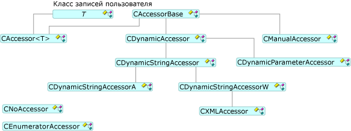

# Методы доступа и наборы строк

Задание и получение данных, шаблоны OLE DB используют метод доступа и набор строк с помощью [CAccessorRowset](../../data/oledb/caccessorrowset-class.md) класса. Этот класс может обрабатывать несколько методов доступа различных типов.

## Типы методов доступа

Все методы доступа являются производными от [CAccessorBase](../../data/oledb/caccessorbase-class.md). `CAccessorBase` предоставляет параметр и привязка к столбцу.

Ниже показаны типы методов доступа.

 
Классы методов доступа

- [CAccessor](../../data/oledb/caccessor-class.md) используйте этот метод доступа в том случае, если вы знаете структуры базы данных-источника во время разработки. `CAccessor` статически связывает запись в базе данных, который содержит буфер, к источнику данных.

- [CDynamicAccessor](../../data/oledb/cdynamicaccessor-class.md) использовать этот метод доступа, если вы не знаете структуру базы данных во время разработки. `CDynamicAccessor` вызовы `IColumnsInfo::GetColumnInfo` Чтобы получить сведения о столбцах базы данных. Создает и управляет метод доступа и буфера.

- [CDynamicParameterAccessor](../../data/oledb/cdynamicparameteraccessor-class.md) использовать этот метод доступа для обработки типов Неизвестная команда. При подготовке команды `CDynamicParameterAccessor` можно получить сведения о параметрах из `ICommandWithParameters` интерфейс, если поставщик поддерживает `ICommandWithParameters`.

- [CDynamicStringAccessor](../../data/oledb/cdynamicstringaccessor-class.md), [CDynamicStringAccessorA](../../data/oledb/cdynamicstringaccessora-class.md), и [CDynamicStringAccessorW](../../data/oledb/cdynamicstringaccessorw-class.md) использования этих классов, если вы не имеют сведений о схеме базы данных. `CDynamicStringAccessorA` Получает данные в виде строк ANSI; `CDynamicStringAccessorW` получает данные в виде строки в Юникоде.

- [CManualAccessor](../../data/oledb/cmanualaccessor-class.md) с этим классом, можно использовать любые типы данных, если поставщик может преобразовать тип. Он обрабатывает результирующих столбцов и параметров команды.

В следующей таблице перечислены поддержка в типы методов доступа шаблонов OLE DB.

|Тип метода доступа|Динамический|Обрабатывает параметры|Буфер|Несколько методов доступа|
|-------------------|-------------|--------------------|------------|------------------------|
|`CAccessor`|Нет|Да|Пользовательская|Да|
|`CDynamicAccessor`|Да|Нет|Шаблоны OLE DB|Нет|
|`CDynamicParameterAccessor`|Да|Да|Шаблоны OLE DB|Нет|
|`CDynamicStringAccessor[A,W]`|Да|Нет|Шаблоны OLE DB|Нет|
|`CManualAccessor`|Да|Да|Пользовательская|Да|

## Типы наборов строк

Шаблоны OLE DB поддерживают три вида набора строк (см. предыдущий рисунок): единый наборов строк (реализованный [CRowset](../../data/oledb/crowset-class.md)), групповой набор строк (реализованный [CBulkRowset](../../data/oledb/cbulkrowset-class.md)) и массивный (реализован по [CArrayRowset](../../data/oledb/carrayrowset-class.md)). Одиночные наборы строк выборки, дескриптор одной строки при `MoveNext` вызывается. Большого набора строк можно получить несколько дескрипторов строк. Набор строк массива являются наборы строк, которые можно получить, используя синтаксис массива.

Ниже показаны типы наборов строк.

 
Классы набора строк

[Наборы строк схемы](../../data/oledb/obtaining-metadata-with-schema-rowsets.md) не доступа в данных хранилища данных, но вместо этого доступ к сведениям о хранилище данных, называемые метаданными. Наборы строк схемы обычно используются в ситуациях, в которых структуру базы данных не известен во время компиляции и должен быть получен во время выполнения.

## См. также

[Шаблоны потребителей OLE DB](../../data/oledb/ole-db-consumer-templates-cpp.md)