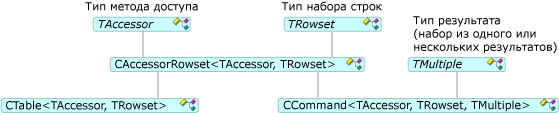

# Команды и таблицы

Команды и таблицы дают возможность доступа к наборам строк; то есть откройте наборы строк, выполнять команды и привязывать столбцы. [CCommand](../../data/oledb/ccommand-class.md) и [CTable](../../data/oledb/ctable-class.md) классы, создания экземпляров объектов команд и таблиц, соответственно. Эти классы являются производными от [CAccessorRowset](../../data/oledb/caccessorrowset-class.md) как показано на рисунке ниже.

 
Классы команд и таблиц

В предыдущей таблице `TAccessor` может быть любым типом метода доступа, перечисленных в [типы методов доступа](../../data/oledb/accessors-and-rowsets.md). `TRowset` может быть любым типом набора строк, перечисленных в [типы наборов строк](../../data/oledb/accessors-and-rowsets.md). `TMultiple` Указывает тип результата (один или несколько результирующих наборов).

[Мастер потребителя ATL OLE DB](../../atl/reference/atl-ole-db-consumer-wizard.md) позволяет указать, следует ли объект команд или таблиц.

- Для источников данных без команды, можно использовать `CTable` класса. Обычно он используется для простых наборов строк, не указаны другие параметры и не требуется нескольких результатов. Этот простой класс открывает таблицу в источнике данных с помощью имени таблицы, указанной вами.

- Для источников данных, поддерживающих команды, можно использовать `CCommand` вместо этого класса. Чтобы выполнить команду, вызовите [откройте](../../data/oledb/ccommand-open.md) для данного класса. Кроме того, можно вызвать `Prepare` для подготовки команды, которую требуется выполнить более одного раза.

   `CCommand` с тремя аргументами шаблона: тип метода доступа, тип набора строк и тип результата (`CNoMultipleResults`, по умолчанию или `CMultipleResults`). Если указать `CMultipleResults`, `CCommand` поддерживает класс `IMultipleResults` интерфейс и обрабатывает несколько наборов строк. [DBVIEWER](https://github.com/Microsoft/VCSamples) примере показано, как обрабатывать несколько результатов.

## См. также

[Шаблоны потребителей OLE DB](../../data/oledb/ole-db-consumer-templates-cpp.md)