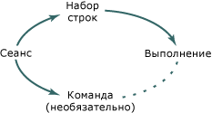

# Интерфейсы объекта сеанса

В следующей таблице показаны обязательные и необязательные интерфейсы, определенные в OLE DB для объекта сеанса.

|Интерфейс|Обязательный?|Реализовано с помощью шаблонов OLE DB?|
|---------------|---------------|--------------------------------------|
|[IGetDataSource](/previous-versions/windows/desktop/ms709721)|Обязательный|Да|
|[IOpenRowset](/previous-versions/windows/desktop/ms716946)|Обязательный|Да|
|[ISessionProperties](/previous-versions/windows/desktop/ms713721)|Обязательный|Да|
|[IAlterIndex](/previous-versions/windows/desktop/ms714943)|Optional|Нет|
|[IAlterTable](/previous-versions/windows/desktop/ms719764)|Optional|Нет|
|[IBindResource](/previous-versions/windows/desktop/ms714936)|Optional|Нет|
|[ICreateRow](/previous-versions/windows/desktop/ms716832)|Optional|Нет|
|[IDBCreateCommand](/previous-versions/windows/desktop/ms711625)|Optional|Да|
|[IDBSchemaRowset](/previous-versions/windows/desktop/ms713686)|Optional|Да|
|[IIndexDefinition](/previous-versions/windows/desktop/ms711593)|Optional|Нет|
|[ISupportErrorInfo](/previous-versions/windows/desktop/ms715816)|Optional|Да|
|[ITableCreation](/previous-versions/windows/desktop/ms713639)|Optional|Нет|
|[ITableDefinition](/previous-versions/windows/desktop/ms714277)|Optional|Нет|
|[ITableDefinitionWithConstraints](/previous-versions/windows/desktop/ms720947)|Optional|Нет|
|[ITransaction](/previous-versions/windows/desktop/ms723053)|Optional|Нет|
|[Интерфейс ITransactionJoin](/previous-versions/windows/desktop/ms718071)|Optional|Нет|
|[Интерфейс ITransactionLocal](/previous-versions/windows/desktop/ms714893)|Optional|Нет|
|[ITransactionObject](/previous-versions/windows/desktop/ms713659)|Optional|Нет|

Объект сеанса создает объект набора строк. Если поставщик поддерживает команды, сеанс также создает объект command (`CCommand`, реализации OLE DB `TCommand`). Реализует объект команды `ICommand` интерфейс и использует `ICommand::Execute` метод для выполнения команд на наборе строк, как показано на рисунке ниже.

## См. также

[Архитектура шаблона поставщика OLE DB](../../data/oledb/ole-db-provider-template-architecture.md) 
