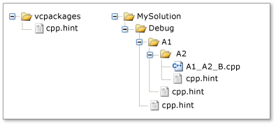

# <a name="hint-files"></a>Файлы подсказок

*Файл указаний* помогает интегрированной среде разработки (IDE) Visual Studio интерпретировать идентификаторы Visual C++, такие как имена функций и макросов. При открытии проекта Visual C++ *система анализа* интегрированной среды разработки анализирует код в каждом исходном файле в проекте и собирает информацию обо всех идентификаторах. Затем интегрированная среда разработки использует эту информацию для поддержки функций, таких как **представления классов** и **панель навигации**.

Система анализа, появившаяся в Visual C++ 2010, распознает синтаксис C/C++, но может неправильно интерпретировать оператор, содержащий макрос. Неправильная интерпретация возможна, если макрос приводит к тому, что введенный исходный код является синтаксически неверным. Оператор может стать синтаксически верным после того, как исходный код будет скомпилирован, а препроцессор заменит [идентификатор макроса](../preprocessor/hash-define-directive-c-cpp.md) на его определение. Система анализа не требует сборку проекта, так как использует файлы указаний для интерпретации макросов. Поэтому функция просмотра, например **представление классов**, доступна сразу же.

Файл указаний содержит настраиваемые пользователем *указания*, которые имеют тот же синтаксис, что и определения макросов C/C++. Visual C++ включает встроенный файл указаний, которого достаточно для большинства проектов, но вы можете создать собственные файлы указаний, чтобы улучшить обработку идентификаторов в Visual Studio.

> [!IMPORTANT]
> Если вы изменяете или добавляете файл указаний, нужно удалить файл SDF и/или файл VC.db в решении, чтобы изменения вступили в силу.

## <a name="scenario"></a>Сценарий

Предположим, что следующий код находится в исходном файле, который вы просматриваете с помощью обозревателя **представления классов**. Макрос `STDMETHOD` объявляет метод `myMethod`, принимающий один параметр и возвращающий указатель на **HRESULT**.

```cpp
// Source code file.
STDMETHOD(myMethod)(int parameter1);
```

Приведенные ниже определения макросов находятся в отдельном файле заголовка.

```cpp
// Header file.
#define STDMETHOD(method) HRESULT (STDMETHODCALLTYPE * method)
#define STDMETHODCALLTYPE __stdcall
#define HRESULT void*
```

Система анализа не может интерпретировать исходный код, так как функция `STDMETHOD` объявлена, а это объявление синтаксически неверно из-за того, что функция имеет два списка параметров. Система анализа не открывает файл заголовка, чтобы найти определения для макросов `STDMETHOD`, `STDMETHODCALLTYPE` и `HRESULT`. Так как система анализа не может интерпретировать макрос `STDMETHOD`, она пропускает весь оператор и продолжает анализ.

Система анализа не использует файлы заголовка, так как проект может зависеть от одного или нескольких важных файлов заголовка. При изменении любого файла заголовка системе анализа может потребоваться перепроверить все файлы заголовка в проекте, что замедляет работу интегрированной среды разработки. Вместо этого система анализа использует указания о том, как обрабатывать макросы `STDMETHOD`, `STDMETHODCALLTYPE` и `HRESULT`.

Как узнать, что вам нужно указание? А если нужно, то какого типа? Один из признаков, указывающих на потребность в указании, заключается в том, что представление идентификатора в **представлении классов** не согласуется с представлением в **редакторе**. Например, **представление классов** может не отображать член класса, который точно существует, или может быть указано неверное имя этого члена. Дополнительные сведения о типах указаний, которые помогают решать распространенные проблемы, см. в разделе "Каким макросам нужно указание?" ниже.

## <a name="architecture"></a>Архитектура

Файлы указаний хранятся в физических каталогах, а не в логических, отображаемых в **обозревателе решений**. Чтобы файл указаний использовался, нужно добавить его в проект. Система анализа использует файлы указаний только при анализе исходных файлов.

Каждый файл указаний называется **cpp.hint**. Таким образом, файл указаний могут содержать разные каталоги, но в отдельном каталоге может находиться лишь один такой файл.

В проекте может использоваться как один или несколько файлов указаний, так и ни одного. При отсутствии файлов указаний система анализа использует методики восстановления после ошибок, чтобы пропускать нераспознаваемый исходный код. В противном случае система анализа использует указанную ниже стратегию для обнаружения и сбора указаний.

### <a name="search-order"></a>Порядок поиска

Система анализа ищет файлы указаний в каталогах в следующем порядке.

- Каталог, содержащий пакет установки для Visual C++ (**vcpackages**). Этот каталог содержит встроенный файл указаний, описывающий символы в часто используемых системных файлах, таких как **windows.h**. Поэтому проект автоматически наследует основную часть нужных ему указаний.

- Путь из корневого каталога исходного файла к каталогу, содержащему сам исходный файл. В типичном проекте Visual C++ корневой каталог содержит файл проекта или решения.

   Исключением из этого правила является ситуация, когда *стоп-файл* находится в пути к исходному файлу. Стоп-файл обеспечивает дополнительный уровень контроля над порядком поиска. Это может быть любой файл, который называется **cpp.stop**. Вместо того чтобы начать с корневого каталога, система анализа выполняет поиск из каталога, содержащего стоп-файл, по направлению к каталогу, содержащему исходный файл. В типовом проекте стоп-файл не требуется.

### <a name="hint-gathering"></a>Сбор указаний

Файл указаний может не содержать ни одного указания или содержать более нуля *указаний*. Определение или удаление указания выполняется как и для макроса C/C++. То есть директива препроцессора `#define` создает или переопределяет указание, а директива `#undef` удаляет его.

Система анализа открывает каждый файл указаний в описанном выше порядке поиска, собирает указания из каждого файла в набор *полезных указаний*, а затем использует эти полезные указания для интерпретации идентификаторов в коде.

Для сбора указаний система анализа использует описанные ниже правила.

- Если новое указание задает имя, которое еще не было определено, это имя добавляется в список полезных указаний.

- Если новое указание задает уже определенное имя, существующее имя переопределяется.

- Если новое указание является директивой `#undef`, указывающей имеющееся полезное указание, существующее указание удаляется.

Первое правило означает, что полезные указания наследуются от ранее открытых файлов указаний. Два последних правила означают, что указания, обнаруженные позже в порядке поиска, могут переопределить указания, обнаружены раньше. Например, можно переопределить любые имеющиеся указания, создав файл указаний в каталоге с исходным файлом.

Описание сбора указаний см. в разделе `Example` ниже.

### <a name="syntax"></a>Синтаксис

Указания создаются и удаляются с использованием такого же синтаксиса, что и у директив препроцессора, создающих и удаляющих макросы. На самом деле система анализа использует препроцессор C/C++ для оценки указаний. Дополнительные сведения о директивах препроцессора см. в разделах [Директива #define (C/C++)](../preprocessor/hash-define-directive-c-cpp.md) и [Директива #undef (C/C++)](../preprocessor/hash-undef-directive-c-cpp.md).

Единственными необычными элементами синтаксиса являются строки замены `@<`, `@=` и `@>`. Это строки замены для конкретного файла указаний, используемые только с макросами *схемы*. Схема — это набор макросов, связывающих данные, функции и события с другими данными, функциями и обработчиками событий. Например, `MFC` использует схемы для создания [схем сообщений](../mfc/reference/message-maps-mfc.md), а `ATL` — [схем объектов](../atl/reference/object-map-macros.md). Строки замены для конкретного файла указаний задают начальный, промежуточные и конечный элементы схемы. Важно только имя макроса схемы. Таким образом, каждая строка замены намеренно скрывает реализацию макроса.

Указания используют приведенный ниже синтаксис.

|Синтаксис|Значение|
|------------|-------------|
|`#define` *имя_указания* *строка_замены*<br /><br /> `#define` *имя_указания* `(` *параметр*, ...`)`*строка_замены*|Директива препроцессора, которая определяет новое указание или переопределяет существующее. После директивы препроцессор заменяет каждый экземпляр *имени_указания* в исходном коде на *строку_замены*.<br /><br /> Вторая форма синтаксиса определяет указание, подобное функции. Если в исходном коде находится подобное функции указание, препроцессор сначала заменяет каждый экземпляр *параметра* в *строке_замены* на соответствующий аргумент в исходном коде, а затем заменяет *имя_указания* на *строку_замены*.|
|`@<`|*Строка_замены* для конкретного файла указаний задает начало набора элементов схемы.|
|`@=`|*Строка_замены* для конкретного файла указаний задает промежуточный элемент схемы. Схема может содержать несколько элементов схемы.|
|`@>`|*Строка_замены* для конкретного файла указаний задает конец набора элементов схемы.|
|`#undef` *имя_указания*|Директива препроцессора, удаляющая имеющее указание. Имя указания предоставляется идентификатором *имя_указания*.|
|`//` *комментарий*|Однострочный комментарий.|
|`/*` *comment* `*/`|Многострочный комментарий.|

## <a name="what-macros-require-a-hint"></a>Каким макросам нужно указание?

Макросы определенных типов могут мешать работе системы анализа. Этот раздел описывает типы макросов, которые могут вызывать проблему, и тип указания, позволяющий решить ее.

### <a name="disruptive-macros"></a>Макросы, нарушающие работу

Некоторые макросы вызывают неправильную интерпретацию исходного кода в системе анализа, но их можно пропустить без ущерба для работы. Например, макросы Source Code Annotation Language ([SAL](../c-runtime-library/sal-annotations.md)) разрешаются в атрибуты C++, которые помогают находить программные ошибки. Если вы хотите игнорировать заметки SAL при просмотре кода, можно создать файл указаний, который скрывает заметку.

В следующем исходном коде для функции `FormatWindowClassName()` используется тип параметра `PXSTR` и имя параметра `szBuffer`. Однако система анализа путает заметки SAL `_Pre_notnull_` и `_Post_z_` с типом или именем параметра.

**Исходный код:**

```cpp
static void FormatWindowClassName(_Pre_notnull__Post_z_ PXSTR szBuffer)
```

**Стратегия:** определение Null

В этом случае рекомендуется рассматривать заметки SAL как несуществующие. Для этого задайте указание, строка замены которого имеет значение Null. В результате система анализа пропускает эти заметки, и они не отображаются в обозревателе **представления классов**. (Visual C++ имеет встроенный файл указаний, скрывающий заметку SAL.)

**Файл указаний:**

```cpp.hint
#define _Pre_notnull_
```

### <a name="concealed-cc-language-elements"></a>Скрытые элементы языка C/C++

Типичная причина неверной интерпретации кода в системе анализа заключается в том, скрывает ли макрос токен [ключевого слова](../cpp/keywords-cpp.md) или [знака препинания](../cpp/punctuators-cpp.md) C/C++. То есть макрос может содержать половину из пары знаков препинания, такой как `<>`, `[]`, `{}` и `()`.

В приведенном ниже исходном коде макрос `START_NAMESPACE` скрывает непарную открывающую фигурную скобку (`{`).

**Исходный код:**

```cpp
#define START_NAMESPACE namespace MyProject {
```

**Стратегия:** прямое копирование

Если семантика макроса критична для работы, создайте указание, которое идентично этому макросу. Система анализа разрешает макрос в определение в файле указаний.

Обратите внимание, что, если макрос в исходном файле содержит другие макросы, они будут интерпретированы только в том случае, если уже находятся в наборе полезных указаний.

**Файл указаний:**

```cpp.hint
#define START_NAMESPACE namespace MyProject {
```

### <a name="maps"></a>Карты

Схема состоит из макросов, определяющих начальный элемент, конечный элемент и ни одного, один или несколько промежуточных элементов. Система анализа неверно интерпретирует схемы, так как каждый макрос схемы скрывает элементы языка C/C++, а синтаксис полного оператора C/C++ распределяется между несколькими отдельными макросами.

Приведенный ниже исходный код определяет макросы `BEGIN_CATEGORY_MAP`, `IMPLEMENTED_CATEGORY` и `END_CATEGORY_MAP`.

**Исходный код:**

```cpp
#define BEGIN_CATEGORY_MAP(x)\
static const struct ATL::_ATL_CATMAP_ENTRY* GetCategoryMap() throw() {\
static const struct ATL::_ATL_CATMAP_ENTRY pMap[] = {
#define IMPLEMENTED_CATEGORY( catid ) { _ATL_CATMAP_ENTRY_IMPLEMENTED, &catid },
#define END_CATEGORY_MAP()\
   { _ATL_CATMAP_ENTRY_END, NULL } };\
   return( pMap ); }
```

**Стратегия:** определение элементов схемы

Задайте указания для начального, средних (при их наличии) и конечного элементов схемы. Используйте специальные строки замены схемы — `@<`, `@=` и `@>`. Дополнительные сведения см. в подразделе `Syntax` данного раздела.

**Файл указаний:**

```cpp.hint
// Start of the map.
#define BEGIN_CATEGORY_MAP(x) @<
// Intermediate map element.
#define IMPLEMENTED_CATEGORY( catid ) @=
// Intermediate map element.
#define REQUIRED_CATEGORY( catid ) @=
// End of the map.
#define END_CATEGORY_MAP() @>
```

### <a name="composite-macros"></a>Составные макросы

Составные макросы содержат один или несколько типов макросов, нарушающих работу системы анализа.

Приведенный ниже исходный код содержит макрос `START_NAMESPACE`, задающий начало области пространства имен, и макрос `BEGIN_CATEGORY_MAP`, задающий начало схемы.

**Исходный код:**

```cpp
#define NSandMAP START_NAMESPACE BEGIN_CATEGORY_MAP
```

**Стратегия:** прямое копирование

Создайте указания для макросов `START_NAMESPACE` и `BEGIN_CATEGORY_MAP`, а затем указание для макроса `NSandMAP`, который аналогичен приведенному выше для исходного кода. Кроме того, если составной макрос состоит только из нарушающих работу макросов и пробела, можно определить указание, строка замены которого является определением Null.

В этом примере предполагается, что `START_NAMESPACE` уже имеется указание, как описано в подразделе `Concealed C/C++ Language Elements`. Кроме того, предполагается, что `BEGIN_CATEGORY_MAP` содержит указание, как описано выше в подразделе `Maps`.

**Файл указаний:**

```cpp.hint
#define NSandMAP START_NAMESPACE BEGIN_CATEGORY_MAP
```

### <a name="inconvenient-macros"></a>Неудобные макросы

Некоторые макросы могут интерпретироваться системой анализа, однако из-за того, что макрос является длинным или сложным, исходный код будет трудно читать. В целях удобочитаемости можно предоставить указание, упрощающее отображение макроса.

**Исходный код:**

```cpp
#define STDMETHOD(methodName) HRESULT (STDMETHODCALLTYPE * methodName)
```

**Стратегия:** упрощение

Создайте указание, отображающее упрощенное определение макроса.

**Файл указаний:**

```cpp.hint
#define STDMETHOD(methodName) void* methodName
```

## <a name="example"></a>Пример

В следующем примере показано, как выполняется сбор указаний из соответствующих файлов. Стоп-файлы в этом примере не используются.

На следующем рисунке показаны некоторые физические каталоги в проекте Visual C++. Файлы указаний находятся в каталогах `vcpackages`, `Debug`, `A1` и `A2`.

### <a name="hint-file-directories"></a>Каталоги файлов указаний



### <a name="directories-and-hint-file-contents"></a>Каталоги и содержимое файлов указаний

Ниже приведены каталоги в этом проекте, содержащие файлы указаний, и содержимое этих файлов. Показана лишь часть файлов указаний в каталоге `vcpackages`.

- vcpackages

    ```cpp.hint
    // vcpackages (partial list)
    #define _In_
    #define _In_opt_
    #define _In_z_
    #define _In_opt_z_
    #define _In_count_(size)
    ```

- Отладка

    ```cpp.hint
    // Debug
    #undef _In_
    #define OBRACE {
    #define CBRACE }
    #define RAISE_EXCEPTION(x) throw (x)
    #define START_NAMESPACE namespace MyProject {
    #define END_NAMESPACE }
    ```

- A1

    ```cpp.hint
    // A1
    #define START_NAMESPACE namespace A1Namespace {
    ```

- A2

    ```cpp.hint
    // A2
    #undef OBRACE
    #undef CBRACE
    ```

### <a name="effective-hints"></a>Полезные указания

Следующая таблица содержит полезные указания для исходных файлов в этом проекте.

- Исходный файл: A1_A2_B.cpp

- Полезные указания:

    ```cpp.hint
    // vcpackages (partial list)
    #define _In_opt_
    #define _In_z_
    #define _In_opt_z_
    #define _In_count_(size)
    // Debug...
    #define RAISE_EXCEPTION(x) throw (x)
    // A1
    #define START_NAMESPACE namespace A1Namespace {
    // ...Debug
    #define END_NAMESPACE }
    ```

Следующие заметки применяются к предыдущему списку.

- Эти полезные указания получены из каталогов `vcpackages`, `Debug`, `A1` и `A2`.

- Директива **#undef** в файле указаний `Debug` удалила указание `#define _In_` в файле из каталога `vcpackages`.

- Файл указаний в каталоге `A1` переопределяет `START_NAMESPACE`.

- Указание `#undef` в каталоге `A2` удалило указания для `OBRACE` и `CBRACE` в файле из каталога `Debug`.

## <a name="see-also"></a>См. также

[Типы файлов, создаваемых для проектов Visual C++](../ide/file-types-created-for-visual-cpp-projects.md)<br>
[Директива #define (C/C++)](../preprocessor/hash-define-directive-c-cpp.md)<br>
[Директива #undef (C/C++)](../preprocessor/hash-undef-directive-c-cpp.md)<br>
[Заметки SAL](../c-runtime-library/sal-annotations.md)<br>
[Схемы сообщений](../mfc/reference/message-maps-mfc.md)<br>
[Макросы схемы сообщений](../atl/reference/message-map-macros-atl.md)<br>
[Макросы сопоставления объектов](../atl/reference/object-map-macros.md)