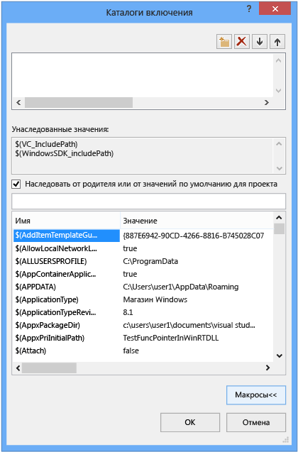

# <a name="working-with-project-properties"></a>Работа со свойствами проектов

В интегрированной среде разработки все сведения, необходимые для сборки проекта, представлены в виде *свойств*. Эти сведения включают в себя имя приложения, расширение (например, DLL, EXE, LIB), параметры компилятора, параметры компоновщика, параметры отладчика, настраиваемые этапы сборки и многие другие компоненты. Как правило, для просмотра и изменения этих свойств используются *страницы свойств* (**Проект &#124; Свойства**).

При создании проекта система задает значения для различных свойств. Значения по умолчанию варьируются в зависимости от типа проекта и параметров, выбранных в мастере приложений. Например, проект ATL имеет свойства, относящиеся к файлам MIDL, но в базовом консольном приложении они отсутствуют. В области "Общие" на страницах свойств отображаются свойства по умолчанию:


Некоторые свойства, такие как имя приложения, применяются ко всем вариантам сборки, независимо от целевой платформы и того, предназначена ли эта сборка для отладки или выпуска. Однако большинство свойств зависит от конфигурации. Это вызвано тем, что компилятор должен знать, на какой именно платформе будет запускаться программа и какие именно параметры компилятора нужно использовать для создания правильного кода. Таким образом, при установке свойства важно следить за тем, для какой конфигурации и платформы должно применяться новое значение. Нужно ли применить его только для сборок отладки Win32 либо еще и для сборок отладки ARM и отладки x64? Например, свойство **Оптимизации** по умолчанию имеет значение **Наибольшая скорость (/O2)** в конфигурации выпуска, но отключено в конфигурации отладки.

Страницы свойств разработаны таким образом, чтобы вы всегда могли просмотреть и при необходимости изменить конфигурацию и платформу, к которым относится значение свойства. На следующем рисунке показаны страницы свойств со сведениями о конфигурации и платформе в расположенных сверху списках. Когда свойство **Оптимизация** задано здесь, оно применяется только к сборкам отладки Win32, что является активной конфигурацией, как показано красными стрелками.


На следующем рисунке показана та же страница свойств проекта, но конфигурация изменена на выпуск. Обратите внимание на другое значение для свойства "Оптимизация". Кроме того, обратите внимание, что активной конфигурацией по-прежнему является отладка. Здесь вы можете задать свойства для любой конфигурации, а не только активной.


Сама система проектов основана на платформе MSBuild, которая определяет форматы файлов и правила сборки проектов любого типа. Платформа MSBuild в значительной степени упрощает сборку для нескольких платформ и конфигураций, но вам нужно немного разобраться в ее работе. Это особенно важно в том случае, если вы хотите определить настраиваемые конфигурации или создать многоразовые наборы свойств, которые можно совместно использовать и импортировать в несколько проектов.

Свойства проекта хранятся непосредственно в файле проекта (VCXPROJ) или в других файлах XML или PROPS, импортируемых файлом проекта и предоставляющих значения по умолчанию. Как указано выше, одному свойству для некоторой конфигурации можно назначить разные значения в разных файлах. При сборке проекта модуль MSBuild оценивает файл проекта и все импортированные файлы в строго определенном порядке (как описано ниже). По мере оценки каждого файла все значения свойств, определенные в этом файле, переопределяют существующие значения. Все неуказанные значения наследуются от файлов, оцененных ранее. Таким образом, при установке свойства с помощью страниц свойств важно следить за тем, где именно вы это делаете. Если задать свойство X в файле PROPS, при том что для того же свойства задано значение Y в файле проекта, проект будет создан со свойством, имеющим значение Y. Если то же свойство имеет значение Z для элемента проекта, например CPP-файла, то модуль MSBuild использует значение Z. Дополнительные сведения см. в разделе [Наследование свойств](#bkmkPropertyInheritance) ниже.

## <a name="build-configurations"></a>Конфигурации сборки

Конфигурация — это просто произвольная группа свойств, которым назначено имя. Visual Studio предоставляет конфигурации отладки и выпуска, каждая из которых задает различные свойства соответственно для сборки отладки или выпуска. Вы можете использовать **Configuration Manager** для определения настраиваемых конфигураций — так удобно группировать свойства для определенной конфигурации сборки. Диспетчер свойств используется для расширенной работы со свойствами, но мы расскажем о нем сейчас, так как он помогает визуализировать конфигурации свойств. В зависимости от ваших параметров доступ к нему можно получить, выбрав **Вид &#124; Диспетчер свойств** или **Вид &#124; Другие окна &#124; Диспетчер свойств**. Он имеет узлы для каждой пары конфигурации и платформы в проекте. В каждом из этих узлов находятся узлы для страниц свойств (файлы PROPS), позволяющие задать некоторые свойства для этой конфигурации.


Если перейти в область "Общие" на страницах свойств (см. рисунок выше) и задать для свойства "Набор символов" значение "Не задано" вместо "Use Unicode" (Использовать Юникод) и нажать кнопку **ОК**, диспетчер свойств не будет показывать страницу свойств **Unicode Support** (Поддержка Юникода) для текущей конфигурации, однако она сохранится для других конфигураций.

Дополнительные сведения о диспетчере и страницах свойств см. в разделе [Создание многоразовых конфигураций свойств](#bkmkPropertySheets) ниже.

> [!TIP]
> Файл USER — это устаревший компонент, и мы рекомендуем удалить его, чтобы обеспечить правильную группировку свойств по конфигурации и платформе.

## <a name="target-platforms"></a>Целевые платформы

*Целевая платформа* обозначает тип устройства и/или операционной системы, где будет запускаться исполняемый файл. Вы можете создать проект для нескольких платформ. Доступные целевые платформы для проектов C++ зависят от вида проекта. Среди прочего, к ним относятся Win32, x64, ARM, Android и iOS.     Целевая платформа **X86**, которую вы могли заметить в **Configuration Manager**, идентична **Win32** в собственных проектах C++. Win32 означает 32-разрядную версию Windows, а **x64** — 64-разрядную. Дополнительные сведения об этих двух платформах см. в разделе [Запуск 32-разрядных приложений](/windows/desktop/WinProg64/running-32-bit-applications).

Значение целевой платформы **Любой ЦП**, которые вы могли заметить в **Configuration Manager**, не влияет на собственные проекты C++; оно применяется к C+ +/CLI и другим типам проектов .NET. Дополнительные сведения см. в разделе [Параметр /CLRIMAGETYPE (указание типа образа среды CLR)](../build/reference/clrimagetype-specify-type-of-clr-image.md).

## <a name="property-pages"></a>страницы свойств

Как уже говорилось ранее, система проектов Visual C++ основана на [MSBuild](/visualstudio/msbuild/msbuild-properties) и значения хранятся в XML-файле проекта, а также в файлах PROPS и TARGETS по умолчанию. Для Visual Studio 2015 эти файлы расположены в **\Program Files (x86)\MSBuild\Microsoft.Cpp\v4.0\V140**. Для Visual Studio 2017 эти файлы расположены в **\\Program Files (x86)\\Microsoft Visual Studio\\2017\\_выпуск_\\Common7\\IDE\\VC\\VCTargets**, где _выпуск_ — это установленный выпуск Visual Studio. Свойства также хранятся в любых пользовательских файлах PROPS, которые вы можете добавить в свой проект. Если у вас нет четкого представления о работе MSBuild, настоятельно рекомендуется не изменять эти файлы вручную и использовать для изменения свойств, особенно участвующих в наследовании, страницы свойств в интегрированной среде разработки.

На следующем рисунке показаны страницы свойств для проекта Visual C++. В левой области выбрано *правило* **Каталоги VC++**, а в правой области отображаются свойства, связанные с этим правилом. Значения `$(...)`, к сожалению, называются *макросами*. Это *не* макросы C/C++, а просто константы времени компиляции. Макросы рассмотрены в разделе [Макросы страниц свойств](#bkmkPropertiesVersusMacros) ниже.


> [!WARNING]
> Конфигурации **Общие свойства** в более ранних версиях Visual Studio были удалены. Для добавления ссылки на проект диалоговое окно **Добавление ссылки** используется таким же образом, как и для управляемых языков. См. раздел [Управление ссылками в проекте](/visualstudio/ide/managing-references-in-a-project).

#### <a name="to-set-a-property-for-a-project"></a>Задание свойства проекта

1. Для большинства сценариев можно задать свойства на уровне проекта, не создавая настраиваемую страницу свойств. В главном меню выберите **Проект &#124; Свойства** или щелкните правой кнопкой мыши узел проекта в **обозревателе решений** и выберите пункт **Свойства**.

2. Используйте списки **Конфигурация** и **Платформа** в верхней части диалогового окна, чтобы указать, для каких групп свойств следует применить ваши изменения. Во многих случаях уместнее всего вариант **Все платформы** и **Все конфигурации**. Чтобы задать свойства только для некоторых конфигураций, выберите их в **диспетчере свойств**, а затем откройте контекстное меню и щелкните пункт **Свойства**.

В диалоговом окне **Страницы свойств** отображаются только страницы свойств, относящиеся к текущему проекту. Например, если проект не содержит IDL-файл, страница свойств MIDL не отображается.

При выделении свойства на странице свойств можно нажать клавишу **F1** для перехода в раздел справки с дополнительной информацией о соответствующем параметре компилятора или компоновщика.

Следующие разделы содержат дополнительные сведения о каждой странице свойств.

- [Страница свойств "Общие" (проект)](../ide/general-property-page-project.md)

- [Страница свойств "Общие" (файл)](../ide/general-property-page-file.md)

- [Страницы свойств командной строки](../ide/command-line-property-pages.md)

- [Параметры проекта для конфигурации отладки C++](/visualstudio/debugger/project-settings-for-a-cpp-debug-configuration)

- [Страница свойств NMake](../ide/nmake-property-page.md)

- [Страницы свойств компоновщика](../ide/linker-property-pages.md)

- [Страницы свойств ресурсов](../ide/resources-property-pages.md)

- [Страницы свойств MIDL](../ide/midl-property-pages.md)

- [Страница свойств веб-ссылок](../ide/web-references-property-page.md)

- [Страница свойств "Инструмент создания XML-данных"](../ide/xml-data-generator-tool-property-page.md)

## <a name="to-quickly-browse-and-search-all-properties"></a>Быстрый просмотр и поиск всех свойств

Страница свойств **Все параметры** (в узле **Свойства конфигурации &#124; C/C++** диалогового окна **Страницы свойств**) позволяет быстро просмотреть и найти свойства, доступные в текущем контексте. Она имеет специальное поле поиска и простой синтаксис, который помогает отфильтровать результаты.

Без префикса:<br/>
поиск только в именах свойств (подстрока без учета регистра).

"/" или "-":<br/>
поиск только в параметрах компилятора (префикс без учета регистра)

v:<br/>
поиск только в значениях (подстрока без учета регистра).

##  <a name="bkmkPropertiesVersusMacros"></a> Макросы страниц свойств

*Макрос* является константой времени компиляции, которая может ссылаться на значение, определенное Visual Studio или системой MSBuild, или пользовательское значение. Использование макросов вместо жестко заданных значений, таких как пути к каталогам, упрощает совместное использование параметров свойств на разных компьютерах и в разных версиях Visual Studio, а также позволяет гарантировать, что параметры проекта правильно участвуют в наследовании свойств. Для просмотра значений всех доступных макросов можно использовать редактор свойств.

### <a name="predefined-macros"></a>Предустановленные макросы

*глобальные макросы*<br/>
Применяются ко всем элементам в конфигурации проекта. Синтаксис: `$(name)`. Пример глобального макроса — свойство `$(VCInstallDir)`, которое сохраняет корневой каталог установки Visual Studio. Глобальный макрос соответствует элементу `PropertyGroup` в MSBuild.

*макросы элементов*<br/>
Синтаксис: `%(name)`. В случае файла макрос элемента применяется только к этому файлу — для примера можно использовать `%(AdditionalIncludeDirectories)`, чтобы определить каталоги, которые применяются только к конкретному файлу. Этот тип макроса элемента соответствует метаданным `ItemGroup` в MSBuild. При использовании в контексте конфигурации проекта макрос элемента применяется ко всем файлам определенного типа. Например, свойство конфигурации C/C++ **Определения препроцессора** может принимать макрос элемента `%(PreprocessorDefinitions)`, который применяется ко всем CPP-файлам в проекте. Этот тип макроса элемента соответствует метаданным `ItemDefinitionGroup` в MSBuild. Дополнительные сведения см. в разделе [Определения элементов](/visualstudio/msbuild/item-definitions).

### <a name="user-defined-macros"></a>Пользовательские макросы

Вы можете создавать *пользовательские макросы* для использования в качестве переменных в сборках проекта. Например, можно создать пользовательский макрос, предоставляющий значение пользовательскому шагу сборки или пользовательскому средству сборки. Пользовательский макрос — это пара "имя-значение". Для доступа к этому значению в файле проекта можно использовать нотацию **$(**<em>name</em>**)**.

Пользовательский макрос хранится на странице свойств. Если проект еще не содержит страницу свойств, можно создать ее, выполнив одно из действий, описанных в разделе [Создание многоразовых конфигураций свойств](#bkmkPropertySheets).

##### <a name="to-create-a-user-defined-macro"></a>Создание пользовательского макроса

1.  В окне **Диспетчер свойств** (в строке меню выберите **Вид**, **Диспетчер свойств**) откройте контекстное меню для страницы свойств (ее имя имеет расширение USER), а затем выберите пункт "Свойства". Откроется диалоговое окно **Страницы свойств** для данной страницы свойств.

2.  В левой области диалогового окна выберите **Пользовательские макросы**. В правой области нажмите кнопку **Добавить макрос**, чтобы открыть диалоговое окно **Добавление пользовательского макроса**.

3.  В диалоговом окне задайте имя и значение для макроса. Кроме того, можно установить флажок **Задание данного макроса в качестве переменной среды в среде сборки**.

## <a name="property-editor"></a>Редактор свойств

Редактор свойств можно использовать для изменения некоторых строковых свойств и выбора макросов в качестве значений. Чтобы открыть редактор свойств, выберите свойство на странице свойств, а затем нажмите кнопку со стрелкой вниз справа. Если раскрывающийся список содержит команду **\<Изменить>**, можно выбрать ее, чтобы открыть редактор свойств для данного свойства.


В редакторе свойств можно нажать кнопку **Макросы**, чтобы просмотреть доступные макросы и их текущие значения. На следующем рисунке показан редактор свойств для свойства **Дополнительные каталоги включаемых файлов** после нажатия кнопки **Макросы**. Если вы добавляете новое значение, когда установлен флажок **Наследовать от родителя или от значений по умолчанию для проекта**, оно добавляется ко всем значениям, которые в данный момент наследуются. Если снять флажок, новое значение заменяет наследуемые значения. В большинстве случаев следует не снимать этот флажок.



##  <a name="bkmkPropertySheets"></a> Создание многоразовых конфигураций свойств

Хотя свойства можно задавать "глобально" для каждого пользователя и для каждого компьютера, мы больше не рекомендуем это делать. Вместо этого рекомендуется использовать **диспетчер свойств**, чтобы создать *страницу свойств* для хранения параметров для каждого типа проекта, который планируется повторно использовать или предоставлять другим пользователям. Страницы свойств также уменьшают вероятность случайного изменения значений свойств для других типов проектов. Более подробно страницы свойств рассмотрены в разделе [Создание многоразовых конфигураций свойств](#bkmkPropertySheets).

> [!IMPORTANT]
> **USER-файлы и связанные с ними проблемы**
>
> В последних версиях Visual Studio использовались глобальные страницы свойств с расширением имени файла USER, которые были расположены в папке \<профиль_пользователя>\AppData\Local\Microsoft\MSBuild\v4.0\. Мы больше не рекомендуем использовать эти файлы, поскольку они определяют свойства для конфигураций проектов для каждого пользователя и для каждого компьютера. Такие "глобальные" параметры могут конфликтовать со сборками, особенно при использовании нескольких целевых платформ на компьютере сборки. Например, при наличии одновременно проекта MFC и проекта Windows Phone свойства USER будут недопустимыми для одного из них. Многократно используемые страницы свойств обеспечивают большую гибкость и надежность.
>
> Хотя USER-файлы по-прежнему устанавливаются средой Visual Studio и участвуют в наследовании свойств, по умолчанию они являются пустыми. Рекомендуется удалить ссылку на эти файлы в **диспетчере свойств**, чтобы гарантировать работу проектов независимо от параметров конкретного пользователя или конкретного компьютера. Это важно для обеспечения правильного поведения в среде управления исходным кодом (SCC).

Чтобы открыть **диспетчер свойств**, в строке меню последовательно выберите **Вид**, **Другие окна** и **Диспетчер свойств**.

Если имеется общий, часто используемый набор свойств, которые нужно применить к нескольким проектам, то с помощью **диспетчера свойств** их можно записать в многоразовый файл *страницы свойств*, который по соглашению имеет расширение PROPS. Эту страницу можно применять к новым проектам, чтобы исключить необходимость в задании свойств с нуля. Чтобы открыть **Диспетчер свойств**, в строке меню выберите **Вид**, **Диспетчер свойств**.


Внутри каждого узла конфигурации отображаются узлы для каждой страницы свойств, которая применяется к этой конфигурации. Система добавляет страницы свойств, которые задают значения в зависимости от параметров, выбранных в мастере приложений при создании проекта. Щелкните правой кнопкой мыши любой узел и выберите пункт "Свойства", чтобы просмотреть свойства, применяемые к этому узлу. Все страницы свойств автоматически импортируются в "главную" страницу свойств проекта (ms.cpp.props) и оцениваются в порядке их следования в диспетчере свойств. Вы можете переместить их, чтобы изменить порядок оценки. Страницы свойств, которые оцениваются позже, переопределяют значения ранее оцененных страниц.

Если щелкнуть команду **Добавить новую страницу свойств проекта**, а затем выбрать, например, страницу свойств MyProps.props, отображается диалоговое окно страницы свойств. Обратите внимание, что оно относится к странице свойств MyProps; все вносимые изменения записываются на эту страницу, а не в файл проекта (с расширением VCXPROJ).

Свойства на странице свойств переопределяются, если то же свойство задано непосредственно в VCXPROJ-файле.

Страницу свойств можно импортировать любое количество раз. Несколько проектов в решении могут наследовать параметры от одной страницы свойств, и проект может иметь несколько страниц. Страница свойств сама может наследовать параметры от другой страницы свойств.

Также можно создать одну страницу свойства для нескольких конфигураций. Для этого создайте страницу свойств для каждой конфигурации, откройте контекстное меню для одной из них, выберите **Добавить существующую страницу свойств** и добавьте другие страницы. Однако при использовании одной общей страницы свойств следует иметь в виду, что, устанавливая свойство, вы задаете его для всех конфигураций, к которым применяется соответствующая страница, и интегрированная среда разработки не указывает, какие проекты или другие страницы свойств наследуют от данной страницы свойств.

В больших решениях, которые будут содержать много проектов, имеет смысл создать страницу свойств на уровне решения. При добавлении проекта к решению используйте **диспетчер свойств** для добавления этой страницы свойств в проект. При необходимости можно добавить новую страницу свойств на уровне проекта для задания значений, относящихся к данному проекту.

> [!IMPORTANT]
> По умолчанию PROPS-файл не участвует в системе управления версиями, поскольку он не создается как элемент проекта. Если требуется включить этот файл в систему управления версиями, можно вручную добавить его как элемент решения.

#### <a name="to-create-a-property-sheet"></a>Создание страницы свойств

1. В строке меню выберите **Вид**, **Диспетчер свойств**. Открывается диалоговое окно **Диспетчер свойств**.

2. Чтобы определить область страницы свойств, выберите элемент, к которому она применяется. Это может быть определенная конфигурация или другая страница свойств. Откройте контекстное меню этого элемента и выберите команду **Добавить новую страницу свойств проекта**. Укажите имя и расположение.

3. В **диспетчере свойств** откройте новую страницу свойств, а затем задайте свойства, которые следует включить.

##  <a name="bkmkPropertyInheritance"></a> Наследование свойств

Свойства проекта имеют многоуровневую структуру. Каждый уровень наследует значения предыдущего уровня, но унаследованное значение может быть переопределено путем явного задания свойства. Ниже представлено базовое дерево наследования.

1. Параметры по умолчанию из набора инструментов CPP системы MSBuild (..\Program Files\MSBuild\Microsoft.Cpp\v4.0\Microsoft.Cpp.Default.props, импортируемый VCXPROJ-файлом).

2. Страницы свойств.

3. VCXPROJ-файл (может переопределять параметры по умолчанию и параметры страницы свойств).

4. Метаданные элементов.

> [!TIP]
> Свойство, выделенное полужирным шрифтом (`bold`) на странице свойств, определяется в текущем контексте. Свойство в обычном шрифте наследуется.

Файл проекта (VCXPROJ) импортирует другие страницы свойств во время сборки. После завершения импорта страниц свойств вычисляется файл проекта, и в нем используется последнее определение любого значения свойства. Иногда полезно просмотреть развернутый файл, чтобы определить, как наследуется значение данного свойства. Для просмотра развернутой версии введите следующую команду в командной строке Visual Studio (замените заполнители на конкретные имена файлов).

**msbuild /pp:** *temp* **.txt** *myapp* **.vcxproj**

Развернутые файлы проекта могут быть большими и трудными для понимания, если пользователь не знаком с MSBuild. Ниже представлена основная структура файла проекта.

1. Основные свойства проекта, которые не представлены в интегрированной среде разработки.

2. Импорт файла Microsoft.cpp.default.props, который определяет некоторые базовые, независимые от набора инструментов свойства.

3. Глобальные свойства конфигурации (предоставляемые как свойства по умолчанию **PlatformToolset** и **Project** на странице **Конфигурация &gt; Общие**). Эти свойства определяют, какие страницы свойств наборов инструментов и встроенные страницы свойств будут импортироваться из файла Microsoft.cpp.props на следующем шаге.

4. Импорт файла Microsoft.cpp.props, который задает большинство значений проекта по умолчанию.

5. Импорт всех страниц свойств, включая USER-файлы. Эти страницы свойств могут переопределить все значения, кроме свойств по умолчанию **PlatformToolset** и **Project**.

6. Остальная часть свойств конфигурации проекта. Эти значения могут переопределять значения, заданные на страницах свойств.

7. Элементы (файлы) вместе с связанными с ними метаданными. Эти элементы всегда используются последними в правилах вычисления MSBuild, даже если появляются до других свойств и импортов.

Дополнительные сведения см. в разделе [Свойства MSBuild](/visualstudio/msbuild/msbuild-properties).

## <a name="adding-an-include-directory-to-the-set-of-default-directories"></a>Добавление каталога включения к набору каталогов по умолчанию

При добавлении каталога включения в проект важно не переопределить все каталоги по умолчанию. Правильный способ добавления каталога — добавить новый путь, например "C:\MyNewIncludeDir\", и затем добавить макрос **$(IncludePath)** к значению свойства.

## <a name="setting-environment-variables-for-a-build"></a>Задание переменных среды для сборки

Компилятор Visual C++ (cl.exe ) распознает определенные переменные среды, в частности LIB, LIBPATH, PATH и INCLUDE. При сборке с помощью интегрированной среды разработки для задания этих переменных среды используются свойства, заданные на странице свойств [Каталоги VC++](../ide/vcpp-directories-property-page.md). Если значения LIB, LIBPATH, и ВКЛЮЧАЕТ уже заданы, например с помощью командной строки разработчика, они заменяются значениями соответствующих свойств MSBuild. Сборка затем добавляет значение свойства каталогов исполняемых файлов "Каталоги VC++" в начало переменной PATH. Для задания пользовательской переменной среды можно создать пользовательский макрос и затем установить флажок **Задание данного макроса в качестве переменной среды в среде сборки**.

## <a name="setting-environment-variables-for-a-debugging-session"></a>Задание переменных среды для сеанса отладки

В левой области диалогового окна **Страницы свойств** проекта разверните узел **Свойства конфигурации** и выберите пункт **Отладка**.

В правой области измените параметры проекта **Среда** или **Объединение среды**, а затем нажмите кнопку **ОК**.

## <a name="modifying-properties-and-targets-without-changing-the-project-file"></a>Изменение свойств и целевых объектов без изменения файла проекта

Вы можете переопределить свойства проекта и целевые объекты из командной строки MSBuild, не изменяя файл проекта. Это удобно в том случае, если вы хотите применять некоторые свойства лишь временно или периодически. Для этого нужно обладать некоторыми знаниями о MSBuild. Дополнительные сведения см. в разделе [MSBuild](https://docs.microsoft.com/en-us/visualstudio/msbuild/msbuild).

> [!IMPORTANT]
> Для создания файла PROPS или TARGETS можно использовать редактор XML в Visual Studio или любой текстовый редактор. Не используйте **диспетчер свойств** в этом сценарии, так как он добавляет свойства в файл проекта.

*Переопределение свойств проекта*

1. Создайте файл PROPS, задающий свойства, которые нужно переопределить.

1. В командной строке укажите: set ForceImportBeforeCppTargets="C:\sources\my_props.props".

*Переопределение целевых объектов проекта*

1. Создайте файл TARGETS с соответствующей реализацией или конкретным целевым объектом.

2. В командной строке укажите: set ForceImportAfterCppTargets ="C:\sources\my_target.targets".

Вы также можете задать любой параметр в командной строке MSBuild с помощью параметра "/p:".

```cmd
> msbuild myproject.sln /p:ForceImportBeforeCppTargets="C:\sources\my_props.props"
> msbuild myproject.sln /p:ForceImportAfterCppTargets="C:\sources\my_target.targets"
```

В этом случае переопределение свойств и целевых объектов эквивалентно добавлению следующих операций импорта во все файлы VCXPROJ в решении.

```cmd
<Import Project=="C:\sources\my_props.props" />
<Import Project="$(VCTargetsPath)\Microsoft.Cpp.targets" />
<Import Project==" C:\sources\my_target.targets"" />
```

## <a name="see-also"></a>См. также

[Создание проектов Visual C++ и управление ими](../ide/creating-and-managing-visual-cpp-projects.md)<br/>
[Структура файлов VCXPROJ и PROPS](vcxproj-file-structure.md)<br/>
[XML-файлы страницы свойств](property-page-xml-files.md)<br/>
