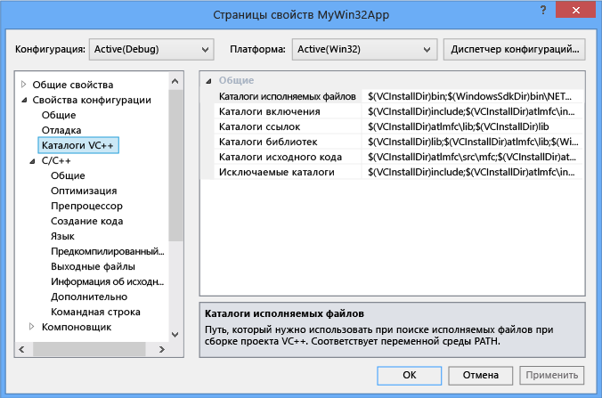
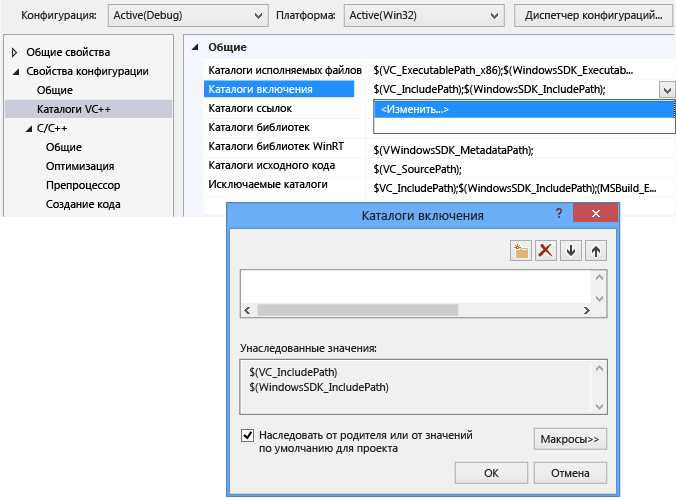
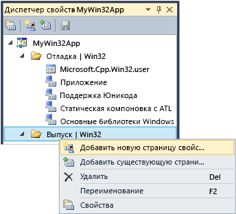

# <a name="working-with-project-properties"></a>Работа со свойствами проектов
В Интегрированной среде разработки все сведения, необходимые для построения проекта представляется как *свойства*. Эти сведения включают имя приложения, расширение (например, DLL, exe-ФАЙЛ, LIB), параметры компилятора, параметры компоновщика, параметры отладчика, настраиваемые этапы построения и многих других параметров. Как правило, используется *страницы свойств* ( **проекта &#124; Свойства**) для просмотра и изменения этих свойств. 
  
 При создании проекта система присваивает значения для различных свойств. Значения по умолчанию варьируются в зависимости от типа проекта и доступные параметры, выберите в мастере приложений. Например, проект ATL имеет свойства, относящиеся к файлам MIDL, но они отсутствуют в простое консольное приложение. На вкладке "Общие" на странице свойств отображаются свойства по умолчанию:  
  
   
  
 Некоторые свойства, такие как имя приложения применяются для всех вариантов сборки, независимо от целевой платформы и является ли оно сборки отладки или выпуска. Однако большинство свойств, зависят от конфигурации. Это потому, что компилятор должен знать, какой конкретной платформы, будет запускаться программа на и какие определенного компилятора параметры для использования, чтобы создавать правильный код. Таким образом при установке свойства, очень важно следить за какая конфигурация и платформа, новое значение следует применять к. Следует применить только для сборок отладки Win32 или его также необходимо применить к отладке ARM и отладки x64? Например **оптимизации** , по умолчанию задано значение **Максимальная скорость (/ O2)** в конфигурации выпуска, но отключен в конфигурации отладки.  
  
 Страницы свойств разработаны, чтобы всегда можно просмотреть, и при необходимости изменить, какая конфигурация и платформа значение свойства следует применять для. На следующем рисунке показаны страницы свойств с конфигурацией и сведения о платформе в полях со списком в верхней. Когда **оптимизации** свойство задано, оно будет применяться только к построений отладки Win32, который является активной конфигурации с красными стрелками, как показано.  
  
   
  
 На следующем рисунке на одной странице свойств проекта, но конфигурация изменилась выпуска. Обратите внимание на различные свойства оптимизации. Также Обратите внимание, что активная конфигурация по-прежнему отладки. Можно задать свойства для каждой конфигурации он не должен быть активным.  
  
   
  
 Сама система проект основан на MSBuild, которая определяет форматы файлов и правила для создания проектов любого типа. MSBuild управляет значительную часть сложности построения для нескольких платформ и конфигураций, но вам необходимо понять немного о его работе. Это особенно важно в том случае, если вы хотите определить пользовательские конфигурации или создания повторно используемых наборов свойств, которые можно совместно использовать и импортировать в несколько проектов.  
  
 Свойства проекта хранятся непосредственно в файле проекта (*.vcxproj) или в других файлах XML или с расширением PROPS, что импорта файла в проекте и задать значения по умолчанию. Как показано выше, для такой же конфигурации одно и то же свойство можно назначить другое значение в разных файлах. При построении проекта модуль MSBuild оценивает файл проекта и все файлы, импортированные в строго определенном порядке (как описано ниже). Как вычисляется каждый файл, все значения свойств, определенных в этом файле переопределяют существующие значения. Все значения, которые не указаны, наследуются от файлов, которые ранее были оценены. Таким образом при установке свойства с помощью страниц свойств, важно также следует обратить внимание, где значение. Если задать свойство «X» в файле с расширением PROPS, но задано значение «Y» в файле проекта, проект будет построен со свойством, имеющим значение «Y». Если же свойство равно «Z» для элемента проекта, например CPP-файл, модуль MSBuild использует значение «Z». Дополнительные сведения см. в разделе [наследование свойств](#bkmkPropertyInheritance) далее в этой статье.  
  
## <a name="build-configurations"></a>Конфигурации построения  
 Конфигурация представляет произвольный группы, имя свойства. Visual Studio предоставляет конфигураций отладки и выпуска и каждого задаются различные свойства, необходимые для сборки отладки или выпуска. Можно использовать **Configuration Manager** для определения пользовательских конфигураций — удобный способ свойства группы для определенной версии сборки. Диспетчер свойств используется для расширенного работать со свойствами, но мы представим его здесь так помогают визуализировать конфигураций свойств. Доступ к его из **представление &#124;  Диспетчер свойств** или **представление &#124; Другие окна &#124; Диспетчер свойств** в зависимости от настроек. Он имеет узлов для каждой пары конфигурации и платформы в проекте. В каждом из этих узлов являются узлами для страниц свойств (с расширением PROPS-файлы), задать некоторые свойства, определенные для этой конфигурации.  
  
   
  
 Если перейти к вкладке "Общие" на странице свойств (см. на приведенном выше рисунке) и задайте свойство набор символов для «Не установлено» вместо «Используйте Unicode» и нажмите кнопку **ОК**, диспетчер свойств будет отображаться не **поддержка Юникода** свойств для текущей конфигурации, но он будет по-прежнему находиться в нем для других конфигураций.  
  
 Дополнительные сведения о диспетчере свойств и страницы свойств см. в разделе [создание повторно используемым конфигурациям свойств](#bkmkPropertySheets) далее в этой статье.  
  
> [!TIP]
>  User-файл — это устаревший компонент, и мы рекомендуем удалить для обновления свойств правильно, сгруппированные по конфигурации и платформы.  
  
## <a name="target-platforms"></a>Целевые платформы  
 *Целевая платформа* ссылается на тип устройства и/или операционной системы, в которой будет выполняться исполняемый файл. Можно построить проект для нескольких платформ. Доступные целевые платформы для проектов C++ зависят от вида проекта; они включают, но не ограничиваются Win32, x64, ARM, Android и iOS.     **X86** целевой платформы, которые могут выводиться в **Configuration Manager** идентична **Win32** в собственных проектах C++. 32-разрядной версии Windows означает Win32 и **x64** означает 64-разрядной версии Windows. Дополнительные сведения об этих двух платформ см. в разделе [под управлением 32-разрядных приложений](https://msdn.microsoft.com/library/windows/desktop/aa384249\(v=vs.85\).aspx).  
  
 **Любой ЦП** целевое значение платформы, которые могут выводиться в **Configuration Manager** не влияет на собственных проектах C++; это уместно в C + +/ CLI и .NET других типов проектов. Дополнительные сведения см. в разделе [Параметр /CLRIMAGETYPE (указание типа образа среды CLR)](../build/reference/clrimagetype-specify-type-of-clr-image.md).  
  
## <a name="property-pages"></a>страницы свойств  
 Как уже говорилось ранее, система проектов Visual C++ основана на [MSBuild](/visualstudio/msbuild/msbuild-properties) и значения хранятся в файле проекта XML по умолчанию файлы с расширением PROPS и .targets. Для Visual Studio 2015, эти файлы расположены в **\Program Files (x86)\MSBuild\Microsoft.Cpp\v4.0\V140**. Для Visual Studio 2017 г., эти файлы расположены в  **\\Program Files (x86)\\Microsoft Visual Studio\\2017 г.\\_edition_\\Common7\\ Интегрированная среда разработки\\VC\\VCTargets**, где _выпуск_ установлен выпуск Visual Studio. Свойства также хранятся все файлы с расширением PROPS пользовательские, можно добавить собственный проект. Настоятельно рекомендуется, можно не изменять эти файлы вручную и вместо этого используйте страницы свойств в среде разработки для изменения всех свойств, особенно тех, которые участвуют в наследовании, если нет очень хорошее представление о MSBuild.  
  
 На следующем рисунке показаны страницы свойств для проекта Visual C++. В левой области **каталоги VC ++***правило* выбран, и в правой части перечислены свойства, связанные с этим правилом. `$(...)` Значения к сожалению, называются *макросы*. Это *не* макросы C/C++, но константы просто во время компиляции. Макросы рассматриваются в [макрос страницы свойств](#bkmkPropertiesVersusMacros) далее в этой статье.)  
  
   
  
> [!WARNING]
>  **Общие свойства** конфигураций в более ранних версиях Visual Studio были удалены. Чтобы добавить ссылку на проект, теперь использовать **добавить ссылку** диалогового окна таким же образом, как и для управляемых языков. В разделе [управление ссылками в проекте](/visualstudio/ide/managing-references-in-a-project).  
  
#### <a name="to-set-a-property-for-a-project"></a>Задание свойства проекта  
  
1.  Для большинства сценариев можно задать свойства на уровне проекта без создания пользовательских свойств. В главном меню выберите **проекта &#124; Свойства**, или щелкните правой кнопкой мыши узел проекта в **обозревателе решений** и выберите **свойства**.  
  
2.  Используйте **конфигурации** и **платформы** списком в верхней части диалоговым окном, чтобы указать, какие группы свойств следует применить изменения. Во многих случаях **все платформы** и **все конфигурации** целесообразно. Чтобы задать свойства только для некоторых конфигураций, выберите несколько свойств в **диспетчер свойств**, откройте контекстное меню и выберите **свойства**.  
  
 **Страницы свойств** диалоговом окне отображаются только страницы свойств, которые применяются к текущему проекту. Например, если проект не содержит IDL-файл, страница свойств MIDL не отображается.  
  
 При выборе свойства на странице свойств, можно нажать клавишу **F1** для перехода в справочном разделе Дополнительные сведения о соответствующий ключ компилятора или компоновщика.  
  
 Дополнительные сведения о каждой странице свойств можно найти в следующих разделах:  
  
-   [Страница свойств "Общие" (проект)](../ide/general-property-page-project.md)  
  
-   [Страница свойств "Общие" (файл)](../ide/general-property-page-file.md)  
  
-   [Страницы свойств командной строки](../ide/command-line-property-pages.md)  
  
-   [Параметры проекта для конфигурации отладки C++](/visualstudio/debugger/project-settings-for-a-cpp-debug-configuration)  
  
-   [Страница свойств NMake](../ide/nmake-property-page.md)  
  
-   [Страницы свойств компоновщика](../ide/linker-property-pages.md)  
  
-   [Страницы свойств ресурсов](../ide/resources-property-pages.md)  
  
-   [Страницы свойств MIDL](../ide/midl-property-pages.md)  
  
-   [Страница свойств веб-ссылок](../ide/web-references-property-page.md)  
  
-   [Страница свойств "Инструмент создания XML-данных"](../ide/xml-data-generator-tool-property-page.md)  
  
## <a name="to-quickly-browse-and-search-all-properties"></a>Быстрый просмотр и поиск всех свойств  
 **Все параметры** страницы свойств (под **свойства конфигурации &#124; C/C++** узел в **страницы свойств** диалоговое окно) предоставляет быстрый способ просмотра и поиска свойств, доступных в текущем контексте. Она имеет специальное поле поиска и простой синтаксис, который помогает отфильтровать результаты.  
  
 Без префикса:  
 поиск только в именах свойств (подстрока без учета регистра).  
  
 "/" или "-":  
 поиск только в параметрах компилятора (префикс без учета регистра)  
  
 v:  
 поиск только в значениях (подстрока без учета регистра).  
  
##  <a name="bkmkPropertiesVersusMacros"></a>Макрос страницы свойств  
 Объект *макрос* является константой во время компиляции, который может ссылаться на значение, определенное в Visual Studio или MSBuild системой или пользователем значение. Использование макросов вместо жестко заданных значений, таких как пути к каталогам, упрощает совместное использование параметров свойств на разных компьютерах и в разных версиях Visual Studio, а также позволяет гарантировать, что параметры проекта правильно участвуют в наследовании свойств. Для просмотра значений всех доступных макросов можно использовать редактор свойств.  
  
### <a name="predefined-macros"></a>Предустановленные макросы  
 глобальные макросы  
 Применяются ко всем элементам в конфигурации проекта. Синтаксис: `$(name)`. Пример глобального макроса — свойство `$(VCInstallDir)`, которое сохраняет корневой каталог установки Visual Studio. Глобальный макрос соответствует элементу `PropertyGroup` в MSBuild.  
  
 макросы элементов  
 Синтаксис: `%(name)`. В случае файла макрос элемента применяется только к этому файлу — для примера можно использовать `%(AdditionalIncludeDirectories)`, чтобы определить каталоги, которые применяются только к конкретному файлу. Этот тип макроса элемента соответствует метаданным `ItemGroup` в MSBuild. При использовании в контексте конфигурации проекта макрос элемента применяется ко всем файлам определенного типа. Например, C/C++ **определения препроцессора** свойство конфигурации может занять `%(PreprocessorDefinitions)` макрос элемента, который применяется ко всем cpp-файлам в проекте. Этот тип макроса элемента соответствует метаданным `ItemDefinitionGroup` в MSBuild. Дополнительные сведения см. в разделе [Определения элементов](/visualstudio/msbuild/item-definitions).  
  
### <a name="user-defined-macros"></a>Пользовательские макросы  
 Можно создать *пользовательские макросы* для использования в качестве переменных в сборках проекта. Например, можно создать пользовательский макрос, предоставляющий значение пользовательскому шагу сборки или пользовательскому средству сборки. Пользовательский макрос — это пара "имя-значение". В файле проекта используется **$(***имя***)** нотации для доступа к значению.  
  
 Пользовательский макрос хранится на странице свойств. Если проект еще не содержит страницу свойств, можно создать его, выполнив следующие шаги в разделе [создание повторно используемым конфигурациям свойств](#bkmkPropertySheets).  
  
##### <a name="to-create-a-user-defined-macro"></a>Создание пользовательского макроса  
  
1.  В **диспетчер свойств** окна (в строке меню выберите **представление**, **диспетчер свойств**), откройте контекстное меню для страницы свойств (ее имя расширение User) и нажмите кнопку Свойства. **Страницы свойств** откроется диалоговое окно для данной страницы свойств.  
  
2.  В левой области диалогового окна выберите **пользовательские макросы**. В области справа выберите **добавить макрос** кнопку, чтобы открыть **добавить пользовательский макрос** диалоговое окно.  
  
3.  В диалоговом окне задайте имя и значение для макроса. При необходимости установите **задание данного макроса в качестве переменной среды в среде построения** флажок.  
  
## <a name="property-editor"></a>Редактор свойств  
 Редактор свойств можно использовать для изменения некоторых строковых свойств и выбора макросов в качестве значений. Чтобы открыть редактор свойств, выберите свойство на странице свойств, а затем нажмите кнопку со стрелкой вниз справа. Если в раскрывающемся списке содержатся  **\<Правка >**, вы можете выбрать ее, чтобы открыть редактор свойств для данного свойства.  
  
   
  
 В редакторе свойств можно выбрать **макросы** кнопку, чтобы просмотреть доступные макросы и их текущие значения. На следующем рисунке показан редактор свойств для **Дополнительные каталоги включаемых файлов** свойство после **макросы** нажатия кнопки. Когда **наследовать от родителя или проекта по умолчанию** флажок и добавьте новое значение, оно добавляется ко всем значениям, которые в данный момент наследуются. Если снять флажок, новое значение заменяет наследуемые значения. В большинстве случаев следует не снимать этот флажок.  
  
 ![Редактор свойств, Visual C# 43; &#43; ] (../ide/media/propertyeditorvc.png "PropertyEditorVC")  
  
##  <a name="bkmkPropertySheets"></a>Создание повторно используемым конфигурациям свойств  
 Хотя свойства можно задавать "глобально" для каждого пользователя и для каждого компьютера, мы больше не рекомендуем это делать. Вместо этого рекомендуется использовать **диспетчер свойств** для создания *свойств* для хранения параметров для каждого типа проекта, который вы хотите иметь возможность повторно или совместно с другими разделами. Страницы свойств также уменьшают вероятность случайного изменения значений свойств для других типов проектов. Страницы свойств будут рассмотрены более подробно [создание повторно используемым конфигурациям свойств](#bkmkPropertySheets).  
  
> [!IMPORTANT]
>  **User-файлы и почему они проблемы**  
>   
>  В последних версиях Visual Studio использовались глобальные страницы свойств с расширением имени файла User, которые были расположены в \<профиль_пользователя > \AppData\Local\Microsoft\MSBuild\v4.0\ папки. Мы больше не рекомендуем использовать эти файлы, поскольку они определяют свойства для конфигураций проектов для каждого пользователя и для каждого компьютера. Такие "глобальные" параметры могут конфликтовать со сборками, особенно при использовании нескольких целевых платформ на компьютере сборки. Например, при наличии одновременно проекта MFC и проекта Windows Phone свойства USER будут недопустимыми для одного из них. Многократно используемые страницы свойств обеспечивают большую гибкость и надежность.  
>   
>  Хотя USER-файлы по-прежнему устанавливаются средой Visual Studio и участвуют в наследовании свойств, по умолчанию они являются пустыми. Рекомендуется удалить ссылку на эти файлы в **диспетчер свойств** чтобы гарантировать проектов независимо от конкретного пользователя, параметры для каждого компьютера это важно для обеспечения правильного поведения в SCC (исходный код среда управления).  
  
 Для отображения **диспетчер свойств**, в строке меню выберите **представление**, **другие окна**, **диспетчер свойств**.  
  
 Если имеется общий, часто используемый набор свойств, которые требуется применить к нескольким проектам, можно использовать **диспетчер свойств** их можно записать в повторно используемый *свойств* файл, который по соглашению имеет расширение имени файла props. Эту страницу можно применять к новым проектам, чтобы исключить необходимость в задании свойств с нуля. Чтобы получить доступ к **диспетчер свойств**, в строке меню выберите **представление**, **диспетчер свойств**.  
  
   
  
 Из каждого узла конфигурации отобразятся узлы для каждой страницы свойств, который применяется к этой конфигурации. Система добавляет страницы свойств, которые заданы значения в зависимости от параметров, выбранных в мастере приложений при создании проекта. Щелкните правой кнопкой мыши любой узел и выберите свойства, чтобы просмотреть свойства, применяемые к этому узлу. Все страницы свойств, автоматически импортируются в окно «главный» свойств проекта (ms.cpp.props) и оцениваются в порядке их следования в диспетчере свойств. Можно переместить их можно изменять порядок вычисления. Страницы свойств, которые вычисляются позже переопределяют значения в ранее вычисленный листов.  
  
 При выборе **добавить новую страницу свойств проекта** и затем выбрать, например, страницу свойств myprops.props, диалоговое окно страницы свойств откроется. Обратите внимание, что оно относится к странице свойств MyProps; все вносимые изменения записываются на эту страницу, а не в файл проекта (с расширением VCXPROJ).  
  
 Свойства на странице свойств переопределяются, если то же свойство задано непосредственно в VCXPROJ-файле.  
  
 Страницу свойств можно импортировать любое количество раз. Несколько проектов в решении могут наследовать параметры от одной страницы свойств, и проект может иметь несколько страниц. Страница свойств сама может наследовать параметры от другой страницы свойств.  
  
 Также можно создать одну страницу свойства для нескольких конфигураций. Для этого создайте страницу свойств для каждой конфигурации, откройте контекстное меню для одной из них, выберите **добавить существующую страницу свойств**, а затем добавьте другие страницы. Однако при использовании одной общей страницы свойств следует иметь в виду, что, устанавливая свойство, вы задаете его для всех конфигураций, к которым применяется соответствующая страница, и интегрированная среда разработки не указывает, какие проекты или другие страницы свойств наследуют от данной страницы свойств.  
  
 В больших решениях, которые будут содержать много проектов, имеет смысл создать страницу свойств на уровне решения. При добавлении проекта к решению используйте **диспетчер свойств** для добавления этой страницы свойств для проекта. При необходимости можно добавить новую страницу свойств на уровне проекта для задания значений, относящихся к данному проекту.  
  
> [!IMPORTANT]
>  По умолчанию PROPS-файл не участвует в системе управления версиями, поскольку он не создается как элемент проекта. Если требуется включить этот файл в систему управления версиями, можно вручную добавить его как элемент решения.  
  
#### <a name="to-create-a-property-sheet"></a>Создание страницы свойств  
  
1.  В строке меню выберите **представление**, **диспетчер свойств**. **Диспетчер свойств** открывается.  
  
2.  Чтобы определить область страницы свойств, выберите элемент, к которому она применяется. Это может быть определенная конфигурация или другая страница свойств. Откройте контекстное меню для этого элемента, а затем выберите **добавить новую страницу свойств проекта**. Укажите имя и расположение.  
  
3.  В **диспетчер свойств**, откройте новое окно свойств и задайте свойства, которые требуется включить.  
  
##  <a name="bkmkPropertyInheritance"></a>Наследование свойств  
 Свойства проекта имеют многоуровневую структуру. Каждый уровень наследует значения предыдущего уровня, но унаследованное значение может быть переопределено путем явного задания свойства. Ниже представлено базовое дерево наследования.  
  
1.  Параметры по умолчанию из набора инструментов CPP системы MSBuild (..\Program Files\MSBuild\Microsoft.Cpp\v4.0\Microsoft.Cpp.Default.props, импортируемый VCXPROJ-файлом).  
  
2.  Страницы свойств.  
  
3.  VCXPROJ-файл (может переопределять параметры по умолчанию и параметры страницы свойств).  
  
4.  Метаданные элементов.  
  
> [!TIP]
>  На странице свойств, свойства в `bold` определяется в текущем контексте. Свойство в обычном шрифте наследуется.  
  
 Файл проекта (VCXPROJ) импортирует другие страницы свойств во время сборки. После завершения импорта страниц свойств вычисляется файл проекта, и в нем используется последнее определение любого значения свойства. Иногда полезно просмотреть развернутый файл, чтобы определить, как наследуется значение данного свойства. Для просмотра развернутой версии введите следующую команду в командной строке Visual Studio (замените заполнители на конкретные имена файлов).  
  
 **msbuild /pp:** *temp* **.txt** *myapp* **.vcxproj**  
  
 Развернутые файлы проекта могут быть большими и трудными для понимания, если пользователь не знаком с MSBuild. Ниже представлена основная структура файла проекта.  
  
1.  Основные свойства проекта, которые не представлены в интегрированной среде разработки.  
  
2.  Импорт файла Microsoft.cpp.default.props, который определяет некоторые базовые, независимые от набора инструментов свойства.  
  
3.  Глобальные свойства конфигурации (в виде **PlatformToolset** и **проекта** свойства по умолчанию на **общие конфигурации** страницы. Эти свойства определяют, какие страницы свойств наборов инструментов и встроенные страницы свойств будут импортироваться из файла Microsoft.cpp.props на следующем шаге.  
  
4.  Импорт файла Microsoft.cpp.props, который задает большинство значений проекта по умолчанию.  
  
5.  Импорт всех страниц свойств, включая USER-файлы. Эти страницы свойств могут переопределить все значения, кроме **PlatformToolset** и **проекта** свойства по умолчанию.  
  
6.  Остальная часть свойств конфигурации проекта. Эти значения могут переопределять значения, заданные на страницах свойств.  
  
7.  Элементы (файлы) вместе с связанными с ними метаданными. Эти элементы всегда используются последними в правилах вычисления MSBuild, даже если появляются до других свойств и импортов.  
  
 Дополнительные сведения см. в разделе [Свойства MSBuild](/visualstudio/msbuild/msbuild-properties).  
  
## <a name="adding-an-include-directory-to-the-set-of-default-directories"></a>Добавление каталога включения к набору каталогов по умолчанию  
 При добавлении каталога включения в проект важно не переопределить все каталоги по умолчанию. Правильный способ добавления каталога — Добавить новый путь, например «C:\MyNewIncludeDir\"и затем добавить **$(IncludePath)** макрос на значение свойства.  
  
## <a name="setting-environment-variables-for-a-build"></a>Задание переменных среды для сборки  
 Компилятор Visual C++ (cl.exe ) распознает определенные переменные среды, в частности LIB, LIBPATH, PATH и INCLUDE. При построении интегрированную среду разработки, свойства, которые заданы в [страница свойств каталогов VC ++](../ide/vcpp-directories-property-page.md) страницы свойств используются для задания этих переменных среды. Если значения LIB, LIBPATH, и ВКЛЮЧАЕТ уже заданы, например с помощью командной строки разработчика, они заменяются значениями соответствующих свойств MSBuild. Сборка затем добавляет значение свойства каталогов исполняемых файлов "Каталоги VC++" в начало переменной PATH. Можно задать переменную среды, определяемых пользователем создать пользовательский макрос и затем установить флажок **задание данного макроса в качестве переменной среды в среде построения**.  
  
## <a name="setting-environment-variables-for-a-debugging-session"></a>Задание переменных среды для сеанса отладки  
 В левой части проекта **страницы свойств** диалогового окна разверните **свойства конфигурации** , а затем выберите **Отладка**. 
  
 В правой области измените **среды** или **Объединение среды** параметры проекта и выберите **ОК** кнопки.  

## <a name="modifying-properties-and-targets-without-changing-the-project-file"></a>Изменение свойств и целевых объектов, не изменяя файл проекта
Можно переопределить свойства проекта и целевых объектов из командной строки MSBuild без изменения файла проекта. Это полезно в том случае, если вы хотите применить некоторые свойства временно или время от времени. Предполагается знание MSBuild. Дополнительные сведения см. в разделе [MSBUild](https://docs.microsoft.com/en-us/visualstudio/msbuild/msbuild).

> [!IMPORTANT]
> Редактор XML в Visual Studio или любой текстовый редактор для создания файла с расширением PROPS или .targets. Не используйте **диспетчер свойств** в этом сценарии, так как он добавляет свойства в файл проекта.

*Чтобы переопределить свойства проекта:*
- Создайте файл с расширением PROPS, задающий набор свойств, который требуется переопределить. 
- В командной строке: задать ForceImportBeforeCppTargets="C:\sources\my_props.props»
 
*Чтобы переопределить целевых объектов проекта:*
1) Создайте файл с расширением TARGETS с их реализации или конкретного целевого объекта
2) В командной строке: задать ForceImportAfterCppTargets = «C:\sources\my_target.targets»
 
Также можно задать любой из параметров в командной строке msbuild с помощью параметра/p::

```cmd
> msbuild myproject.sln /p:ForceImportBeforeCppTargets="C:\sources\my_props.props" 
> msbuild myproject.sln /p:ForceImportAfterCppTargets="C:\sources\my_target.targets" 
```  

Переопределение свойств и целевых объектов в этом случае эквивалентна добавлению следующие операторы imports ко всем файлам VCXPROJ-файл в решении:

```cmd 
<Import Project=="C:\sources\my_props.props" />
<Import Project="$(VCTargetsPath)\Microsoft.Cpp.targets" />
<Import Project==" C:\sources\my_target.targets"" />
```  

## <a name="see-also"></a>См. также  
 [Создание и управление проектов Visual C++](../ide/creating-and-managing-visual-cpp-projects.md) [VCXPROJ-файл и с расширением PROPS файла структуры](vcxproj-file-structure.md) [свойства страницы XML-файлы](property-page-xml-files.md)