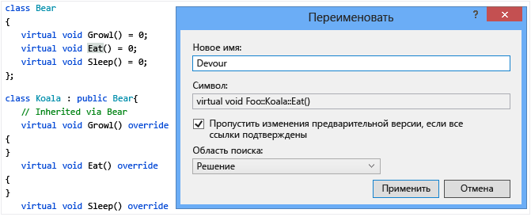
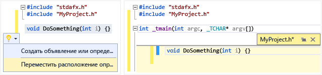
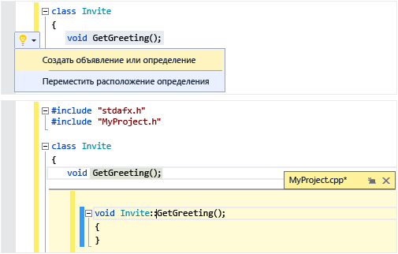
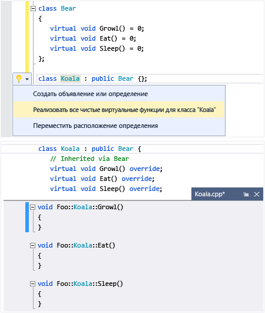
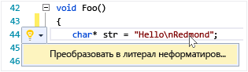
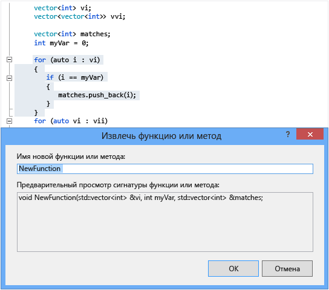

# Написание и рефакторинг кода (C++)
[!INCLUDE[vs2017banner](../assembler/inline/includes/vs2017banner.md)]

Редактор кода Visual C\+\+ и IDE предоставляют различные вспомогательные средства кодирования.  Одни уникальны для C\+\+, а другие фактически одинаковы для всех языков Visual Studio.  Параметры для включения и настройки этих функций находятся в диалоговом окне «Текстовый редактор, C\+\+, Дополнительно» \(**Сервис &#124; Параметры &#124; Текстовый редактор &#124; C\/C\+\+ &#124; Дополнительно** или введите «C\+\+ Дополнительно» на панели **быстрого запуска**\).  Чтобы получить дополнительную справку после выбора параметра, который вы хотите задать, выделите диалоговое окно и нажмите клавишу **F1**.  Для получения общих параметров форматирования кода введите `Editor C++ (Редактор C++)` в поле **QuickLaunch**.  
  
## Добавление нового кода  
 После создания проекта можно начать кодирование в созданных файлах.  Чтобы добавить новые файлы, щелкните правой кнопкой мыши узел проектов в обозревателе решений и последовательно выберите **Добавить &#124; Новый**.  
  
 Чтобы задать параметры форматирования, например отступы, завершение скобок и раскраску, введите `C++ Formatting (Форматирование C++)` в окне **QuickLaunch**.  
  
### IntelliSense  
 IntelliSense — это название набора функций, предоставляющих встроенные сведения о членах, типах и перегрузке функций.  На следующем рисунке показан раскрывающийся список членов, отображаемый при вводе данных на клавиатуре.  Для ввода выбранного текста элемента в файл кода можно нажать клавишу TAB.  
  
   
  
 Дополнительные сведения см. в разделе [Visual C\+\+ Intellisense](../Topic/Visual%20C++%20Intellisense.md).  
  
### Вставка фрагментов  
 Фрагмент — это предварительно определенная часть исходного кода.  Щелкните правой кнопкой мыши одну точку или выбранный текст для вставки фрагмента или размещения выбранного текста внутри фрагмента.  На следующем рисунке показана процедура размещения выбранного оператора в цикле for.  На последнем изображении желтым цветом выделены редактируемые поля, доступ к которым осуществляется с помощью клавиши TAB.  Подробнее см. в разделе [Фрагменты кода](../Topic/Code%20Snippets.md).  
  
   
  
### Добавить класс  
 Добавление нового класса из меню **Проект** с помощью мастера классов.  
  
   
  
### Мастер классов  
 Изменение или проверка существующего класса либо добавление нового класса с помощью мастера классов.  Дополнительные сведения см. в разделе [Добавление функциональных возможностей с помощью мастеров кода \(C\+\+\)](../ide/adding-functionality-with-code-wizards-cpp.md).  
  
   
  
## Рефакторинг  
 Рефакторинг доступен в контекстном меню быстрых действий. Или можно щелкнуть [лампочку](../Topic/Perform%20quick%20actions%20with%20light%20bulbs.md) в редакторе.  
  
### Переименовать  
 Переименование типа, функции либо переменной везде, где она используется в заданной области.  На следующем рисунке метод `Eat` будет переименован в `Devour` в производном и базовом классах.  
  
   
  
### Быстрое действие: расположение определения перехода  
 Перемещение одного или нескольких определений функций в файл заголовка, имя которого совпадает с именем файла кода.  Если заголовок не существует, создается новый заголовок.  Полученные определения отображаются как встроенные в окне показа.  
  
   
  
### Быстрое действие: создать объявление или определение  
 Создание одного или нескольких определений в связанном файле кода для выбранных объявлений заголовка.  
  
   
  
### Быстрое действие: реализовать все чистые виртуальные функции для класса  
 Быстрое создание пустых заглушек реализации для всех унаследованных виртуальных функций в классе.  Чтобы реализовать только виртуальные функции в конкретном базовом классе, просто выделите базовый класс в объявлении производного класса.  
  
   
  
### Преобразовать в необработанный строковый литерал  
 При наведении курсора на строковый литерал можно щелкнуть правой кнопкой мыши и выбрать элемент **Быстрые действия &#124; Преобразовать в необработанный строковый литерал** для преобразования обычной строки в необработанный строковый литерал на C\+\+ 11.  
  
   
  
### Извлечь функцию \(расширение Visual Studio\)  
 Для перемещения раздела кода в его собственную функцию и замены кода на вызов этой функции используйте функцию извлечения \(доступна в качестве [расширения в коллекции Visual Studio](https://visualstudiogallery.msdn.microsoft.com/a081dc8c-c805-4589-9b8b-c2c309a05789)\).  
  
   
  
## Перейти и понять  
  
### Краткие сведения  
 Наведите указатель мыши на переменную для просмотра сведений о ее типе.  Краткие сведения  
  
   
  
### Открыть документ \(Перейти к заголовку\)  
 Щелкните правой кнопкой мыши имя заголовка в директиве `#include` и откройте файл заголовка.  
  
   
  
### Показать определение  
 Наведите указатель мыши на объявление переменной или функции, щелкните правой кнопкой мыши, а затем выберите **Показать определение**, чтобы увидеть встроенное представление его определения.  Дополнительные сведения см. в разделе [Показать определение \(Alt \+ F12\)](../Topic/How%20to:%20View%20and%20Edit%20Code%20by%20Using%20Peek%20Definition%20\(Alt+F12\).md).  
  
   
  
### Перейти к определению  
 Наведите указатель мыши на объявление переменной или функции, щелкните правой кнопкой мыши, а затем выберите **Перейти к определению**, чтобы открыть документ, в котором определен объект.  
  
### Просмотр иерархии вызовов  
 Щелкните правой кнопкой мыши любой вызов функции и просмотрите рекурсивный список всех функций, которые он вызывает, а также все функции, которые вызывают его.  Каждую функцию в списке можно развернуть одинаковым образом.  Дополнительные сведения см. в разделе [Иерархия вызовов](../Topic/Call%20Hierarchy.md).  
  
   
  
### Переключение между файлами заголовков и кода  
 Щелкните правой кнопкой мыши и выберите «Переключение между файлами заголовков и кода» для переключения между файлом заголовка и связанным файлом кода.  
  
### Структура  
 Щелкните правой кнопкой мыши в любом месте файла исходного кода и выберите **Структура**, чтобы свернуть или развернуть определения и \(или\) настраиваемые области для упрощения просмотра только нужных вам частей.  Дополнительные сведения см. в разделе [Структура](../Topic/Outlining.md).  
  
   
  
### Режим карты для полосы прокрутки  
 Режим карты для полосы прокрутки позволяет быстро прокручивать и просматривать файл кода, фактически не покидая текущего расположения.  Чтобы перейти непосредственно в это расположение, можно также щелкнуть в любом месте на карте кода.  
  
   
  
### Создать диаграмму включаемых файлов  
 Щелкните правой кнопкой мыши файл кода в проекте и выберите **Создать диаграмму включаемых файлов** для просмотра диаграммы файлов, которые являются включаемыми \(из других файлов\).  
  
   
  
### Справка F1  
 Для перехода непосредственно к соответствующему справочному разделу MSDN поместите курсор на любой тип, ключевое слово или функцию \(либо сразу за ними\) и нажмите клавишу F1.  Клавиша F1 также работает для элементов в списке ошибок и в некоторых диалоговых окнах.  
  
### Быстрый запуск  
 Для быстрого перехода к любому окну или инструменту в среде Visual Studio просто введите его имя в окне «Быстрый запуск» в правом верхнем углу пользовательского интерфейса.  Список автоматического завершения будет предлагать варианты при вводе данных на клавиатуре.  
  
 