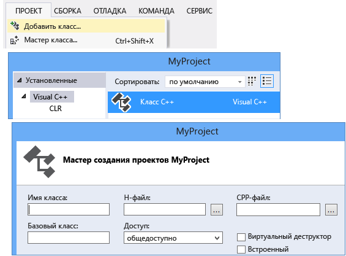
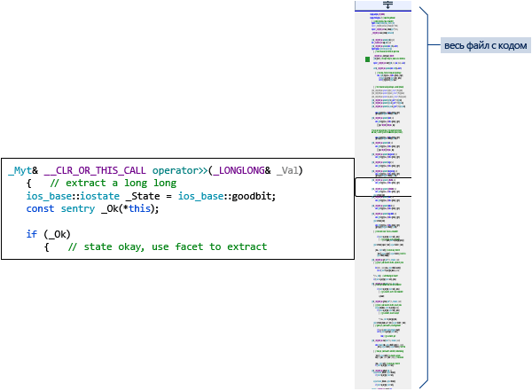

# Написание и рефакторинг кода (C++)

Редактор кода Visual C++ и IDE предоставляют различные вспомогательные средства кодирования. Одни уникальны для C++, а другие фактически одинаковы для всех языков Visual Studio. Дополнительные сведения об общих функциях см. в разделе [Написание кода в редакторе кода и текста](/visualstudio/ide/writing-code-in-the-code-and-text-editor). Параметры для включения и настройки функций C++ находятся в разделе **Сервис &#124; Параметры &#124; Текстовый редактор &#124; C/C++**. Чтобы получить дополнительную справку после выбора параметра, который вы хотите задать, выделите диалоговое окно и нажмите клавишу **F1**. Для получения общих параметров форматирования кода введите `Editor C++` в поле **QuickLaunch**.

Экспериментальные функции, которые могут присутствовать или отсутствовать в будущих версиях Visual Studio, можно найти в диалоговом окне [экспериментальных функций C++ для текстового редактора](/visualstudio/ide/reference/options-text-editor-c-cpp-experimental). В Visual Studio 2017 в этом диалоговом окне можно включить **прогнозный IntelliSense**.

## Добавление новых файлов

Чтобы добавить новые файлы в проект, щелкните правой кнопкой мыши узел проектов в обозревателе решений и выберите **Добавить &#124; Новый**.

## Параметры форматирования

Чтобы задать параметры форматирования, например отступы, завершение скобок и раскраску, введите "C++ Formatting" (Форматирование C++) в окне **QuickLaunch**. Visual Studio 2017 версий 15.7 и более поздних поддерживает ClangFormat. Вы можете настроить эту функцию в разделе **Сервис &#124; Параметры &#124; Текстовый редактор &#124; C/C++ &#124; Форматирование** на [странице свойств форматирования C/C++](/visualstudio/ide/reference/options-text-editor-c-cpp-formatting).

## IntelliSense

IntelliSense — это название набора возможностей, предоставляющих встроенные сведения о членах, типах и перегрузке возможностей. На следующем рисунке показан раскрывающийся список членов, отображаемый при вводе данных на клавиатуре. Для ввода выбранного текста элемента в файл кода можно нажать клавишу TAB.

Дополнительные сведения см. в разделе [IntelliSense для Visual C++](/visualstudio/ide/visual-cpp-intellisense).

## Вставка фрагментов

Фрагмент — это предварительно определенная часть исходного кода. Щелкните правой кнопкой мыши одну точку или выбранный текст для вставки фрагмента или размещения выбранного текста внутри фрагмента. На следующем рисунке показана процедура размещения выбранного оператора в цикле for. На последнем изображении желтым цветом выделены редактируемые поля, доступ к которым осуществляется с помощью клавиши TAB. Дополнительные сведения см. в статье [Фрагменты кода](/visualstudio/ide/code-snippets).

## Добавить класс

Добавьте новый класс из меню **Проект** с помощью мастера классов.

Можно также использовать мастер классов для изменения или просмотра существующего класса.

Дополнительные сведения см. в разделе [Добавление функциональных возможностей с помощью мастеров кода (C++)](../ide/adding-functionality-with-code-wizards-cpp.md).

## Рефакторинг

Рефакторинг доступен в контекстном меню быстрых действий. Или можно щелкнуть [лампочку](/visualstudio/ide/perform-quick-actions-with-light-bulbs) в редакторе.  Некоторые также находятся в меню **Правка > Рефакторинг**.  Эти функции включают перечисленные ниже.

* [Переименование](refactoring/rename.md)
* [Извлечение функции](refactoring/extract-function.md)
* [Реализация чистых виртуальных функций](refactoring/implement-pure-virtuals.md)
* [Создание объявления или определения](refactoring/create-declaration-definition.md)
* [Перемещение определения функции](refactoring/move-definition-location.md)
* [Преобразование в необработанный строковый литерал](refactoring/convert-to-raw-string-literal.md)
* [Изменение сигнатуры](refactoring/change-signature.md)

## Перейти и понять

Visual C++ имеет множество общих функций навигации по коду с другими языками. Дополнительные сведения см. в разделах [Навигация по коду](/visualstudio/ide/navigating-code) и [Просмотр структуры кода](/visualstudio/ide/viewing-the-structure-of-code).

## Краткие сведения

Наведите указатель мыши на переменную для просмотра сведений о ее типе.

## Открыть документ (Перейти к заголовку)

Щелкните правой кнопкой мыши имя заголовка в директиве `#include` и откройте файл заголовка.

## Показать определение

Наведите указатель мыши на объявление переменной или функции, щелкните правой кнопкой мыши, а затем выберите **Показать определение**, чтобы увидеть встроенное представление его определения. Дополнительные сведения см. в разделе [Команда "Показать определение" (ALT+F12)](/visualstudio/ide/how-to-view-and-edit-code-by-using-peek-definition-alt-plus-f12).

## Перейти к определению

Наведите указатель мыши на объявление переменной или функции, щелкните правой кнопкой мыши, а затем выберите **Перейти к определению**, чтобы открыть документ, в котором определен объект.

## Просмотр иерархии вызовов

Щелкните правой кнопкой мыши любой вызов функции и просмотрите рекурсивный список всех функций, которые он вызывает, а также все функции, которые вызывают его. Каждую функцию в списке можно развернуть одинаковым образом. Дополнительные сведения см. в разделе [Иерархия вызовов](/visualstudio/ide/reference/call-hierarchy).

## Переключение между файлами заголовков и кода

Щелкните правой кнопкой мыши и выберите **Переключение между файлами заголовков и кода** для переключения между файлом заголовка и связанным файлом кода.

## структуризация

Щелкните правой кнопкой мыши в любом месте файла исходного кода и выберите **Структура**, чтобы свернуть или развернуть определения и/или настраиваемые области для упрощения просмотра только нужных вам частей. Дополнительные сведения см. в разделе [Структура](/visualstudio/ide/outlining).

## Режим карты для полосы прокрутки

Режим карты для полосы прокрутки позволяет быстро прокручивать и просматривать файл кода, фактически не покидая текущего расположения. Чтобы перейти непосредственно в это расположение, можно также щелкнуть в любом месте на карте кода. Дополнительные сведения см. в разделе [Практическое руководство. Отслеживание кода за счет настройки полосы прокрутки](/visualstudio/ide/how-to-track-your-code-by-customizing-the-scrollbar).

## Создать диаграмму включаемых файлов

Щелкните правой кнопкой мыши файл кода в проекте и выберите **Создать диаграмму включаемых файлов** для просмотра диаграммы файлов, которые являются включаемыми (из других файлов).

## Справка F1

Чтобы перейти непосредственно к соответствующему справочному разделу на сайте docs.microsoft.com, поместите курсор на любой тип, ключевое слово или функцию (либо сразу за ними) и нажмите клавишу F1. Клавиша F1 также работает для элементов в списке ошибок и в некоторых диалоговых окнах.

## Быстрый запуск

Для быстрого перехода к любому окну или инструменту в среде Visual Studio просто введите его имя в окне «Быстрый запуск» в правом верхнем углу пользовательского интерфейса. Список автоматического завершения будет предлагать варианты при вводе данных на клавиатуре.

