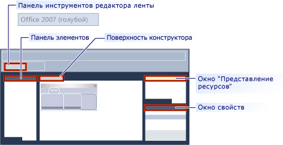

# <a name="ribbon-designer-mfc"></a>Конструктор лент (MFC)
Конструктор лент позволяет создавать и настраивать ленту в приложениях MFC. Лента — это элемент пользовательского интерфейса (UI), который объединяет команды в логические группы. Эти группы отображаются на отдельных вкладках ленты в верхней части окна. Лента заменяет меню и панели инструментов. Лента может значительно повысить удобство использования приложения. Дополнительные сведения см. в разделе [лент](http://go.microsoft.com/fwlink/p/?linkid=129233). На следующем рисунке показана лента.  
  
   
  
 В более ранних версиях Visual Studio, требовалось создать путем написания кода, который использует классы ленты MFC, такие как лент [CMFCRibbonBar класса](../mfc/reference/cmfcribbonbar-class.md). В [!INCLUDE[vs_dev10_long](../build/includes/vs_dev10_long_md.md)], конструктор лент предоставляет альтернативный метод создания лент. Во-первых, создайте и настройте ленту как ресурс. Затем загрузите ресурс ленты из кода в приложение MFC. Можно даже использовать ресурсы ленты и классы ленты MFC вместе. Например можно создать ресурс ленты и программно добавлять дополнительные элементы в его во время выполнения с помощью кода.  
  
## <a name="understanding-the-ribbon-designer"></a>Основные сведения о конструкторе лент  
 Конструктор лент создает и сохраняет ленты как ресурсы. При создании ресурса ленты конструктор лент выполняет следующие три действия.  
  
-   Добавляет запись в скрипт определения ресурсов проекта (*.rc). В следующем примере `IDR_RIBBON` — уникальное имя, идентифицирующее ресурс ленты, `RT_RIBBON_XML` — тип ресурса, а `ribbon.mfcribbon-ms` — имя файла ресурсов.  
  
 ```  
    IDR_RIBBON RT_RIBBON_XML      "res\\ribbon.mfcribbon-ms"  
 ```  
  
-   Добавляет определения идентификаторов команд в файл resource.h.  
  
 ```  
 #define IDR_RIBBON            307  
 ```  
  
-   Создает файл ресурсов ленты (*.mfcribbon-ms), который содержит XML-код, определяющий кнопки, элементы управления и атрибуты ленты. Изменения в конструкторе ленты на ленту сохраняются в файле ресурсов как XML. В следующем примере кода показана часть содержимого \*файл MFCRIBBON ms:  
  
 ```  
 <RIBBON_BAR>  
 <ELEMENT_NAME>RibbonBar</ELEMENT_NAME>  
 <IMAGE>  
 <ID>  
 <NAME>IDB_BUTTONS</NAME>  
 <VALUE>113</VALUE>  
 </ID>   
 ```  
  
 Чтобы использовать ресурс ленты в приложении MFC, загрузить ресурс путем вызова [CMFCRibbonBar::LoadFromResource](../mfc/reference/cmfcribbonbar-class.md#loadfromresource).  
  
## <a name="creating-a-ribbon-by-using-the-ribbon-designer"></a>Создание ленты с помощью конструктора лент  
 Ниже описаны два способа для добавления ресурса ленты в проект MFC.  
  
-   Создайте приложение MFC и настройте мастер проектов MFC для создания ленты. Дополнительные сведения см. в разделе [Пошаговое руководство: создание ленты приложения с помощью MFC](../mfc/walkthrough-creating-a-ribbon-application-by-using-mfc.md).  
  
-   Создайте ресурс ленты в существующем проекте MFC и загрузите его. Дополнительные сведения см. в разделе [Пошаговое руководство: обновление приложения MFC Scribble (часть 1)](../mfc/walkthrough-updating-the-mfc-scribble-application-part-1.md).  
  
 Если в проекте уже есть вручную закодированная лента, MFC предоставляет функции, которые можно использовать для преобразования существующей ленты в ресурс ленты. Дополнительные сведения см. в разделе [как: преобразование существующей ленты MFC в ресурс ленты](../mfc/how-to-convert-an-existing-mfc-ribbon-to-a-ribbon-resource.md).  
  
> [!NOTE]
>  Ленты не могут быть созданы в приложениях на базе диалоговых окон. Дополнительные сведения см. в разделе [тип приложения, мастер приложений MFC](../mfc/reference/application-type-mfc-application-wizard.md).  
  
## <a name="customizing-ribbons"></a>Настройка лент  
 Чтобы открыть ленту в конструкторе лент, дважды щелкните ресурс ленты в представлении ресурсов. В конструкторе можно добавлять, удалять и настраивать элементы на ленте, кнопку «Приложение» и панель инструментов быстрого доступа. Вы также можете привязать события, например события нажатия кнопки и события меню, к методу в приложении.  
  
 На следующем рисунке показаны различные компоненты конструктора лент.  
  
   
  
- **Панель элементов:** содержит элементы управления, которые можно перетащить в область конструктора.  
  
- **Область конструктора:** содержит визуальное представление ресурса ленты.  
  
- **Окно "Свойства":** перечислены атрибуты элемента, выбранного в области конструктора.  
  
- **Окно представления ресурсов:** отображает ресурсы, содержащие ресурсы ленты в проекте.  
  
- **Панель инструментов редактора ленты:** содержит команды, которые позволяют просмотреть ленту и изменить ее визуальную тему.  
  
 В следующих разделах описаны способы использования возможностей в конструкторе лент.  
  
- [Практическое руководство. Настройка кнопки приложения](../mfc/how-to-customize-the-application-button.md)  
  
- [Практическое руководство. Настройка панели быстрого доступа](../mfc/how-to-customize-the-quick-access-toolbar.md)  
  
- [Практическое руководство. Добавление элементов управления и обработчиков событий ленты](../mfc/how-to-add-ribbon-controls-and-event-handlers.md)  
  
- [Практическое руководство. Загрузка ресурса ленты из приложения MFC](../mfc/how-to-load-a-ribbon-resource-from-an-mfc-application.md)  
  
## <a name="definitions-of-ribbon-elements"></a>Определения элементов ленты  
   
  
- **Кнопка приложения:** кнопки, которая отображается в левом верхнем углу ленты. Кнопка «Приложение» заменяет меню «Файл» и отображается, даже если лента свернута. При нажатии этой кнопки отображается меню, которое содержит список команд.  
  
- **Панель быстрого доступа:** небольшая настраиваемая панель инструментов, отображаются часто используемые команды.  
  
- **Категория**: логическая группа, которая представляет содержимое вкладки ленты.  
  
- **Кнопка по умолчанию категории:** кнопка, которая отображается на ленте, когда лента свернута. При нажатии кнопки категория снова появляется как меню.  
  
- **Панель:** область панели ленты, где отображается группа связанных элементов управления. Каждая категория ленты содержит одну или несколько панелей ленты.  
  
- **Элементы ленты:** элементы управления в панелях, например, кнопки и поля со списком. Различные элементы управления, которые можно разместить на ленте см [пример RibbonGadgets: приложение для мини-приложения на ленте](../visual-cpp-samples.md).  
  
## <a name="see-also"></a>См. также  
 [Элементы пользовательского интерфейса](../mfc/user-interface-elements-mfc.md)   
 [Работа с файлами ресурсов](../windows/working-with-resource-files.md)

