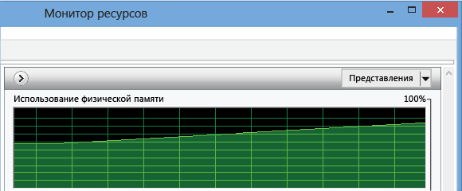
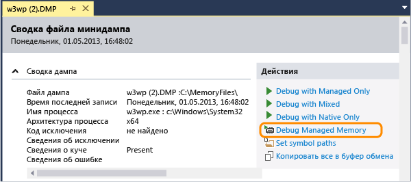
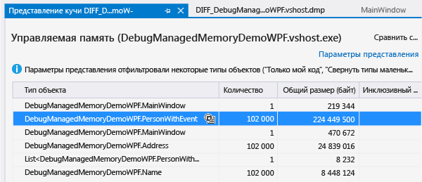
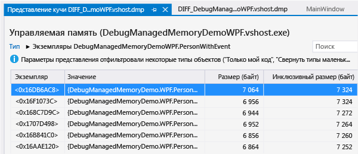
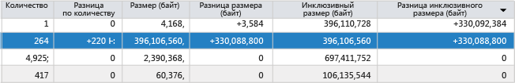

# Анализ проблем с памятью .NET Framework
С помощью анализатора управляемой памяти Visual Studio вы можете найти утечки памяти и определить неэффективное использование памяти в коде .NET Framework.  Минимальная версия .NET Framework целевого кода — .NET Framework 4.5.  
  
 Средство анализа памяти обрабатывает сведения в *файлах дампов с данными кучи* копии объектов в памяти приложения.  Вы можете собрать файлы дампа \(DMP\) в среде Visual Studio или с помощью других системных средств.  
  
-   Можно проанализировать один мгновенный снимок, чтобы понять относительное влияние типов объектов на использование памяти и найти код в приложении, который использует память неэффективно.  
  
-   Вы также можете сравнить \(*diff*\) два мгновенных снимка приложения, чтобы найти области в коде, вызывающие рост используемой памяти.  
  
 Пошаговое руководство по использованию анализатора управляемой памяти см. в записи [Использование Visual Studio 2013 для диагностики проблем с памятью .NET в производственной среде](http://blogs.msdn.com/b/visualstudioalm/archive/2013/06/20/using-visual-studio-2013-to-diagnose-net-memory-issues-in-production.aspx) блога, посвященного Visual Studio ALM и Team Foundation Server.  
  
##   Содержание  
 [Использование памяти в приложениях .NET Framework](#BKMK_Memory_use_in__NET_Framework_apps)  
  
 [Определение проблемы с памятью в приложении](#BKMK_Identify_a_memory_issue_in_an_app)  
  
 [Получение снимков памяти](#BKMK_Collect_memory_snapshots)  
  
 [Анализ использования памяти](#BKMK_Analyze_memory_use)  
  
##   Использование памяти в приложениях .NET Framework  
 .NET Framework — это среда выполнения со сборкой мусора, поэтому в большинстве приложений использование памяти не вызывает проблем.  Но в долго работающих приложениях, таких как веб\-службы и приложения, и на устройствах с ограниченным объемом памяти, накопление объектов в памяти может снизить производительность приложения и устройства.  Избыточное использование памяти может привести к дефициту ресурсов, если сборщик мусора будет запускаться слишком часто или операционной системе приходится часто перемещать данные между ОЗУ и диском.  В худшем случае приложение может завершить работу с исключением "Недостаточно памяти".  
  
 *Управляемая куча* .NET — это область виртуальной памяти, в которой хранятся ссылочные объекты, созданные приложением.  Жизненный цикл объектов контролирует сборщик мусора \(GC\).  Сборщик мусора использует ссылки для отслеживания объектов, занимающих блоки памяти.  Ссылка создается, когда объект создается и назначается переменной.  У одного объекта может быть несколько ссылок.  Например, дополнительные ссылки на объект можно создать, добавив его в класс, коллекцию или другую структуру данных или назначив объект второй переменной.  Менее очевидный способ создания ссылки — добавление обработчика в событие другого объекта.  В этом случае второй объект содержит ссылку на первый объект, пока не будет явно удален обработчик или второй объект.  
  
 Для каждого приложения сборщик мусора хранит три ссылки, отслеживающие объекты, на которые ссылается приложение.  У *дерева ссылок* есть набор корневых элементов, в том числе глобальные и статические объекты, а также связанные стеки потоков и динамические инициализируемые объекты.  Объект становится корневым, если у него есть по крайней мере один родительский объект с ссылкой на него.  Сборщик мусора может освободить память, занимаемую объектом, только если другие объекты или переменные в приложении не ссылаются на него.  
  
  [Содержание](#BKMK_Contents)  
  
##   Определение проблемы с памятью в приложении  
 Самым очевидным признаком проблем с памятью служит производительность приложения, особенно ее падение с течением времени.  Ухудшение производительности других приложений во время работы вашего приложения также может указывать на проблему с памятью.  Если вы подозреваете наличие проблемы с памятью, воспользуйтесь диспетчером задач или [монитором производительности Windows](http://technet.microsoft.com/en-us/library/cc749249.aspx) для дальнейшего анализа.  Например, посмотрите, существуют ли случаи увеличения общего объема памяти, которые вы не можете объяснить — возможно, это источник утечки памяти:  
  
   
  
 Вы также можете заметить пиковые объемы используемой памяти, которые превышают предполагаемый объем — это может указывать на неэффективное использование памяти в процедуре:  
  
   
  
##   Получение снимков памяти  
 Средство анализа памяти обрабатывает данные в *файлах дампов*, которые содержат сведения о куче.  Вы можете создать файлы дампов в Visual Studio или использовать другое средство, например [ProcDump](http://technet.microsoft.com/en-us/sysinternals/dd996900.aspx) от подразделения [Windows Sysinternals](http://technet.microsoft.com/sysinternals).  См. запись [Что такое дамп и как его создать?](http://blogs.msdn.com/b/debugger/archive/2009/12/30/what-is-a-dump-and-how-do-i-create-one.aspx) в блоге группы разработчиков отладчика Visual Studio.  
  
> [!NOTE]
>  Большинство средств могут собирать данные дампа с полными данными памяти кучи или без них.  Анализатору памяти Visual Studio требуются полные сведения о куче.  
  
 **Получение дампа в Visual Studio**  
  
1.  Вы можете создать файл дампа для процесса, запущенного из проекта Visual Studio, или можете присоединить отладчик к запущенному процессу.  См. раздел [Присоединение к выполняемым процессам](../Topic/Attach%20to%20Running%20Processes%20with%20the%20Visual%20Studio%20Debugger.md)  
  
2.  Остановите выполнение.  Отладчик остановится, если выбрать команду **Прервать все** в меню **Отладка**, или дойдет до исключения или точки останова.  
  
3.  В меню **Отладка** выберите команду **Сохранение дампа**.  Укажите расположение в диалоговом окне **Сохранение дампа** и убедитесь, что в списке **Тип файла** выбран пункт **Минидамп с кучей** \(по умолчанию\).  
  
 **Сравнение двух снимков памяти**  
  
 Для анализа роста объема используемой приложением памяти получите два файла дампа из одного экземпляра приложения.  
  
  [Содержание](#BKMK_Contents)  
  
##   Анализ использования памяти  
 [Фильтрация списка объектов](#BKMK_Filter_the_list_of_objects) **&#124;** [Анализ данных памяти из одного снимка](#BKMK_Analyze_memory_data_in_from_a_single_snapshot) **&#124;** [Сравнение двух снимков памяти](#BKMK_Compare_two_memory_snapshots)  
  
 Чтобы проанализировать файл дампа на наличие проблем с памятью:  
  
1.  В Visual Studio последовательно выберите **Файл**, **Открыть** и выберите файл дампа.  
  
2.  На странице **Сводка файла минидампа** щелкните **Отладка управляемой памяти**.  
  
       
  
 Анализатор памяти начнет сеанс отладки для анализа файла, а результаты появятся на странице "Представление кучи":  
  
  [Содержание](#BKMK_Contents)  
  
###   Фильтрация списка объектов  
 По умолчанию анализатор памяти фильтрует список объектов в снимке памяти, отображая только типы и экземпляры, относящиеся к коду пользователя, и показывая только те типы, общий инклюзивный размер которых превышает процентный порог от общего размера кучи.  Эти параметры можно изменить в списке **Параметры представления**:  
  
|||  
|-|-|  
|**Включить только мой код**|В режиме "Только мой код" основные системные объекты скрыты, поэтому в списке отображаются только типы, созданные вами.   Режим "Только мой код" также можно включить в диалоговом окне **Параметры** среды Visual Studio.  В меню **Отладка** выберите **Параметры и настройки**.  На вкладке **Отладка**\/**Общие** установите или снимите флажок **Только мой код**.|  
|**Свернуть маленькие объекты**|Параметр **Свернуть маленькие объекты** позволяет скрыть все типы, общий инклюзивный размер которых меньше 0,5 % от общего размера кучи.|  
  
 Вы также можете фильтровать список типов, введя строку в поле **Поиск**.  В списке будут показаны только типы, имена которых содержат введенную строку.  
  
  [Содержание](#BKMK_Contents)  
  
###   Анализ данных памяти из одного снимка  
 Visual Studio начнет новый сеанс отладки для анализа файла, а результаты появятся в окне "Представление кучи".  
  
   
  
  [Содержание](#BKMK_Contents)  
  
#### Таблица "Тип объекта"  
 В верхней таблице перечислены типы объектов, которые хранятся в памяти.  
  
-   В поле **Количество** отображается число экземпляров типа в снимке.  
  
-   Значение **Размер \(байт\)** — это размер всех экземпляров типа, кроме размера объектов, на которые он ссылается.  Поле  
  
-   **Инклюзивный размер \(байт\)** содержит размер объектов, на которые указаны ссылки.  
  
 Вы можете выбрать значок экземпляров \(\) в столбце **Тип объекта**, чтобы просмотреть список экземпляров этого типа.  
  
#### Таблица экземпляров  
   
  
-   **Экземпляр** — это расположение объекта в памяти, которое служит идентификатором объекта.  
  
-   В поле **Значение** показано фактическое значение типа.  Можно навести указатель мыши на имя ссылочного типа, чтобы просмотреть его значения в подсказке.  
  
       
  
-   Значение **Размер \(байт\)** — это размер объекта, кроме размера объектов, на которые он ссылается.  Поле  
  
-   **Инклюзивный размер \(байт\)** содержит размер объектов, на которые указаны ссылки.  
  
 По умолчанию типы и экземпляры сортируются по полю **Инклюзивный размер \(байт\)**.  Выберите заголовок столбца в списке, чтобы изменить порядок сортировки.  
  
#### Пути к корню  
  
-   Для типа, выбранного в таблице **Тип объекта**, в таблице **Пути к корню** отображаются уникальные иерархии типа, которые ведут к корневым объектам для всех объектов этого типа, а также число ссылок на тип, расположенных над ним в иерархии.  
  
-   Для объекта, выбранного в списке экземпляров типа, в таблице **Пути к корню** отображается граф фактических объектов, содержащих ссылку на этот экземпляр.  Можно навести указатель мыши на имя объекта, чтобы просмотреть его значения в подсказке.  
  
#### Ссылочные типы и объекты  
  
-   Для типа, выбранного в таблице **Тип объекта**, на вкладке **Ссылочные типы** отображается размер и число ссылочных типов, которые содержатся во всех объектах выбранного типа.  
  
-   Для выбранного экземпляра типа на вкладке **Ссылочные типы** отображаются объекты, содержащиеся в выбранном экземпляре.  Можно навести указатель мыши на имя, чтобы просмотреть значения в подсказке.  
  
 **Циклические ссылки**  
  
 Объект может ссылаться на второй объект, который напрямую или косвенно содержит ссылку на первый объект.  Если анализатор памяти обнаруживает такую ситуацию, он прекращает расширение ссылочного пути и добавляет строку **\[Обнаружен цикл\]** в описание первого объекта и останавливает работу.  
  
 **Корневые типы**  
  
 Анализатор памяти добавляет к корневым объектам комментарии с описанием ссылки, которые содержатся в объектах:  
  
|Комментарий|Описание|  
|-----------------|--------------|  
|**Статическая переменная** `VariableName`|Статическая переменная.  `VariableName` — имя переменной.|  
|**Дескриптор завершения**|Ссылка из очереди метода завершения|  
|**Локальная переменная**|Локальная переменная.|  
|**Строгий дескриптор**|Дескриптор строгой ссылки из таблицы дескрипторов объектов.|  
|**Асинх.  Закрепленный дескриптор**|Асинхронный закрепленный объект из таблицы дескрипторов объектов.|  
|**Зависимый дескриптор**|Зависимый объект из таблицы дескрипторов объектов.|  
|**Закрепленный дескриптор**|Закрепленная строгая ссылка из таблицы дескрипторов объектов.|  
|**Дескриптор RefCount**|Объект с подсчетом ссылок из таблицы дескрипторов объектов.|  
|**Дескриптор SizedRef**|Строгая ссылка, хранящая приблизительный размер общего закрытия всех объектов и корневых объектов во время сборки мусора.|  
|**Закрепленная локальная переменная**|Закрепленная локальная переменная.|  
  
###   Сравнение двух снимков памяти  
 Вы можете сравнить два файла дампа процесса, чтобы найти объекты, которые могут вызывать утечку памяти.  Интервал между сбором первого \(более раннего\) и второго \(более позднего\) файла должен быть достаточно большим, чтобы увеличение числа потерянных объектов было очевидным.  Сравнение двух файлов  
  
1.  Откройте второй файл дампа и щелкните **Отладка управляемой памяти** на странице **Сводка файла минидампа**.  
  
2.  На странице отчета анализа памяти откройте список **Выберите базовый уровень** и нажмите кнопку **Обзор**, чтобы выбрать первый файл дампа.  
  
 Анализатор добавляет столбцы в верхнюю область отчета, в которых отображается разница между значениями полей **Количество**, **Размер** и **Инклюзивный размер** типов и соответствующих значений в более раннем снимке.  
  
   
  
 Также в таблицу **Пути к корню** добавляет столбец **Разница числа ссылок**.  
  
  [Содержание](#BKMK_Contents)  
  
## См. также  
 [Блог VS ALM TFS. Использование Visual Studio 2013 для диагностики проблем с памятью .NET в производственной среде](http://blogs.msdn.com/b/visualstudioalm/archive/2013/06/20/using-visual-studio-2013-to-diagnose-net-memory-issues-in-production.aspx)   
 [Channel 9 &#124; Visual Studio TV &#124; Анализ управляемой памяти](http://channel9.msdn.com/Series/Visual-Studio-2012-Premium-and-Ultimate-Overview/Managed-Memory-Analysis)   
 [Channel 9 &#124; Visual Studio Toolbox &#124; Анализ управляемой памяти в Visual Studio 2013](http://channel9.msdn.com/Shows/Visual-Studio-Toolbox/Managed-Memory-Analysis-in-Visual-Studio-2013)