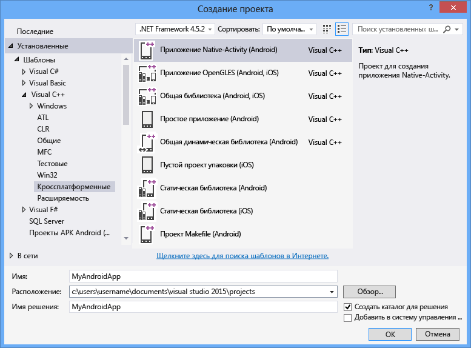

# Создание кроссплатформенных приложений с помощью Visual C++
Вы можете создать кроссплатформенный код для устройств Android, iOS и Windows, используя Visual C\+\+ для разработки кроссплатформенных мобильных приложений.  Это необязательный компонент, доступный в Visual Studio 2015, который обеспечивает поддержку кроссплатформенной разработки кода для iOS, Android и Windows с помощью Visual C\+\+.  
  
 Вы можете использовать Visual Studio для создания общих библиотек стандартного кода C\+\+ для классических приложений Windows, универсальных приложений Windows, а также для платформ iOS и Android.  Вы можете создавать собственные приложения для платформ Windows и Android, используя только инструменты Visual C\+\+ и сторонние средства, встроенные в Visual Studio.  Если у вас компьютер Mac, вы можете использовать Visual Studio для создания и отладки кода C\+\+ для приложений iOS, собранных и развернутых на Mac.  
  
> [!NOTE]
>  Без дополнительной настройки Visual C\+\+ для кроссплатформенной мобильной разработки поддерживает API Android уровней 19 и 21 и ориентирован на Android 4.4 и 5.0.  Другие уровни API можно установить с помощью диспетчера пакета SDK.  Отладчик Visual Studio C\+\+ Android требует, чтобы на целевых эмуляторах или устройствах выполнялись API Android уровня 17 \(версия 4.2\) или выше.  
  
 В этой статье описывается, как начать создавать кроссплатформенные приложения с помощью Visual C\+\+ для разработки кроссплатформенных мобильных приложений в Visual Studio 2015:  
  
 [Требования](#req)   
 [Получение инструментов](#GetTools)  
 [Создание нового проекта Android Native Activity](#Create)  
 [Сборка и запуск приложения Android Native Activity](#BuildHello)  
  
##   Требования  
  
-   Требования к установке см. в статье [Требования к системе для Visual Studio 2015](https://www.visualstudio.com/visual-studio-2015-system-requirements-vs).  
  
    > [!IMPORTANT]
    >  Если вы используете Windows 7 или Windows Server 2008 R2, вы можете писать код для классических приложений Windows, приложений и библиотек кода для Android Native Activity, а также приложений и библиотек кода для iOS, но не для приложений Магазина Windows и универсальных приложений Windows.  
  
 Применительно к построению специфических платформ устройств существует несколько дополнительных требований:  
  
-   Для эмулятора Visual Studio для Android и эмуляторов Windows Phone требуется компьютер, на котором можно запустить Hyper\-V.  Дополнительные сведения см. в разделе [Системные требования эмулятора](http://msdn.microsoft.com/ru-ru/4d5bb438-231a-4cd2-84b7-e9660b0e3baf).  
  
-   Эмуляторы Android x86, поставляемые с пакетом Android SDK, лучше всего работают на компьютерах, где может выполняться драйвер Intel HAXM.  Этот драйвер требует процессора Intel x64 с VT\-x и поддержкой Execute Disable Bit.  Дополнительные сведения см. в статье [Инструкции по установке ПО Intel® Hardware Accelerated Execution Manager — Microsoft Windows](http://go.microsoft.com/fwlink/p/?LinkId=536385).  
  
-   Создание приложений для iOS требует наличия учетной записи iOS Developer Program и компьютера Mac, на котором может выполняться Xcode 6.  
  
##   Получение инструментов  
 Visual C\+\+ для разработки кроссплатформенных мобильных приложений — это необязательный компонент, включенный в Visual Studio 2015.  Для получения Visual Studio перейдите на страницу [загрузки Visual Studio 2015](http://go.microsoft.com/fwlink/?linkid=517106) и скачайте Visual Studio 2015.  
  
 Установщик Visual Studio 2015 включает в себя компонент, обеспечивающий поддержку разработки кроссплатформенных мобильных приложений.  Эта возможность подразумевает установку среды разработки мобильных приложений Visual C\+\+ и следующих общих средств и пакетов SDK.  В основном это программное обеспечение с открытым исходным кодом, необходимое для поддержки кроссплатформенной разработки.  
  
-   Для процесса сборки Android требуется набор Android Native Development Kit \(R10E, 32\-разрядный\).  
  
-   Для процесса сборки Android требуются наборы Android SDK, Apache Ant и Java SE Development Kit.  
  
-   Эмулятор Microsoft Visual Studio для Android — это быстрый и эффективный эмулятор для разработки приложений Android.  
  
 Подробные инструкции по установке см. в статье [Установка Visual C\+\+ для разработки кроссплатформенных мобильных приложений](../Topic/Install%20Visual%20C++%20for%20Cross-Platform%20Mobile%20Development.md).  
  
 Чтобы создать код для iOS, потребуется установить и настроить удаленный агент сборки на компьютере Mac и подключиться к нему в Visual Studio.  Подробные инструкции по установке и настройке см. в статье [Установка и настройка средств для разработки с помощью iOS](../Topic/Install%20And%20Configure%20Tools%20to%20Build%20using%20iOS.md).  
  
##   Создание нового проекта Android Native Activity  
 Вы можете использовать Visual C\+\+ для разработки кроссплатформенных мобильных приложений, чтобы создать, собрать, запустить и отладить полное приложение Android с помощью C\+\+.  Visual Studio включает шаблон для проекта Android Native Activity, который поможет начать работу.  
  
 В этом руководстве вы сначала создадите новый проект, а затем выполните сборку и запуск приложения по умолчанию.  
  
 Перед тем как вы сможете создать новый проект, убедитесь, что выполнены все требования к системе и установлен Visual C\+\+ для разработки кроссплатформенных мобильных приложений для Visual Studio.  Дополнительные сведения см. в статье [Установка Visual C\+\+ для разработки кроссплатформенных мобильных приложений](../Topic/Install%20Visual%20C++%20for%20Cross-Platform%20Mobile%20Development.md).  
  
#### Создание нового проекта  
  
1.  Запустите Visual Studio.  В строке меню выберите **Файл**, **Создать**, **Проект**.  
  
2.  В диалоговом окне **Новый проект** в меню **Шаблоны** щелкните пункт **Visual C\+\+**, **Кроссплатформенное приложение**, а затем выберите шаблон **Приложение Native\-Activity \(Android\)**.  
  
3.  Назначьте приложению имя, например `MyAndroidApp`, а затем нажмите кнопку **ОК**.  
  
       
  
     Visual Studio создаст новое решение и откроет обозреватель решений.  
  
 В новое решение приложения Android Native Activity входят два проекта.  
  
-   **MyAndroidApp.NativeActivity** содержит ссылки и связующий код для запуска приложения как приложения Native Activity на Android.  Реализация точек входа из связующего кода находится в файле main.cpp.  Предварительно откомпилированные заголовки находятся в файле pch.h.  Ваш проект приложения компилируется в общую библиотеку \(SO\-файл\), которая передается в проект упаковки.  
  
-   **MyAndroidApp.Packaging** создает пакет \(APK\-файл\) для развертывания на устройстве или в эмуляторе Android.  Он содержит ресурсы и файл AndroidManifest.xml, в котором задаются свойства манифеста.  В него также входит XML\-файл, управляющий процессом сборки Ant.  По умолчанию он задан как начальный проект, который можно развернуть и запустить непосредственно из Visual Studio.  
  
##   Сборка и запуск приложения Android Native Activity  
 Разработайте и запустите приложение, созданное шаблоном, чтобы проверить установку и настройку.  По умолчанию шаблон задает конфигурацию решения "отладка" и платформу решения x86, чтобы запусткать приложения в эмуляторе Microsoft Visual Studio для Android.  Если вы предпочитаете тестировать приложение на другой платформе, загрузите целевой эмулятор или подключите устройство к компьютеру.  
  
#### Сборка и запуск приложения Native Activity по умолчанию  
  
1.  В строке меню последовательно выберите **Сборка** и **Собрать решение**.  
  
     В окне **Выходные данные** отображаются выходные данные процесса сборки для двух проектов в решении.  
  
2.  Выберите один из профилей эмулятора Visual Studio в качестве цели развертывания.  
  
     Если вы установили другие эмуляторы или подключили устройство Android, то можете выбрать их в раскрывающемся списке платформы развертывания.  
  
3.  Нажмите клавишу F5 для запуска процесса отладки или Shift \+ F5 для запуска без отладки.  
  
     Вот как выглядит приложение по умолчанию в эмуляторе Visual Studio для Android.  
  
       
  
    > [!TIP]
    >  Visual Studio запускает эмулятор, который за несколько секунд загружает и развертывает код.  После запуска приложения можно задать точки останова и использовать отладчик для проверки кода, языковых стандартов и контрольных значений.  
  
4.  Для останова процесса отладки нажмите Shift \+ F5.  
  
     Эмулятор является отдельным процессом, который продолжает выполняться.  Вы можете изменять, компилировать и развертывать код несколько раз в одном эмуляторе.  
  
## См. также  
 [Скачать Visual Studio 2015](http://go.microsoft.com/fwlink/?linkid=517106)