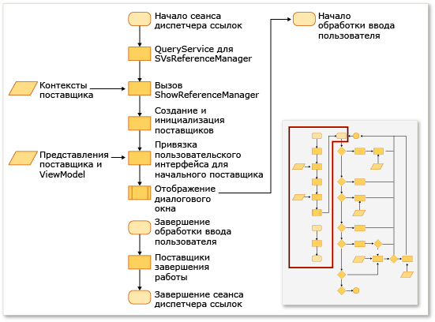
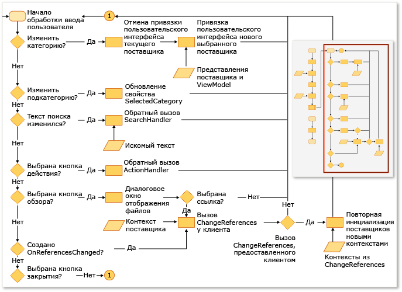

# Расширение диспетчера ссылок
С помощью диспетчера ссылок в расширении Visual Studio можно добавлять ссылки в проект. Перед открытием диспетчера ссылок проекты должны настроить его для отображения данных из правильных местоположений. Например, проект, предназначенный для [!INCLUDE[net_v40_short](../misc/includes/net_v40_short_md.md)], должен заполнять сборки из папки, отличной от папки проекта, предназначенного для [!INCLUDE[net_v35_long](../misc/includes/net_v35_long_md.md)].  
  
 Обычно диспетчер ссылок настраивается с помощью коллекции ProviderContexts из следующих поставщиков.  
  
-   <xref:Microsoft.VisualStudio.Shell.Interop.IVsAssemblyReferenceProviderContext>  
  
-   <xref:Microsoft.VisualStudio.Shell.Interop.IVsComReferenceProviderContext>  
  
-   <xref:Microsoft.VisualStudio.Shell.Interop.IVsFileReferenceProviderContext>  
  
-   <xref:Microsoft.VisualStudio.Shell.Interop.IVsProjectReferenceProviderContext>  
  
-   <xref:Microsoft.VisualStudio.Shell.Interop.IVsPlatformReferenceProviderContext>  
  
 Клиентский компонент отображает диспетчер ссылок путем вызова метода ShowReferenceManager в службе Visual Studio, которая называется SVsReferenceManager. Коллекция классов IVsReferenceProviderContext передается в этот метод в качестве аргумента. Эти контексты определяют, какие вкладки отображаются в левой части диалогового окна диспетчера ссылок. Каждый поставщик содержит все сведения, необходимые для заполнения и отображения в диалоговом окне данных, которые вам требуются для добавления ссылки в проект.  
  
 Этот процесс показан на рисунке ниже.  
  
   
  
   
  
## Добавление настраиваемой вкладки  
 Чтобы добавить настраиваемую вкладку, необходимо реализовать IReferenceProvider, IVsReference и IVsReferenceProviderContext.  
  
#### Добавление настраиваемой вкладки  
  
1.  Реализуйте интерфейс IReferenceProvider, а затем с помощью Managed Extensibility Framework \(MEF\) экспортируйте его для использования в диспетчере ссылок.  
  
     Диспетчер ссылок использует объект ReferenceProvider для создания элементов, отображаемых в диспетчере ссылок. Интерфейс для этого объекта задается в библиотеке Microsoft.VisualStudio.ReferenceManager.Contracts.dll.  
  
2.  Реализуйте объект ProviderContext.  
  
     Диспетчер ссылок используется свойство GUID этого объекта для сопоставления контекста с поставщиком. При инициализации диспетчера ссылок он передает поставщику объект ProviderContext с помощью метода ShowReferenceManager. Объект ProviderContext должен содержать все сведения, необходимые поставщику для перечисления IVsReferences.  
  
3.  Расширьте класс StandardReferenceProviderContext.  
  
     Диспетчер ссылок предоставляет несколько базовых классов, таких как класс StandardReferenceProviderContext, которые можно использовать для начала работы. Ваш класс поставщика может расширить StandardReferenceProvider, а элемент ссылки может расширить StandardReferenceItem.  
  
 Класс поставщика может выглядеть как в следующем примере.  
  
```  
[Export(typeof(IReferenceProvider))] [ExportMetadata("Name", "AssemblyReferenceProvider")] [ExportMetadata("Guid", VSConstants.AssemblyReferenceProvider_string)] internal class AssemblyReferenceProvider : StandardReferenceProvider { }  
```  
  
 Класс контекста может выглядеть как в следующем примере.  
  
```  
  
[Export(typeof(IVsReferenceProviderContext))] [Export(typeof(IVsAssemblyReferenceProviderContext))] [Export("AssemblyReferenceProviderContext", typeof(IVsReferenceProviderContext))] [Export(VSConstants.AssemblyReferenceProvider_string, typeof(IVsReferenceProviderContext))] [PartCreationPolicy(System.ComponentModel.Composition.CreationPolicy.NonShared)] [ExportMetadata("Name", "AssemblyReferenceProviderContext")] [ExportMetadata("Guid", VSConstants.AssemblyReferenceProvider_string)] public class AssemblyReferenceProviderContext : StandardReferenceProviderContext<IVsAssemblyReference, AssemblyIdentity>, IVsAssemblyReferenceProviderContext { }  
```  
  
 Для класса элемента ссылки рекомендуется реализовать IWatchableReference и сделать класс сериализуемым. При таком подходе вы можете воспользоваться преимуществами методов сериализации кеша в классе StandardReferenceProvider в дополнение к службе ReferenceWatcher, которая автоматически синхронизирует пометки элементов между разными вкладками в диалоговом окне.  
  
```  
[Serializable] public class StandardReferenceItem : IWatchableReference { }  
```  
  
 Класс ReferenceProvider содержит два важных метода. Первый метод — это Initialize, который вызывается только один раз, когда выполняется первая загрузка поставщика в диалоговое окно. Второй метод — SetContext, который вызывается сразу после Initialize, но может вызываться снова, если произошел сбой системы проектов при добавлении какой\-либо из указанных ссылок и попытке фиксации изменений.  
  
> [!NOTE]
>  Поскольку поставщики сохраняются в течение всего срока программы, они могут сохранять состояние между сеансами, но если пользователь закрывает диалоговое окно и быстро открывает его снова, может возникнуть состояние гонки.  
  
## Переопределение существующего источника перечисления вкладок  
 Некоторые контексты поставщика имеют свойство с именем Tabs \(Вкладки\) и типом uint. Это свойство является битовой маской, и от его значений зависит, какие вкладки будет отображать данный поставщик.  Например, интерфейс IVsAssemblyReferenceProviderContext определяет свойство "Вкладки", для которого можно задать следующие значения:  
  
```  
namespace Microsoft.VisualStudio.Shell.Interop { public enum __VSASSEMBLYPROVIDERTAB { TAB_ASSEMBLY_FRAMEWORK = 1, TAB_ASSEMBLY_EXTENSIONS = 2, TAB_ASSEMBLY_ALL = 3, } }  
```  
  
 Класс IVsPlatformReferenceProviderContext имеет аналогичное свойство. Нельзя изменить имя вкладки, но можно задать текст заголовка, который будет отображаться при выборе пользователем этой вкладки. Этим значением можно управлять через следующие методы в классе IVsAssemblyProviderContext:  
  
```  
void SetTabTitle(uint etabId, string szTabTitle);  
```  
  
## Переопределение фильтра в диалоговом окне "Обзор"  
 Вы можете предоставить настраиваемый фильтр по типу в диалоговое окно "Обзор" в диспетчере ссылок, изменив значение свойства BrowseFilter объекта IFileReferenceProviderContext.  В следующем примере демонстрируется этот способ из машинного кода:  
  
```  
  
// Holds a list of provider contexts CComSafeArray<LPUNKNOWN> spProviderContexts; // Creates the file reference context for Browse vsReferenceManager->CreateProviderContext(GUID_FileReferenceProvider, &pFileRefProviderContext)); // Sets the Browse filter pFileRefProviderContext->put_BrowseFilter(wszFilter); spProviderContexts.Add(pFileRefProviderContext); // Show the reference manager hr = srpRefMgr->ShowReferenceManager( spVsRefMgrUser, spProviderContexts, strTitle, HELPKEYWORD_AddReference, GUID_AssemblyReferenceProvider, wszFilter, m_bstrStartBrowse);  
```  
  
## См. также  
 [Практическое руководство. Добавление и удаление ссылок с помощью диспетчера ссылок](../Topic/How%20to:%20Add%20or%20Remove%20References%20By%20Using%20the%20Reference%20Manager.md)