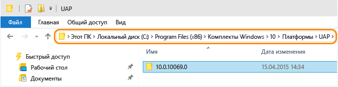

# Перенос приложений на универсальную платформу Windows (UWP)
Вручную внесите необходимые изменения в существующие файлы проектов для приложений Магазина Windows 8.1, Windows Phone 8.1 или универсальных приложений Windows, созданных с помощью версии\-кандидата Visual Studio 2015, чтобы их можно было использовать в окончательной первоначальной версии Visual Studio 2015. \(Если у вас есть универсальное приложение Windows 8.1 с проектом приложения Windows и проектом Windows Phone, инструкции по миграции нужно будет выполнить для каждого проекта.\)  
  
 Универсальная платформа Windows позволяет создавать приложения, предназначенные для одного или нескольких семейств устройств. Чтобы получить дополнительную информацию об универсальных приложениях Windows, ознакомьтесь с этим [руководством по платформе](https://msdn.microsoft.com/library/windows/apps/dn894631.aspx).  
  
-   [Перенос существующего приложения Магазина Windows 8.1 или приложения для Windows Phone 8.1 на языке C\# или Visual Basic](#MigrateCSharp) на универсальную платформу Windows.  
  
-   [Перенос существующего приложения Магазина Windows 8.1 или приложения для Windows Phone 8.1 на языке C\+\+](#MigrateCPlusPlus) на универсальную платформу Windows.  
  
-   [Изменения, которые необходимо внести для существующих универсальных приложений Windows, созданных с помощью версии\-кандидата Visual Studio 2015](#PreviousVersions).  
  
-   [Изменения, которые необходимо внести для существующих проектов модульных тестов универсальных приложений Windows, созданных с помощью версии\-кандидата Visual Studio 2015](#MigrateUnitTest).  
  
 Если вы не хотите вносить все эти изменения, узнайте, как [перенести существующие приложения](http://msdn.microsoft.com/library/windows/apps/xaml/mt238321.aspx) в новый проект универсального приложения Windows.  
  
##  <a name="MigrateCSharp"></a> Перенос существующего приложения Магазина Windows 8.1 или приложения для Windows Phone 8.1 на языке C\# или Visual Basic на универсальную платформу Windows  
  
#### Перенос файлов проекта C\# или Visual Basic  
  
1.  Чтобы определить установленную универсальную платформу Windows, откройте следующую папку: **\\Program Files \(x86\)\\Windows Kits\\10\\Platforms\\UAP**. Она содержит список папок для каждой установленной универсальной платформы Windows. Имя папки соответствует версии установленной универсальной платформы Windows. Например, для устройства с ОС Windows 10 устанавливается универсальная платформа Windows версии 10.0.10240.0.  
  
       
  
     Можно установить несколько версий универсальной платформы Windows. Мы рекомендуем использовать последнюю версию для вашего приложения.  
  
2.  Используя проводник, перейдите в папку, где хранится проект UWP. Создайте JSON\-файл в этой папке. Назовите файл project.json, а затем добавьте в него следующее содержимое.  
  
    ```json  
    { "dependencies": { "Microsoft.ApplicationInsights": "1.0.0", "Microsoft.ApplicationInsights.PersistenceChannel": "1.0.0", "Microsoft.ApplicationInsights.WindowsApps": "1.0.0", "Microsoft.NETCore.UniversalWindowsPlatform": "5.0.0" }, "frameworks": { "uap10.0": {} }, "runtimes": { "win10-arm": {}, "win10-arm-aot": {}, "win10-x86": {}, "win10-x86-aot": {}, "win10-x64": {}, "win10-x64-aot": {} } }  
  
    ```  
  
3.  Создайте файл default.rd.xml с приведенным ниже содержимым. Если у вас есть проект Visual Basic, добавьте этот файл в каталог My Project проекта. Если у вас есть проект C\#, добавьте этот файл в каталог Properties проекта.  
  
    ```xml  
    <?xml version="1.0"?> <!-- This file contains Runtime Directives used by .NET Native. The defaults here are suitable for most developers. However, you can modify these parameters to modify the behavior of the .NET Native optimizer. Runtime Directives are documented at http://go.microsoft.com/fwlink/?LinkID=391919 To fully enable reflection for App1.MyClass and all of its public/private members <Type Name="App1.MyClass" Dynamic="Required All"/> To enable dynamic creation of the specific instantiation of AppClass<T> over System.Int32 <TypeInstantiation Name="App1.AppClass" Arguments="System.Int32" Activate="Required Public" /> Using the Namespace directive to apply reflection policy to all the types in a particular namespace <Namespace Name="DataClasses.ViewModels" Seralize="All" /> --> <Directives xmlns="http://schemas.microsoft.com/netfx/2013/01/metadata"><Application> <!-- An Assembly element with Name="*Application*" applies to all assemblies in the application package. The asterisks are not wildcards. --> <Assembly Dynamic="Required All" Name="*Application*"/> <!-- Add your application specific runtime directives here. --> </Application></Directives>  
    ```  
  
4.  Откройте решение, которое содержит существующее приложение Магазина Windows 8.1 или приложение для Windows Phone 8.1, в Visual Studio.  
  
5.  В обозревателе решений щелкните существующий проект приложения правой кнопкой мыши и выберите пункт **Выгрузить проект**. После выгрузки проекта щелкните его файл правой кнопкой мыши еще раз и выберите команду изменения файла CSPROJ или VBPROJ.  
  
       
  
6.  Найдите элемент \<PropertyGroup\>, который содержит элемент \<TargetPlatformVersion\> со значением 8.1. Для этого элемента \<PropertyGroup\> выполните указанные ниже действия.  
  
    1.  Установите для элемента \<Platform\> значение **x86**.  
  
    2.  Добавьте элемент \<TargetPlatformIdentifier\> и присвойте ему значение **UAP**.  
  
    3.  Измените текущее значение элемента \<TargetPlatformVersion\> на установленную версию универсальной платформы Windows. Кроме того, добавьте элемент \<TargetPlatformMinVersion\> и присвойте ему такое же значение.  
  
    4.  Измените значение элемента \<MinimumVisualStudioVersion\> на **14**.  
  
    5.  Замените элемент \<ProjectTypeGuids\>, как показано ниже.  
  
         Для C\#:  
  
        ```xml  
        <ProjectTypeGuids>{A5A43C5B-DE2A-4C0C-9213-0A381AF9435A};{FAE04EC0-301F-11D3-BF4B-00C04F79EFBC}</ProjectTypeGuids>  
        ```  
  
         Для Visual Basic:  
  
        ```xml  
        <ProjectTypeGuids>{A5A43C5B-DE2A-4C0C-9213-0A381AF9435A};{F184B08F-C81C-45F6-A57F-5ABD9991F28F}</ProjectTypeGuids>  
        ```  
  
    6.  Добавьте элемент \<EnableDotNetNativeCompatibleProfile\> и присвойте ему значение **true**.  
  
    7.  Масштаб ресурса по умолчанию для универсальных приложений Windows — 200. Если проект включает ресурсы, масштаб которых отличается от 200, потребуется добавить в элемент PropertyGroup элемент \<UapDefaultAssetScale\> со значением масштаба имеющихся ресурсов. Узнайте больше о [ресурсах и масштабах](http://msdn.microsoft.com/library/jj679352.aspx).  
  
         Теперь элемент \<PropertyGroup\> должен выглядеть так, как показано в примере ниже.  
  
        ```xml  
        <PropertyGroup> … <Platform Condition=" '$(Platform)' == '' ">x86</Platform> <TargetPlatformVersion>10.0.10240.0</TargetPlatformVersion> <TargetPlatformMinVersion>10.0.10240.0</TargetPlatformMinVersion> <TargetPlatformIdentifier>UAP</TargetPlatformIdentifier> <MinimumVisualStudioVersion>14</MinimumVisualStudioVersion> <ProjectTypeGuids>{A5A43C5B-DE2A-4C0C-9213-0A381AF9435A};{FAE04EC0-301F-11D3-BF4B-00C04F79EFBC}</ProjectTypeGuids> <EnableDotNetNativeCompatibleProfile>true</EnableDotNetNativeCompatibleProfile> <UapDefaultAssetScale>100</UapDefaultAssetScale> … </PropertyGroup>  
        ```  
  
7.  Замените все вхождения значения 12.0 на значение 14.0 в соответствии с версией Visual Studio, которая теперь используется. Например:  
  
    ```xml  
    <Project Tools Version="14.0" DefaultTargets="Build" xmlns="http://schemas.microsoft.com/developer/msbuild/2003">  
    ```  
  
    ```  
    <PropertyGroup Condition=" '$(VisualStudioVersion)' == '' or '$(VisualStudioVersion)' < '14.0' "> <VisualStudioVersion>14.0</VisualStudioVersion>  
    ```  
  
8.  Найдите элементы \<PropertyGroup\>, настроенные для платформы AnyCPU, в составе атрибута Condition. Удалите эти элементы и все их дочерние элементы. Платформа AnyCPU не поддерживается для приложений Windows 10 в Visual Studio 2015. Например, следует удалить следующие элементы \<PropertyGroup\>:  
  
    ```xml  
    <PropertyGroup Condition=" '$(Configuration)|$(Platform)' == 'Debug|AnyCPU' "> <PlatformTarget>AnyCPU</PlatformTarget> <DebugSymbols>true</DebugSymbols> <DebugType>full</DebugType> <Optimize>false</Optimize> <OutputPath>bin\Debug\</OutputPath> <DefineConstants>DEBUG;TRACE;NETFX_CORE;WINDOWS_UAP</DefineConstants> <ErrorReport>prompt</ErrorReport> <WarningLevel>4</WarningLevel> </PropertyGroup> <PropertyGroup Condition=" '$(Configuration)|$(Platform)' == 'Release|AnyCPU' "> <PlatformTarget>AnyCPU</PlatformTarget> <DebugType>pdbonly</DebugType> <Optimize>true</Optimize> <OutputPath>bin\Release\</OutputPath> <DefineConstants>TRACE;NETFX_CORE;WINDOWS_UAP</DefineConstants> <ErrorReport>prompt</ErrorReport> <WarningLevel>4</WarningLevel> </PropertyGroup>  
    ```  
  
9. Для каждого оставшегося элемента \<PropertyGroup\> проверьте, имеет ли он атрибут Condition с конфигурацией выпуска. Если имеет, но не содержит элемент \<UseDotNetNativeToolchain\>, добавьте его. Присвойте элементу \<UseDotNetNativeToolchain\> значение true, как показано ниже.  
  
    ```xml  
    <PropertyGroup Condition="'$(Configuration)|$(Platform)' == 'Release|x64'"> <OutputPath>bin\x64\Release\</OutputPath> <DefineConstants>TRACE;NETFX_CORE;WINDOWS_UAP</DefineConstants> <Optimize>true</Optimize> <NoWarn>;2008</NoWarn> <DebugType>pdbonly</DebugType> <PlatformTarget>x64</PlatformTarget> <UseVSHostingProcess>false</UseVSHostingProcess> <ErrorReport>prompt</ErrorReport> <Prefer32Bit>true</Prefer32Bit> <UseDotNetNativeToolchain>true</UseDotNetNativeToolchain> </PropertyGroup>  
    ```  
  
10. Для проектов Windows Phone удалите элемент \<PropertyGroup\>, содержащий элемент \<TargetPlatformIdentifier\> со значением WindowsPhoneApp. Также удалите все его дочерние элементы.  
  
    ```xml  
    <PropertyGroup Condition=" '$(TargetPlatformIdentifier)' == '' "> <TargetPlatformIdentifier>WindowsPhoneApp</TargetPlatformIdentifier> </PropertyGroup>  
    ```  
  
11. Найдите элемент \<ItemGroup\>, содержащий элемент \<AppxManifest\>. Добавьте следующий элемент \<None\> в качестве дочернего элемента для элемента \<ItemGroup\>.  
  
    ```xml  
    <None Include="project.json" />  
    ```  
  
12. Найдите элемент \<ItemGroup\>, содержащий другие активы, добавляемые в проект, например PNG\-файлы логотипов \(\<Content Include\="Assets\\Logo.scale\-100.png" \/\>\). Добавьте в этот элемент \<ItemGroup\> следующий дочерний элемент \<Content\>:  
  
     **Для C\#:**  
  
    ```xml  
    <Content Include="Properties\default.rd.xml" />  
    ```  
  
     **Для Visual Basic:**  
  
    ```xml  
    <Content Include="My Project\default.rd.xml" />  
    ```  
  
13. Найдите элемент \<ItemGroup\>, который содержит дочерние элементы элемента ссылки \(\<Reference\>\) на пакеты NuGet. Запишите пакеты NuGet, которые вы использовали, так как их потребуется загрузить с помощью диспетчера пакетов NuGet после перезагрузки проекта. Удалите этот элемент \<ItemGroup\> вместе с его дочерними элементами. Например, проект UWP может содержать следующие пакеты NuGet, которые необходимо удалить.  
  
    ```xml  
    <ItemGroup> <Reference Include="Microsoft.ApplicationInsights, Version=0.14.3.177, Culture=neutral, PublicKeyToken=31bf3856ad364e35, processorArchitecture=MSIL"> <HintPath>..\packages\Microsoft.ApplicationInsights.0.14.3-build00177\lib\portable-win81+wpa81\Microsoft.ApplicationInsights.dll</HintPath> <Private>True</Private> </Reference> <Reference Include="Microsoft.ApplicationInsights.Extensibility.Windows, Version=0.14.3.177, Culture=neutral, PublicKeyToken=31bf3856ad364e35, processorArchitecture=MSIL"> <HintPath>..\packages\Microsoft.ApplicationInsights.WindowsApps.0.14.3-build00177\lib\win81\Microsoft.ApplicationInsights.Extensibility.Windows.dll</HintPath> <Private>True</Private> </Reference> <Reference Include="Microsoft.ApplicationInsights.PersistenceChannel, Version=0.14.3.186, Culture=neutral, PublicKeyToken=31bf3856ad364e35, processorArchitecture=MSIL"> <HintPath>..\packages\Microsoft.ApplicationInsights.PersistenceChannel.0.14.3-build00177\lib\portable-win81+wpa81\Microsoft.ApplicationInsights.PersistenceChannel.dll</HintPath> <Private>True</Private> </Reference> <Reference Include="System.Numerics.Vectors, Version=4.0.0.0, Culture=neutral, PublicKeyToken=b03f5f7f11d50a3a, processorArchitecture=MSIL"> <HintPath>..\packages\System.Numerics.Vectors.4.0.0\lib\win8\System.Numerics.Vectors.dll</HintPath> <Private>True</Private> </Reference> <Reference Include="System.Numerics.Vectors.WindowsRuntime, Version=4.0.0.0, Culture=neutral, PublicKeyToken=b03f5f7f11d50a3a, processorArchitecture=MSIL"> <HintPath>..\packages\System.Numerics.Vectors.4.0.0\lib\win8\System.Numerics.Vectors.WindowsRuntime.dll</HintPath> <Private>True</Private> </Reference> </ItemGroup>  
    ```  
  
14. Сохраните изменения.  
  
15. Закройте файл CSPROJ или VBPROJ.  
  
16. Щелкните проект правой кнопкой мыши в обозревателе решений и выберите в контекстном меню команду "Перезагрузить проект". Все файлы проекта теперь должны отображаться в обозревателе решений.  
  
17. Используйте диспетчер NuGet, чтобы снова добавить в проект пакеты, удаленные в предыдущем шаге.  
  
     Теперь необходимо выполнить инструкции по [обновлению файлов манифеста пакета](#PackageManifest) для всех проектов для Магазина Windows 8.1 и Windows Phone 8.1.  
  
##  <a name="MigrateCPlusPlus"></a> Перенос существующего приложения Магазина Windows 8.1 или приложения для Windows Phone 8.1 на языке C\+\+ на универсальную платформу Windows  
  
#### Перенос файлов проекта C\+\+  
  
1.  Чтобы определить установленную универсальную платформу Windows, откройте следующую папку: **\\Program Files \(x86\)\\Windows Kits\\10\\Platforms\\UAP**. Она содержит список папок для каждой установленной универсальной платформы Windows. Имя папки соответствует версии установленной универсальной платформы Windows. Например, для устройства с ОС Windows 10 устанавливается универсальная платформа Windows версии 10.0.10240.0.  
  
       
  
     Можно установить несколько версий универсальной платформы Windows. Мы рекомендуем использовать последнюю версию для вашего приложения.  
  
2.  Откройте решение, которое содержит существующее приложение Магазина Windows 8.1 или приложение для Windows Phone 8.1 на языке C\+\+, в Visual Studio.  
  
     Щелкните правой кнопкой мыши существующий проект в обозревателе решений и выберите пункт **Выгрузить проект**. После выгрузки проекта щелкните его файл правой кнопкой мыши еще раз и выберите команду изменения файла VCXPROJ.  
  
       
  
3.  Найдите элемент \<PropertyGroup\>, который содержит элемент \<ApplicationTypeRevision\> со значением 8.1. Для этого элемента \<PropertyGroup\> выполните указанные ниже действия.  
  
    1.  Добавьте элемент \<WindowsTargetPlatformVersion\> и элемент \<WindowsTargetPlatformMinVersion\> и присвойте им значение установленной версии универсальной платформы Windows.  
  
    2.  Обновите значение элемента ApplicationTypeRevision с 8.1 до 10.0.  
  
    3.  Измените значение элемента \<MinimumVisualStudioVersion\> на 14.  
  
    4.  Добавьте элемент \<EnableDotNetNativeCompatibleProfile\> и присвойте ему значение true.  
  
    5.  Масштаб ресурса по умолчанию для универсальных приложений Windows — 200. Если проект включает ресурсы, масштаб которых отличается от 200, потребуется добавить в элемент PropertyGroup элемент \<UapDefaultAssetScale\> со значением масштаба имеющихся ресурсов. Узнайте больше о [ресурсах и масштабах](http://msdn.microsoft.com/library/jj679352.aspx).  
  
    6.  Только для проектов Windows Phone измените значение элемента \<ApplicationType\> с Windows Phone на Windows Store.  
  
         Теперь элемент \<PropertyGroup\> должен выглядеть так, как показано в примере ниже.  
  
        ```xml  
        <PropertyGroup> … <WindowsTargetPlatformVersion>10.0.10240.0</WindowsTargetPlatformVersion> <WindowsTargetPlatformMinVersion>10.0.10240.0</WindowsTargetPlatformMinVersion> <ApplicationType>Windows Store</ApplicationType> <ApplicationTypeRevision>10.0</ApplicationTypeRevision> <MinimumVisualStudioVersion>14</MinimumVisualStudioVersion> <EnableDotNetNativeCompatibleProfile>true</EnableDotNetNativeCompatibleProfile> <UapDefaultAssetScale>100</UapDefaultAssetScale> … </PropertyGroup>  
        ```  
  
4.  Присвойте всем экземплярам элемента \<PlatformToolset\> значение v140. Примеры.  
  
    ```xml  
    <PropertyGroup Condition="'$(Configuration)|$(Platform)'=='Release|Win32'" Label="Configuration"> <ConfigurationType>Application</ConfigurationType> <UseDebugLibraries>false</UseDebugLibraries> <WholeProgramOptimization>true</WholeProgramOptimization> <PlatformToolset>v140</PlatformToolset> <UseDotNetNativeToolchain>true</UseDotNetNativeToolchain> </PropertyGroup>  
    ```  
  
5.  Для каждого оставшегося элемента \<PropertyGroup\> проверьте, имеет ли он атрибут Condition с конфигурацией выпуска. Если имеет, но не содержит элемент \<UseDotNetNativeToolchain\>, добавьте его. Присвойте элементу \<UseDotNetNativeToolchain\> значение true, как показано ниже.  
  
    ```xml  
    <PropertyGroup Condition="'$(Configuration)|$(Platform)'=='Release|X64'" Label="Configuration"> <ConfigurationType>Application</ConfigurationType> <UseDebugLibraries>false</UseDebugLibraries> <WholeProgramOptimization>true</WholeProgramOptimization> <PlatformToolset>v140</PlatformToolset> <UseDotNetNativeToolchain>true</UseDotNetNativeToolchain> </PropertyGroup>  
  
    ```  
  
6.  Сохраните изменения. Закройте файл проекта.  
  
7.  Щелкните файл проекта правой кнопкой мыши в обозревателе решений и выберите в контекстном меню команду "Перезагрузить проект". Все файлы проекта теперь должны отображаться в обозревателе решений.  
  
     Теперь необходимо выполнить инструкции по [обновлению файлов манифеста пакета](#PackageManifest) для всех проектов для Магазина Windows 8.1 и Windows Phone 8.1.  
  
##  <a name="PackageManifest"></a> Обновление файла манифеста пакета для всех проектов приложений Магазина Windows 8.1 или приложений для Windows Phone 8.1  
 Файл манифеста пакета необходимо обновить для каждого проекта в рамках решения.  
  
#### Обновление файла манифеста пакета  
  
1.  Откройте файл Package.appxmanifest в проекте. Файл Package.AppxManifest необходимо изменить для каждого проекта приложения Магазина Windows и приложения для Windows Phone.  
  
2.  Вам нужно обновить элемент \<Package\>, используя новые схемы в соответствии с типом существующего проекта. Сначала удалите указанные ниже схемы в соответствии с типом проекта \(приложение Магазина Windows или приложение для Windows Phone\).  
  
     **Прежний вариант для проекта Магазина Windows:** элемент \<Package\> выглядит следующим образом:  
  
    ```xml  
    <Package xmlns="http://schemas.microsoft.com/appx/2010/manifest" xmlns:m2="http://schemas.microsoft.com/appx/2013/manifest">  
  
    ```  
  
     **Прежний вариант для проекта Windows Phone:** элемент \<Package\> выглядит следующим образом:  
  
    ```xml  
    <Package xmlns="http://schemas.microsoft.com/appx/2010/manifest" xmlns:m2="http://schemas.microsoft.com/appx/2013/manifest" xmlns:m3="http://schemas.microsoft.com/appx/2014/manifest" xmlns:mp="http://schemas.microsoft.com/appx/2014/phone/manifest">  
    ```  
  
     **Новый вариант для универсальной платформы Windows:** добавьте приведенные ниже схемы в элемент \<Package\>. Удалите из элементов префиксы идентификаторов пространств имен, связанные со схемами, которые вы удалили. Обновите свойство IgnorableNamespaces, присвоив ему значение uap mp. Новый элемент \<Package\> должен выглядеть следующим образом:  
  
    ```xml  
    <Package xmlns="http://schemas.microsoft.com/appx/manifest/foundation/windows10" xmlns:uap="http://schemas.microsoft.com/appx/manifest/uap/windows10" xmlns:mp="http://schemas.microsoft.com/appx/2014/phone/manifest" IgnorableNamespaces= "uap mp">  
  
    ```  
  
3.  Добавьте в элемент \<Package\> дочерний элемент \<Dependencies\>. Затем добавьте в этот элемент \<Dependencies\> дочерний элемент \<TargetDeviceFamily\> с атрибутами Name, MinVersion и MaxVersionTested. Присвойте атрибуту Name следующее значение: Windows.Universal. В качестве значений атрибутов MinVersion и MaxVersionTested укажите установленную версию универсальной платформы Windows. Этот элемент должен выглядеть следующим образом:  
  
    ```xml  
    <Dependencies> <TargetDeviceFamily Name="Windows.Universal" MinVersion="10.0.10069.0" MaxVersionTested="10.0.10069.0" /> </Dependencies>  
    ```  
  
4.  **Только для проектов Магазина Windows.** В элемент \<Package\> необходимо добавить дочерний элемент \<mp:PhoneIdentity\>. Добавьте атрибуты PhoneProductId и PhonePublisherId. Присвойте атрибуту PhoneProductId то же значение, что и атрибуту Name в элементе \<Identity\>. Присвойте атрибуту PhonePublishedId значение 00000000\-0000\-0000\-0000\-000000000000. Пример:  
  
    ```xml  
    <Identity Name="aa3815a1-2d97-4c71-8c99-578135b28cd8" Publisher="CN=xxxxxxxx" Version="1.0.0.0" /> <mp:PhoneIdentity PhoneProductId="aa3815a1-2d97-4c71-8c99-578135b28cd8" PhonePublisherId="00000000-0000-0000-0000-000000000000"/>  
    ```  
  
5.  Найдите элемент \<Prerequisites\> и удалите его и все его дочерние элементы.  
  
6.  Добавьте пространство имен **uap** в следующие элементы \<Resource\>: Scale, DXFeatureLevel. Примеры.  
  
    ```xml  
    <Resources> <Resource Language="en-us"/> <Resource uap:Scale="180"/> <Resource uap:DXFeatureLevel="dx11"/> </Resources>  
  
    ```  
  
7.  Добавьте пространство имен **uap** в следующие элементы \<Capability\>: documentsLibrary, picturesLibrary, videosLibrary, musicLibrary, enterpriseAuthentication, sharedUserCertificates, removableStorage, appointments и contacts. Примеры.  
  
    ```xml  
    <Capabilities> <uap:Capability Name="documentsLibrary"/> <uap:Capability Name="removableStorage"/> </Capabilities>  
  
    ```  
  
8.  Добавьте пространство имен **uap** в элемент \<VisualElements\> и все его дочерние элементы. Примеры.  
  
    ```xml  
    <uap:VisualElements DisplayName="My WWA App" Square150x150Logo="images/150x150.png" Square44x44Logo="images/44x44.png" Description="My WWA App" BackgroundColor="#777777"> <uap:SplashScreen Image="images/splash.png"/> </uap:VisualElements>  
  
    ```  
  
     **Только для проектов Магазина Windows.** Названия размеров плитки изменились. Измените атрибуты в элементе \<VisualElements\> в соответствии с новыми размерами. Размер 70x70 изменен на 71x71, а 30x30 — на 44x44.  
  
     **Прежний вариант** названий размеров плитки:  
  
    ```xml  
    <m2:VisualElements … Square30x30Logo="Assets\SmallLogo.png" …> <m2:DefaultTile … Square70x70Logo="images/70x70.png"> </m2:VisualElements>  
  
    ```  
  
     **Новый вариант** названий размеров плитки:  
  
    ```xml  
    <uap:VisualElements … Square44x44Logo="Assets\SmallLogo.png" …> <uap:DefaultTile … Square71x71Logo="images/70x70.png"> </uap:VisualElements>  
  
    ```  
  
9. Добавьте пространство имен **uap** в элемент \<ApplicationContentUriRules\> и все его дочерние элементы. Примеры.  
  
    ```xml  
    <uap:ApplicationContentUriRules> <uap:Rule Type="include" Match="https://www.microsoft.com/"/> <uap:Rule Type="exclude" Match="*.pdf"/> </uap:ApplicationContentUriRules>  
  
    ```  
  
10. Добавьте пространство имен **uap** в следующие элементы \<Extension\> и все их дочерние элементы: windows.accountPictureProvide, windows.alarm, windows.appointmentsProvider, windows.autoPlayContent, windows.autoPlayDevice, windows.cachedFileUpdate, windows.cameraSettings, windows.fileOpenPicker, windows.fileTypeAssociation, windows.fileSavePicker, windows.lockScreenCall, windows.printTaskSettings, windows.protocol, windows.search, windows.shareTarget. Примеры.  
  
    ```xml  
    <Extensions> <uap:Extension Category="windows.alarm"/> <uap:Extension Category="windows.search" EntryPoint="MyActivateableClassId.baz"/> <uap:Extension Category="windows.protocol"> <uap:Protocol Name="mailto" DesiredView="useHalf"> <uap:DisplayName>MailTo Protocol</uap:DisplayName> </uap:Protocol> </uap:Extension> </Extensions>  
  
    ```  
  
11. Добавьте пространство имен **uap** в фоновые задачи типа chatMessageNotification. Примеры.  
  
    ```xml  
    <Extension Category="windows.backgroundTasks" EntryPoint="Fabrikam.BackgroundTask" Executable="MyBackground.exe"> <BackgroundTasks ServerName="MyBackgroundTasks"> <uap:Task Type="chatMessageNotification"/> </BackgroundTasks> </Extension>  
  
    ```  
  
12. Измените зависимости платформы. Добавьте имя Publisher во все элементы \<PackageDependency\> и укажите атрибут MinVersion, если он еще не задан.  
  
     **Прежний вариант** элемента \<PackageDependency\>:  
  
    ```xml  
    <Dependencies> <PackageDependency Name="Microsoft.VCLibs.120.00" /> </Dependencies>  
  
    ```  
  
     **Новый вариант** элемента \<PackageDependency\>:  
  
    ```xml  
    <Dependencies> <PackageDependency Name="Microsoft.VCLibs.120.00" Publisher="CN=Microsoft Corporation, O=Microsoft Corporation, L=Redmond, S=Washington, C=US" MinVersion="12.0.30113.0" /> </Dependencies>  
  
    ```  
  
     Укажите соответствующие значения Publisher и MinVersion для используемой платформы. Учтите, что в Windows 10 эти имена могут измениться.  
  
13. Замените фоновые задачи типов gattCharacteristicNotification и rfcommConnection задачей типа Bluetooth. Примеры.  
  
     **Прежний вариант:**  
  
    ```xml  
    <Extension Category="windows.backgroundTasks" EntryPoint="Fabrikam.BackgroundTask" Executable="MyBackground.exe"> <BackgroundTasks ServerName="MyBackgroundTasks"> <Task Type="rfcommConnection"/> <Task Type="gattCharacteristicNotification"/> </BackgroundTasks> </Extension>  
    ```  
  
     **Новый вариант** с задачей типа Bluetooth:  
  
    ```xml  
    <Extension Category="windows.backgroundTasks" EntryPoint="Fabrikam.BackgroundTask" Executable="MyBackground.exe"> <BackgroundTasks ServerName="MyBackgroundTasks"> <Task Type="bluetooth"/> </BackgroundTasks> </Extension>  
    ```  
  
14. Замените возможности устройства Bluetooth bluetooth.rfcomm и bluetooth.genericAttributeProfile универсальной возможностью Bluetooth. Примеры.  
  
     **Прежний вариант:**  
  
    ```xml  
    <Capabilities> <m2:DeviceCapability Name="bluetooth.rfcomm"> <m2:Device Id="any"> <m2:Function Type="serviceId:34B1CF4D-1069-4AD6-89B6-E161D79BE4D8"/> </m2:Device> </m2:DeviceCapability> <m2:DeviceCapability Name="bluetooth.genericAttributeProfile"> <m2:Device Id="any"> <m2:Function Type="name:heartRate"/> </m2:Device> </m2:DeviceCapability> </Capabilities>  
    ```  
  
     **Новый вариант** с универсальной возможностью Bluetooth:  
  
    ```xml  
    <Capabilities> <uap:DeviceCapability Name="bluetooth"/> </Capabilities>  
  
    ```  
  
15. Удалите все нерекомендуемые элементы.  
  
    1.  Следующие атрибуты \<VisualElements\> являются нерекомендуемыми и подлежат удалению:  
  
        -   атрибуты \<VisualElements\>: ForegroundText, ToastCapable;  
  
        -   атрибут DefaultSize элемента \<DefaultTile\>;  
  
        -   элемент \<ApplicationView\>.  
  
         Примеры.  
  
        ```xml  
        <m2:VisualElements … ForegroundText="dark" ToastCapable="true"> <m2:DefaultTile DefaultSize="square150x150Logo"/> <m2:ApplicationView MinWidth="width320"/> </m2:VisualElements>  
  
        ```  
  
    2.  Удалите расширения Windows.contact и windows.contactPicker, а также все содержащиеся в них элементы.  
  
16. Сохраните файл Package.appxmanifest. Закройте Visual Studio.  
  
17. Прежде чем повторно открывать решение, необходимо удалить некоторые скрытые файлы.  
  
    1.  Откройте проводник, на панели инструментов нажмите **Вид** и выберите пункты **Скрытые элементы** и **Расширения имен файлов**. Откройте на своем компьютере следующую папку: \<путь к папке решения\>\\.vs\\{Имя проекта}\\v14. Если есть файл с расширением SUO, удалите его.  
  
    2.  Теперь вернитесь к папке, в которой находится решение. Откройте папки проектов, имеющихся в решении. Если внутри этих папок есть файлы с расширением CSPROJ.USER или VBPROJ.USER, удалите их.  
  
         Теперь решение можно повторно открыть в Visual Studio. Можно приступать к написанию кода, сборке и отладке приложения с помощью универсальной платформы Windows.  
  
         Узнайте, как [адаптировать код](https://msdn.microsoft.com/library/windows/apps/dn954974.aspx) для использования новых возможностей универсальной платформы Windows.  
  
##  <a name="PreviousVersions"></a> Изменения, которые необходимо внести для существующих универсальных приложений Windows, созданных с помощью версии\-кандидата Visual Studio 2015  
 Если вы создали универсальные приложения для Windows 10 с помощью версии\-кандидата Visual Studio 2015, проект необходимо изменить так, чтобы он использовал версию универсальной платформы Windows, установленную с последним выпуском Visual Studio 2015. Предыдущие версии не поддерживаются. Необходимые изменения различаются в зависимости от языка, на котором было создано приложение:  
  
-   [приложения на C\# и Visual Basic;](#RCUpdate10CSharp)  
  
-   [приложения на C\+\+.](#RCUpdate10CPlusPlus)  
  
###  <a name="RCUpdate10CSharp"></a> Обновление проектов C\# и Visual Basic для использования последней версии универсальной платформы Windows  
 При открытии решения существующего приложения вы увидите, что приложение требуется обновить.  
  
   
  
 Если вы выберете перезагрузку этого проекта в обозревателе решений, появится следующее диалоговое окно.  
  
   
  
 Так как пакет SDK универсальной платформы Windows для вашего проекта больше не поддерживается, вы не сможете установить его. Просто нажмите кнопку "ОК" и выполните описанные ниже действия.  
  
##### Обновление проектов C\# и Visual Basic для использования последней версии универсальной платформы Windows  
  
1.  Чтобы определить установленную универсальную платформу Windows, откройте следующую папку: **\\Program Files \(x86\)\\Windows Kits\\10\\Platforms\\UAP**. Она содержит список папок для каждой установленной универсальной платформы Windows. Имя папки соответствует версии установленной универсальной платформы Windows. Например, для устройства с ОС Windows 10 устанавливается универсальная платформа Windows версии 10.0.10240.0.  
  
       
  
     Можно установить несколько версий универсальной платформы Windows. Мы рекомендуем использовать последнюю версию для вашего приложения.  
  
2.  Используя проводник, перейдите в папку, где хранится проект UWP. Удалите файл packages.config и создайте новый JSON\-файл в этой папке. Назовите файл project.json, а затем добавьте в него следующее содержимое.  
  
    ```json  
  
    { "dependencies": { "Microsoft.ApplicationInsights": "1.0.0", "Microsoft.ApplicationInsights.PersistenceChannel": "1.0.0", "Microsoft.ApplicationInsights.WindowsApps": "1.0.0", "Microsoft.NETCore.UniversalWindowsPlatform": "5.0.0" }, "frameworks": { "uap10.0": {} }, "runtimes": { "win10-arm": {}, "win10-arm-aot": {}, "win10-x86": {}, "win10-x86-aot": {}, "win10-x64": {}, "win10-x64-aot": {} } }  
  
    ```  
  
3.  В Visual Studio откройте решение, содержащее универсальное приложение Windows на языке C\# или VB. Вы увидите, что файл проекта \(CSPROJ или VBPROJ\) необходимо обновить. Щелкните файл проекта правой кнопкой мыши и выберите команду редактирования.  
  
       
  
4.  Найдите элемент \<PropertyGroup\>, который содержит элементы \<TargetPlatformVersion\> и \<TargetPlatformMinVersion\>. Измените текущее значение элементов \<TargetPlatformVersion\> и \<TargetPlatformMinVersion\> на установленную версию универсальной платформы Windows.  
  
     Масштаб ресурса по умолчанию для универсальных приложений Windows — 200. Проекты, созданные с помощью версии\-кандидата Visual Studio 2015, включали ресурсы с масштабом 100, поэтому вам потребуется добавить в этот элемент PropertyGroup элемент \<UapDefaultAssetScale\> со значением 100. Узнайте больше о [ресурсах и масштабах](http://msdn.microsoft.com/library/jj679352.aspx).  
  
5.  При добавлении ссылок на пакет SDK расширения UWP \(например, Windows Mobile SDK\) потребуется обновить версию пакета SDK. Например, этот элемент \<SDKReference\>:  
  
    ```xml  
    <SDKReference Include="WindowsMobile, Version=10.0.0.1"> <Name>Microsoft Mobile Extension SDK for Universal App Platform</Name> </SDKReference>  
  
    ```  
  
     необходимо заменить этим:  
  
    ```xml  
    <SDKReference Include="WindowsMobile, Version=10.0.10240.0"> <Name>Microsoft Mobile Extension SDK for Universal App Platform</Name> </SDKReference>  
  
    ```  
  
6.  Найдите элемент \<Target\> с новым атрибутом, имеющим значение EnsureNuGetPackageBuildImports. Удалите этот элемент и все его дочерние элементы.  
  
    ```xml  
    <Target Name="EnsureNuGetPackageBuildImports" BeforeTargets="PrepareForBuild"> <PropertyGroup> <ErrorText>This project references NuGet package(s) that are missing on this computer. Use NuGet Package Restore to download them.  For more information, see http://go.microsoft.com/fwlink/?LinkID=322105. The missing file is {0}.</ErrorText> </PropertyGroup> <Error Condition="!Exists('..\packages\Microsoft.Diagnostics.Tracing.EventSource.Redist.1.1.16-beta\build\portable-net45+win8+wpa81\Microsoft.Diagnostics.Tracing.EventSource.Redist.targets')" Text="$([System.String]::Format('$(ErrorText)', '..\packages\Microsoft.Diagnostics.Tracing.EventSource.Redist.1.1.16-beta\build\portable-net45+win8+wpa81\Microsoft.Diagnostics.Tracing.EventSource.Redist.targets'))" /> <Error Condition="!Exists('..\packages\Microsoft.ApplicationInsights.0.14.3-build00177\build\portable-win81+wpa81\Microsoft.ApplicationInsights.targets')" Text="$([System.String]::Format('$(ErrorText)', '..\packages\Microsoft.ApplicationInsights.0.14.3-build00177\build\portable-win81+wpa81\Microsoft.ApplicationInsights.targets'))" /> </Target>  
    ```  
  
7.  Найдите и удалите элементы \<Import\> с атрибутами Project и Condition, ссылающими на Microsoft.Diagnostics.Tracing.EventSource и Microsoft.ApplicationInsights, следующим образом:  
  
    ```xml  
    <Import Project="..\packages\Microsoft.Diagnostics.Tracing.EventSource.Redist.1.1.16-beta\build\portable-net45+win8+wpa81\Microsoft.Diagnostics.Tracing.EventSource.Redist.targets" Condition="Exists('..\packages\Microsoft.Diagnostics.Tracing.EventSource.Redist.1.1.16-beta\build\portable-net45+win8+wpa81\Microsoft.Diagnostics.Tracing.EventSource.Redist.targets')" /> <Import Project="..\packages\Microsoft.ApplicationInsights.0.14.3-build00177\build\portable-win81+wpa81\Microsoft.ApplicationInsights.targets" Condition="Exists('..\packages\Microsoft.ApplicationInsights.0.14.3-build00177\build\portable-win81+wpa81\Microsoft.ApplicationInsights.targets')" />  
  
    ```  
  
8.  Найдите элемент \<ItemGroup\>, который содержит дочерние элементы элемента ссылки \(\<Reference\>\) на пакеты NuGet. Запишите пакеты NuGet, на которые имеются ссылки, так как эти сведения потребуются для следующей процедуры. Одно важное отличие форматов проектов для Windows 10 между версией\-кандидатом Visual Studio 2015 и окончательной первоначальной версией Visual Studio 2015 RTM заключается в том, что в последней версии используется формат [NuGet](http://docs.nuget.org/) версии 3.  
  
     Удалите элемент \<ItemGroup\> и все его дочерние элементы. Например, проект UWP, созданный в версии\-кандидате Visual Studio, будет содержать следующие пакеты NuGet, которые необходимо удалить.  
  
    ```xml  
    <ItemGroup> <Reference Include="Microsoft.ApplicationInsights, Version=0.14.3.177, Culture=neutral, PublicKeyToken=31bf3856ad364e35, processorArchitecture=MSIL"> <HintPath>..\packages\Microsoft.ApplicationInsights.0.14.3-build00177\lib\portable-win81+wpa81\Microsoft.ApplicationInsights.dll</HintPath> <Private>True</Private> </Reference> <Reference Include="Microsoft.ApplicationInsights.Extensibility.Windows, Version=0.14.3.177, Culture=neutral, PublicKeyToken=31bf3856ad364e35, processorArchitecture=MSIL"> <HintPath>..\packages\Microsoft.ApplicationInsights.WindowsApps.0.14.3-build00177\lib\win81\Microsoft.ApplicationInsights.Extensibility.Windows.dll</HintPath> <Private>True</Private> </Reference> <Reference Include="Microsoft.ApplicationInsights.PersistenceChannel, Version=0.14.3.186, Culture=neutral, PublicKeyToken=31bf3856ad364e35, processorArchitecture=MSIL"> <HintPath>..\packages\Microsoft.ApplicationInsights.PersistenceChannel.0.14.3-build00177\lib\portable-win81+wpa81\Microsoft.ApplicationInsights.PersistenceChannel.dll</HintPath> <Private>True</Private> </Reference> <Reference Include="System.Numerics.Vectors, Version=4.0.0.0, Culture=neutral, PublicKeyToken=b03f5f7f11d50a3a, processorArchitecture=MSIL"> <HintPath>..\packages\System.Numerics.Vectors.4.0.0\lib\win8\System.Numerics.Vectors.dll</HintPath> <Private>True</Private> </Reference> <Reference Include="System.Numerics.Vectors.WindowsRuntime, Version=4.0.0.0, Culture=neutral, PublicKeyToken=b03f5f7f11d50a3a, processorArchitecture=MSIL"> <HintPath>..\packages\System.Numerics.Vectors.4.0.0\lib\win8\System.Numerics.Vectors.WindowsRuntime.dll</HintPath> <Private>True</Private> </Reference> </ItemGroup>  
  
    ```  
  
9. Найдите элемент \<ItemGroup\>, содержащий элемент \<AppxManifest\>. При наличии элемента \<None\> с атрибутом Include, для которого задано значение packages.config, удалите его. Кроме того, добавьте элемент \<None\> с атрибутом Include и присвойте ему значение project.json.  
  
10. Сохраните изменения. Закройте файл проекта.  
  
11. Щелкните файл проекта правой кнопкой мыши в обозревателе решений и выберите в контекстном меню команду "Перезагрузить проект". Все файлы проекта теперь должны отображаться в обозревателе решений.  
  
12. В обозревателе решений выберите файл ApplicationInsights.config и откройте его свойства. Задайте для свойства "Действие сборки" значение "Содержание", а для свойства "Копировать в выходной каталог" значение "Копировать, если новее".  
  
13. Откройте файл Package.appxmanifest в проекте.  
  
    1.  Найдите элемент \<TargetDeviceFamily\>. В качестве значений атрибутов MinVersion и MaxVersionTested укажите установленную версию универсальной платформы Windows. Пример:  
  
        ```xml  
        <TargetDeviceFamily Name="Windows.Universal" MinVersion="10.0.10240.0" MaxVersionTested="10.0.10240.0" />  
        ```  
  
    2.  Сохраните изменения.  
  
14. Используйте диспетчер NuGet, чтобы добавить пакеты, удаленные в предыдущем шаге. Одно важное отличие форматов проектов для Windows 10 между версией\-кандидатом Visual Studio 2015 и окончательной первоначальной версией Visual Studio 2015 RTM заключается в том, что в последней версии используется формат [NuGet](http://docs.nuget.org/) версии 3.  
  
 Теперь можно приступать к написанию кода, сборке и отладке приложения.  
  
 При наличии проектов модульных тестов для универсальных приложений Windows необходимо также выполнить [эти действия](#MigrateUnitTest).  
  
###  <a name="RCUpdate10CPlusPlus"></a> Обновление проектов C\+\+ для использования последней версии универсальной платформы Windows  
  
1.  Чтобы определить установленную универсальную платформу Windows, откройте следующую папку: **\\Program Files \(x86\)\\Windows Kits\\10\\Platforms\\UAP**. Она содержит список папок для каждой установленной универсальной платформы Windows. Имя папки соответствует версии установленной универсальной платформы Windows. Например, для устройства с ОС Windows 10 устанавливается универсальная платформа Windows версии 10.0.10240.0.  
  
       
  
     Можно установить несколько версий универсальной платформы Windows. Мы рекомендуем использовать последнюю версию для вашего приложения.  
  
2.  Откройте решение, содержащее универсальное приложение Windows на языке C\+\+. Щелкните правой кнопкой мыши VCXPROJ\-файл проекта и выберите команду его выгрузки. После выгрузки проекта щелкните его файл правой кнопкой мыши еще раз и выберите команду изменения файла.  
  
       
  
3.  Найдите все элементы \<PropertyGroup\>, которые не содержат атрибут Condition, однако содержат элемент \<ApplicationTypeRevision\>. Обновите значение ApplicationTypeRevision с 8.2 до 10.0. Добавьте элемент \<WindowsTargetPlatformVersion\> и элемент \<WindowsTargetPlatformMinVersion\> и присвойте им значение, равное установленной версии универсальной платформы Windows.  
  
     Добавьте элемент \<EnableDotNetNativeCompatibleProfile\> и присвойте ему значение true \(если элемент еще не существует\).  
  
     Масштаб ресурса по умолчанию для универсальных приложений Windows — 200. Проекты, созданные с помощью версии\-кандидата Visual Studio 2015, включали ресурсы с масштабом 100, поэтому вам потребуется добавить в этот элемент PropertyGroup элемент \<UapDefaultAssetScale\> со значением 100. Узнайте больше о [ресурсах и масштабах](http://msdn.microsoft.com/library/jj679352.aspx).  
  
     Элемент \<PropertyGroup\> теперь будет выглядеть следующим образом:  
  
    ```xml  
    <PropertyGroup Label="Globals"> … <MinimumVisualStudioVersion>14.0</MinimumVisualStudioVersion> <ApplicationType>Windows Store</ApplicationType> <ApplicationTypeRevision>10.0</ApplicationTypeRevision> <WindowsTargetPlatformVersion>10.0.10240.0</WindowsTargetPlatformVersion> <WindowsTargetPlatformMinVersion>10.0.10240.0</WindowsTargetPlatformMinVersion> <EnableDotNetNativeCompatibleProfile>true</EnableDotNetNativeCompatibleProfile> <UapDefaultAssetScale>100</UapDefaultAssetScale> </PropertyGroup>  
  
    ```  
  
4.  Для каждого оставшегося элемента \<PropertyGroup\> проверьте, имеет ли он атрибут Condition с конфигурацией выпуска. Если имеет, но не содержит элемент \<UseDotNetNativeToolchain\>, добавьте его. Присвойте элементу \<UseDotNetNativeToolchain\> значение true, как показано ниже.  
  
    ```xml  
    <PropertyGroup Condition="'$(Configuration)|$(Platform)'=='Release|Win32'" Label="Configuration"> <ConfigurationType>Application</ConfigurationType> <UseDebugLibraries>false</UseDebugLibraries> <WholeProgramOptimization>true</WholeProgramOptimization> <PlatformToolset>v140</PlatformToolset> <UseDotNetNativeToolchain>true</UseDotNetNativeToolchain> </PropertyGroup>  
  
    ```  
  
5.  Элементы \<EnableDotNetNativeCompatibleProfile\> и \<UseDotNetNativeToolchain\> необходимо обновить, включив машинный код .NET. Однако машинный код .NET не включен в шаблонах C\+\+.  
  
     Сохраните изменения. Закройте файл проекта.  
  
6.  Щелкните файл проекта правой кнопкой мыши в обозревателе решений и выберите в контекстном меню команду "Перезагрузить проект". Все файлы проекта теперь должны отображаться в обозревателе решений.  
  
7.  Откройте файл Package.appxmanifest в проекте.  
  
    1.  Найдите элемент \<TargetDeviceFamily\>. В качестве значений атрибутов MinVersion и MaxVersionTested укажите установленную версию универсальной платформы Windows. Пример:  
  
        ```xml  
        <TargetDeviceFamily Name="Windows.Universal" MinVersion="10.0.10240.0" MaxVersionTested="10.0.10240.0" />  
        ```  
  
    2.  Сохраните изменения.  
  
         Теперь можно приступать к написанию кода, сборке и отладке приложения.  
  
         При наличии проектов модульных тестов для универсальных приложений Windows необходимо также выполнить [эти действия](#MigrateUnitTest).  
  
##  <a name="MigrateUnitTest"></a> Изменения, которые необходимо внести для существующих проектов модульных тестов универсальных приложений Windows, созданных с помощью версии\-кандидата Visual Studio 2015  
 Если вы создавали проекты модульных тестов для универсальных приложений Windows 10 с помощью версии\-кандидата Visual Studio 2015, в файлы проектов необходимо внести следующие дополнительные изменения, чтобы такие проекты тестов можно было использовать в последнем выпуске Visual Studio 2015. Необходимые изменения различаются в зависимости от языка, на котором было создано приложение:  
  
-   [приложения на C\# и Visual Basic;](#UnitTestRCUpdate10CSharp)  
  
-   [приложения на C\+\+.](#UnitTestRCUpdate10CPlusPlus)  
  
###  <a name="UnitTestRCUpdate10CSharp"></a> Обновление проектов модульных тестов C\# и VB  
  
1.  В Visual Studio откройте решение, содержащее проект модульного теста C\# или VB. Измените значение элемента \<OuttputType\> на AppContainerExe.  
  
    ```xml  
  
    <OutputType>AppContainerExe</OutputType>  
  
    ```  
  
2.  Замените этот элемент \<EnableCoreRuntime\>false\<\/EnableCoreRuntime\> следующим элементом.  
  
    ```xml  
  
    <EnableDotNetNativeCompatibleProfile>true</EnableDotNetNativeCompatibleProfile>  
  
    ```  
  
3.  Удалите следующие строки.  
  
    ```xml  
  
    <PropertyGroup> <AppXPackage>True</AppXPackage> <AppxPackageIncludePrivateSymbols>true</AppxPackageIncludePrivateSymbols> </PropertyGroup> <PropertyGroup Condition=" '$(Configuration)|$(Platform)' == 'Debug|AnyCPU' "> <PlatformTarget>AnyCPU</PlatformTarget> <DebugSymbols>true</DebugSymbols> <DebugType>full</DebugType> <Optimize>false</Optimize> <OutputPath>bin\Debug\</OutputPath> <DefineConstants>DEBUG;TRACE;NETFX_CORE;WINDOWS_UAP</DefineConstants> <ErrorReport>prompt</ErrorReport> <WarningLevel>4</WarningLevel> </PropertyGroup> <PropertyGroup Condition=" '$(Configuration)|$(Platform)' == 'Release|AnyCPU' "> <PlatformTarget>AnyCPU</PlatformTarget> <DebugType>pdbonly</DebugType> <Optimize>true</Optimize> <OutputPath>bin\Release\</OutputPath> <DefineConstants>TRACE;NETFX_CORE;WINDOWS_UAP</DefineConstants> <ErrorReport>prompt</ErrorReport> <WarningLevel>4</WarningLevel> </PropertyGroup>  
  
    ```  
  
4.  Добавьте этот элемент \<UseDotNetNativeToolchain\>true\<\/UseDotNetNativeToolchain\> в качестве дочернего элемента в следующие группы свойств.  
  
    ```xml  
  
    <PropertyGroup Condition="'$(Configuration)|$(Platform)' == 'Release|ARM'"> <PropertyGroup Condition="'$(Configuration)|$(Platform)' == 'Release|X86'"> <PropertyGroup Condition="'$(Configuration)|$(Platform)' == 'Release|X64'">  
  
    ```  
  
5.  Удалите следующие элементы \<ItemGroup\>.  
  
    ```xml  
  
    <ItemGroup> <Compile Include="Properties\AssemblyInfo.cs" /> <Compile Include="UnitTest.cs" /> </ItemGroup> <ItemGroup> <AppxManifest Include="Package.appxmanifest"> <SubType>Designer</SubType> </AppxManifest> <None Include="packages.config" /> <None Include="UnitTestProject1_TemporaryKey.pfx" /> </ItemGroup> <ItemGroup> <Content Include="Properties\Default.rd.xml" /> <Content Include="Assets\Logo.scale-240.png" /> <Content Include="Assets\SmallLogo.scale-240.png" /> <Content Include="Assets\SplashScreen.scale-240.png" /> <Content Include="Assets\Square71x71Logo.scale-240.png" /> <Content Include="Assets\StoreLogo.scale-240.png" /> <Content Include="Assets\WideLogo.scale-240.png" /> </ItemGroup>  
  
    ```  
  
     Замените их следующими элементами.  
  
    ```xml  
  
    <ItemGroup> <Compile Include="Properties\AssemblyInfo.cs" /> <Compile Include="UnitTestApp.xaml.cs"> <DependentUpon>UnitTestApp.xaml</DependentUpon> </Compile> <Compile Include="UnitTest.cs" /> </ItemGroup> <ItemGroup> <ApplicationDefinition Include="UnitTestApp.xaml"> <Generator>MSBuild:Compile</Generator> <SubType>Designer</SubType> </ApplicationDefinition> </ItemGroup> <ItemGroup> <AppxManifest Include="Package.appxmanifest"> <SubType>Designer</SubType> </AppxManifest> <None Include="UnitTestProject1_TemporaryKey.pfx" /> </ItemGroup> <ItemGroup> <Content Include="Properties\UnitTestApp.rd.xml" /> <Content Include="Assets\LockScreenLogo.scale-200.png" /> <Content Include="Assets\SplashScreen.scale-200.png" /> <Content Include="Assets\Square150x150Logo.scale-200.png" /> <Content Include="Assets\Square44x44Logo.scale-200.png" /> <Content Include="Assets\Square44x44Logo.targetsize-24_altform-unplated.png" /> <Content Include="Assets\StoreLogo.png" /> <Content Include="Assets\Wide310x150Logo.scale-200.png" /> </ItemGroup>  
    ```  
  
6.  Создайте новый проект модульного теста и скопируйте файлы UnitTestApp.xaml и UnitTestApp.xaml.cs из нового проекта в существующий обновляемый проект модульного теста.  
  
7.  Скопируйте файл UnitTestApp.rd.xml из папки Properties нового проекта модульного теста в папку Properties существующего обновляемого проекта модульного теста.  
  
8.  Откройте файл Package.appxmanifest в проекте. Затем удалите из него следующие элементы.  
  
    ```xml  
  
    <Applications> <Application Id="vstest.executionengine.universal.App" Executable="vstest.executionengine.appcontainer.uap.exe" EntryPoint="Microsoft.VisualStudio.TestPlatform.TestExecutor.AppContainer.App"> <uap:VisualElements DisplayName="UnitTestProject1" Square150x150Logo="Assets\Logo.png" Square44x44Logo="Assets\SmallLogo.png" Description="UnitTestProject1" BackgroundColor="#464646"> <uap:SplashScreen Image="Assets\SplashScreen.png" /> </uap:VisualElements> </Application> </Applications> <Capabilities> <Capability Name="internetClientServer" /> </Capabilities>  
    ```  
  
     Замените удаленные элементы следующими элементами. Вместо UnitTestProject1 укажите соответствующее значение ProjectName в зависимости от имени проекта в элементах, перечисленных ниже.  
  
    ```xml  
  
    <Applications> <Application Id="vstest.executionengine.universal.App" Executable="$targetnametoken$.exe" EntryPoint="UnitTestProject1.App"> <uap:VisualElements DisplayName="UnitTestProject1" Square150x150Logo="Assets\Square150x150Logo.png" Square44x44Logo="Assets\Square44x44Logo.png" Description="UnitTestProject1" BackgroundColor="transparent"> <uap:DefaultTile Wide310x150Logo="Assets\Wide310x150Logo.png"/> <uap:SplashScreen Image="Assets\SplashScreen.png" /> </uap:VisualElements> </Application> </Applications> <Capabilities> <Capability Name="internetClient" /> </Capabilities>  
    ```  
  
 Теперь можно выполнить модульные тесты.  
  
###  <a name="UnitTestRCUpdate10CPlusPlus"></a> Обновление проектов C\+\+ для использования последней версии универсальной платформы Windows  
  
1.  В Visual Studio откройте решение, содержащее проект модульного теста C\+\+. Удалите следующие элементы.  
  
    ```xml  
  
    <TestApplication>true</TestApplication> <AppxPackage>True</AppxPackage> <CppWindowsStoreUnitTestLibraryType>true</CppWindowsStoreUnitTestLibraryType> <EnableCoreRuntime>false</EnableCoreRuntime>  
  
    ```  
  
2.  Добавьте следующие элементы \<ProjectConfiguration\> под этим элементом \<ItemGroup Label\="ProjectConfigurations"\>, если их еще нет в данном файле:  
  
    ```xml  
  
    <ProjectConfiguration Include="Debug|x64"> <Configuration>Debug</Configuration> <Platform>x64</Platform> </ProjectConfiguration> <ProjectConfiguration Include="Release|x64"> <Configuration>Release</Configuration> <Platform>x64</Platform> </ProjectConfiguration>  
  
    ```  
  
3.  Замените все вхождения этого элемента:  
  
    ```xml  
  
    <ConfigurationType>DynamicLibrary</ConfigurationType>  
  
    ```  
  
     На следующий код:  
  
    ```xml  
  
    <ConfigurationType>Application</ConfigurationType>  
  
    ```  
  
4.  Добавьте следующие элементы \<PropertyGroup\>, если они отсутствуют в файле.  
  
    ```xml  
  
    <PropertyGroup Condition="'$(Configuration)|$(Platform)'=='Debug|x64'" Label="Configuration"> <ConfigurationType>Application</ConfigurationType> <UseDebugLibraries>true</UseDebugLibraries> <PlatformToolset>v140</PlatformToolset> </PropertyGroup> <PropertyGroup Condition="'$(Configuration)|$(Platform)'=='Release|x64'" Label="Configuration"> <ConfigurationType>Application</ConfigurationType> <UseDebugLibraries>false</UseDebugLibraries> <WholeProgramOptimization>true</WholeProgramOptimization> <PlatformToolset>v140</PlatformToolset> <UseDotNetNativeToolchain>true</UseDotNetNativeToolchain> </PropertyGroup>  
  
    ```  
  
5.  Замените все вхождения этого элемента:  
  
    ```xml  
  
    <AdditionalIncludeDirectories>$(VCInstallDir)UnitTest\include;$(ProjectDir);$(IntermediateOutputPath);%(AdditionalIncludeDirectories)</AdditionalIncludeDirectories>  
    ```  
  
     На следующий код:  
  
    ```xml  
  
    <AdditionalIncludeDirectories>$(VCInstallDir)UnitTest\include\UWP;$(ProjectDir);$(IntermediateOutputPath);%(AdditionalIncludeDirectories)</AdditionalIncludeDirectories>  
  
    ```  
  
6.  Замените все вхождения этого элемента:  
  
    ```xml  
  
    <AdditionalLibraryDirectories>$(VCInstallDir)UnitTest\Lib;%(AdditionalLibraryDirectories)</AdditionalLibraryDirectories>  
  
    ```  
  
     На следующий код:  
  
    ```xml  
  
    <AdditionalLibraryDirectories>$(VCInstallDir)UnitTest\lib\UWP;%(AdditionalLibraryDirectories)</AdditionalLibraryDirectories>  
  
    ```  
  
7.  Добавьте следующие элементы \<ItemDefinitionGroup\> в раздел, который уже содержит другие элементы \<ItemDefinitionGroup\>:  
  
    ```xml  
  
    <ItemDefinitionGroup Condition="'$(Configuration)|$(Platform)'=='Debug|x64'"> <ClCompile> <AdditionalOptions>/bigobj %(AdditionalOptions)</AdditionalOptions> <DisableSpecificWarnings>4453;28204</DisableSpecificWarnings> <AdditionalIncludeDirectories>$(VCInstallDir)UnitTest\include\UWP;$(ProjectDir);$(IntermediateOutputPath);%     (AdditionalIncludeDirectories)</AdditionalIncludeDirectories> </ClCompile> <Link> <AdditionalLibraryDirectories>$(VCInstallDir)UnitTest\lib\UWP;%(AdditionalLibraryDirectories)</AdditionalLibraryDirectories> </Link> </ItemDefinitionGroup> <ItemDefinitionGroup Condition="'$(Configuration)|$(Platform)'=='Release|x64'"> <ClCompile> <AdditionalOptions>/bigobj %(AdditionalOptions)</AdditionalOptions> <DisableSpecificWarnings>4453;28204</DisableSpecificWarnings> <AdditionalIncludeDirectories>$(VCInstallDir)UnitTest\include\UWP;$(ProjectDir);$(IntermediateOutputPath);%(AdditionalIncludeDirectories)</AdditionalIncludeDirectories> </ClCompile> <Link> <AdditionalLibraryDirectories>$(VCInstallDir)UnitTest\lib\UWP;%(AdditionalLibraryDirectories)</AdditionalLibraryDirectories> </Link> </ItemDefinitionGroup>  
  
    ```  
  
8.  Удалите следующий элемент \<ItemGroup\>:  
  
    ```xml  
  
    <ItemGroup> <Image Include="Assets\Logo.scale-100.png" /> <Image Include="Assets\SmallLogo.scale-100.png" /> <Image Include="Assets\StoreLogo.scale-100.png" /> <Image Include="Assets\SplashScreen.scale-100.png" /> <Image Include="Assets\WideLogo.scale-100.png" /> </ItemGroup>  
  
    ```  
  
     Замените его этим элементом \<ItemGroup\>:  
  
    ```xml  
  
    <ItemGroup> <Image Include="Assets\LockScreenLogo.scale-200.png" /> <Image Include="Assets\SplashScreen.scale-200.png" /> <Image Include="Assets\Square44x44Logo.scale-200.png" /> <Image Include="Assets\Square44x44Logo.targetsize-24_altform-unplated.png" /> <Image Include="Assets\Square150x150Logo.scale-200.png" /> <Image Include="Assets\StoreLogo.png" /> <Image Include="Assets\Wide310x150Logo.scale-200.png" /> </ItemGroup>  
  
    ```  
  
9. Удалите следующий элемент \<ItemGroup\>:  
  
    ```xml  
  
    <ItemGroup> <ClInclude Include="pch.h" /> </ItemGroup>  
    ```  
  
     Замените его этими элементами \<ItemGroup\>:  
  
    ```xml  
  
    <ItemGroup> <ClInclude Include="pch.h" /> <ClInclude Include="UnitTestApp.xaml.h"> <DependentUpon>UnitTestApp.xaml</DependentUpon> </ClInclude> </ItemGroup> <ItemGroup> <ApplicationDefinition Include="UnitTestApp.xaml"> <SubType>Designer</SubType> </ApplicationDefinition> </ItemGroup>  
  
    ```  
  
10. Удалите следующий элемент:  
  
    ```xml  
    <ClCompile Include="UnitTest.cpp"/>  
    ```  
  
     Замените его этими элементами \<CICompile\>:  
  
    ```xml  
  
    <ClCompile Include="UnitTestApp.xaml.cpp"> <DependentUpon>UnitTestApp.xaml</DependentUpon> </ClCompile> <ClCompile Include="UnitTest.cpp"/>  
  
    ```  
  
11. Добавьте этот элемент:  
  
    ```xml  
    <Import Project="$(VCTargetsPath)\Microsoft.Cpp.targets" />  
    ```  
  
     над этим элементом в файле:  
  
    ```xml  
  
    <ItemGroup> <Xml Include="UnitTestApp.rd.xml" /> </ItemGroup>  
    ```  
  
12. Создайте новый проект модульного теста C\+\+ и скопируйте файлы UnitTestApp.xaml, UnitTestApp.xaml.cpp, UnitTestApp.xaml.h и UnitTestApp.rd.xml из этого проекта в существующий обновляемый проект.  
  
13. Откройте файл Package.appxmanifest в проекте. Затем удалите из него следующие элементы.  
  
    ```xml  
  
    <Applications> <Application Id="vstest.executionengine.universal.App" Executable="vstest.executionengine.appcontainer.uap.exe" EntryPoint="Microsoft.VisualStudio.TestPlatform.TestExecutor.AppContainer.App"> <uap:VisualElements DisplayName="UnitTestProject1" Square150x150Logo="Assets\Logo.png" Square44x44Logo="Assets\SmallLogo.png" Description="UnitTestProject1" BackgroundColor="#464646"> <uap:SplashScreen Image="Assets\SplashScreen.png" /> </uap:VisualElements> </Application> </Applications> <Capabilities> <Capability Name="internetClientServer" /> </Capabilities>  
  
    ```  
  
     Замените удаленные элементы следующими элементами. Вместо UnitTestProject1 укажите соответствующее значение ProjectName в зависимости от имени проекта в элементах, перечисленных ниже.  
  
    ```xml  
  
    <Applications> <Application Id="vstest.executionengine.universal.App" Executable="$targetnametoken$.exe" EntryPoint="UnitTestProject1.App"> <uap:VisualElements DisplayName="UnitTestProject1" Square150x150Logo="Assets\Square150x150Logo.png" Square44x44Logo="Assets\Square44x44Logo.png" Description="UnitTestProject1" BackgroundColor="transparent"> <uap:DefaultTile Wide310x150Logo="Assets\Wide310x150Logo.png"/> <uap:SplashScreen Image="Assets\SplashScreen.png" /> </uap:VisualElements> </Application> </Applications> <Capabilities> <Capability Name="internetClient" /> </Capabilities>  
  
    ```