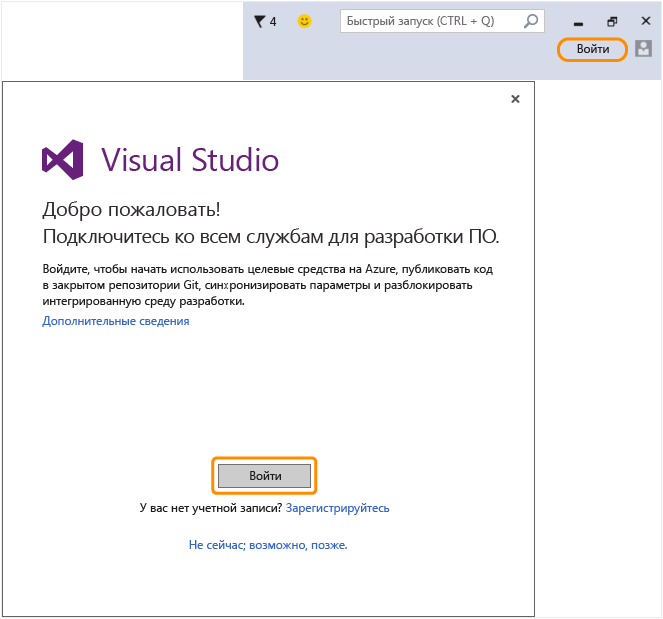

# Вернитесь в Visual Studio, чтобы войти в интегрированную среду разработки, используя новую учетную запись Майкрософт.
Учетная запись Майкрософт успешно создана. Вернитесь в Visual Studio и выполните вход в мастере приветствия при первом запуске или в правом верхнем углу интегрированной среды разработки в любой момент позднее.  
  
 Войдя в интегрированную среду разработки, вы сможете начать использовать кредиты Azure, публиковать код в закрытом репозитории Git, синхронизировать параметры и разблокировать интегрированную среду разработки.[Узнайте больше](../Topic/Signing%20in%20to%20Visual%20Studio.md) о доступных службах для разработчиков.  
  
 