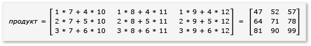
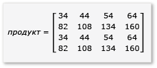

# Пошаговое руководство. Умножение матриц
[!INCLUDE[vs2017banner](../../assembler/inline/includes/vs2017banner.md)]

Это пошаговое руководство демонстрирует использование C\+\+ AMP для ускорения выполнения умножения матриц.  Представлено два алгоритма, один без замощения и один с замощением.  
  
## Обязательные компоненты  
 Перед началом:  
  
-   Чтение значения [Общие сведения о C\+\+ AMP](../../parallel/amp/cpp-amp-overview.md).  
  
-   Чтение значения [Использование плиток](../../parallel/amp/using-tiles.md).  
  
-   Убедитесь, что на компьютере установлены [!INCLUDE[win7](../../build/includes/win7_md.md)], [!INCLUDE[win8](../../build/includes/win8_md.md)], [!INCLUDE[winsvr08_r2](../Token/winsvr08_r2_md.md)] или [!INCLUDE[winserver8](../../build/includes/winserver8_md.md)].  
  
### Создание проекта  
  
1.  В Visual Studio в строке меню выберите **Файл**, **Создать**, **Проект**.  
  
2.  В **Установленные** в области шаблонов выберите **Visual C\+\+**.  
  
3.  Выберите **Пустой проект**, введите `MatrixMultiply` в окне **Имя**, а затем нажмите кнопку **ОК**.  
  
4.  Нажмите кнопку **Далее**.  
  
5.  В **Обозревателе решений** откройте контекстное меню для пункта **Файлы исходного кода**, а затем выберите **Добавить**, **Создать элемент**.  
  
6.  В диалоговом окне **Добавление нового элемента** выберите **Файл C\+\+ \(.cpp\)**, введите `MatrixMultiply.cpp` в поле **Имя**, а затем нажмите кнопку **Добавить**.  
  
## Умножение без замощения  
 В этом разделе рассмотрим умножение двух матриц, A и B, которые определяются следующим образом:  
  
   
  
   
  
 A — матрица 3 на 2, и B — матрица 2 на 3.  Результат перемножения A на B в следующей матрице 3 на 3.  Произведение вычисляется путем поэлементного умножения строк A на столбцы B.  
  
   
  
### Умножение без использования C\+\+ AMP  
  
1.  Откройте MatrixMultiply.cpp и используйте следующий код, чтобы заменить существующий код.  
  
    ```cpp  
  
    #include <iostream>  
  
    void MultiplyWithOutAMP() {  
  
        int aMatrix[3][2] = {{1, 4}, {2, 5}, {3, 6}};  
        int bMatrix[2][3] = {{7, 8, 9}, {10, 11, 12}};  
        int product[3][3] = {{0, 0, 0}, {0, 0, 0}, {0, 0, 0}};  
  
        for (int row = 0; row < 3; row++) {  
            for (int col = 0; col < 3; col++) {  
                // Multiply the row of A by the column of B to get the row, column of product.  
                for (int inner = 0; inner < 2; inner++) {  
                    product[row][col] += aMatrix[row][inner] * bMatrix[inner][col];  
                }  
                std::cout << product[row][col] << "  ";  
            }  
            std::cout << "\n";  
        }  
    }  
  
    void main() {  
        MultiplyWithOutAMP();  
        getchar();  
    }  
  
    ```  
  
     Этот алгоритм — простая реализация определения произведения матриц.  Он не использует параллельных или поточных алгоритмов, чтобы сократить время вычисления.  
  
2.  В строке меню выберите **Файл**, **Сохранить все**.  
  
3.  Нажмите сочетание клавиш F5 для запуска отладки и убедиться, что указан верный результат.  
  
4.  Нажмите кнопку Enter, чтобы выйти из приложения.  
  
### Умножение с помощью C\+\+ AMP  
  
1.  В MatrixMultiply.cpp добавьте следующий код перед методом `main`.  
  
    ```cpp  
  
    void MultiplyWithAMP() {  
        int aMatrix[] = { 1, 4, 2, 5, 3, 6 };  
        int bMatrix[] = { 7, 8, 9, 10, 11, 12 };  
        int productMatrix[] = { 0, 0, 0, 0, 0, 0, 0, 0, 0 };  
  
        array_view<int, 2> a(3, 2, aMatrix);  
        array_view<int, 2> b(2, 3, bMatrix);  
        array_view<int, 2> product(3, 3, productMatrix);  
  
        parallel_for_each(  
            product.extent,   
             [=](index<2> idx) restrict(amp) {  
                int row = idx[0];  
                int col = idx[1];  
                for (int inner = 0; inner < 2; inner++) {  
                    product[idx] += a(row, inner) * b(inner, col);  
                }  
            }  
        );  
  
        product.synchronize();  
  
        for (int row = 0; row < 3; row++) {  
            for (int col = 0; col < 3; col++) {  
                //std::cout << productMatrix[row*3 + col] << "  ";  
                std::cout << product(row, col) << "  ";  
            }  
            std::cout << "\n";  
        }  
    }  
  
    ```  
  
     Код AMP напоминает не AMP код.  Вызов `parallel_for_each` запускает по одному потоку для каждого элемента в `product.extent` и заменяет циклы `for` для строки и столбца.  Значение ячейки в строке и столбце доступно в `idx`.  Можно получить доступ к элементам объекта `array_view` с помощью оператора `[]` и переменной индекса или оператора `()` и переменных строки и столбца.  В примере демонстрируются оба метода.  Метод `array_view::synchronize` копирует значения переменной `product` обратно в переменную `productMatrix`.  
  
2.  Добавьте следующие операторы `include` и `using` в верхнюю часть MatrixMultiply.cpp.  
  
    ```cpp  
  
    #include <amp.h>  
    using namespace concurrency;  
  
    ```  
  
3.  Измените метод `main` для вызова метода `MultiplyWithAMP`.  
  
    ```cpp  
  
    void main() {  
        MultiplyWithOutAMP();  
        MultiplyWithAMP();  
        getchar();  
    }  
  
    ```  
  
4.  Нажмите сочетание клавиш Ctrl\+F5 для запуска отладки и убедитесь, что указан верный результат.  
  
5.  Нажмите клавишу пробел, чтобы выйти из приложения.  
  
## Умножение с замощением  
 Замощение — метод, в котором вы разделяете данные на подмножества одинакового размера, известные как tiles\(мозаики\).  Три позиции изменяются при использовании замощения.  
  
-   Можно создать переменные `tile_static`.  Доступ к данным в пространстве `tile_static` может быть в несколько раз быстрее, чем доступ к данным в глобальной области.  Экземпляр переменной `tile_static` создается для каждой мозаики, и все потоки в мозаике имеют доступ к этой переменной.  Основное преимущество замощения — выигрыш в производительности из\-за доступа `tile_static`.  
  
-   Можно вызвать метод [tile\_barrier::wait](../Topic/tile_barrier::wait%20Method.md) для остановки всех потоков в одной мозаике в указанной строке кода.  Невозможно гарантировать порядок, в котором работают потоки, гарантировано только то, что все потоки в одной мозаике остановятся при вызове `tile_barrier::wait` перед тем, как возобновить выполнение.  
  
-   Имеется доступ к индексу потока по отношению к всему объекту `array_view` и к индексу относительно мозаики.  С помощью локального индекса можно сделать код более удобным для чтения и отладки.  
  
 Чтобы воспользоваться преимуществами замощения при умножении матриц, алгоритм должен разбить матрицу на мозаики, а затем скопировать данные мозаики в переменные `tile_static` для ускорения доступа.  В этом примере матрица разделена на подматрицы одинакового размера.  Результат найден перемножением подматриц.  Две матрицы и их произведение в этом примере:  
  
   
  
   
  
   
  
 Матрицы делятся на четыре матрицы 2x2, которые определяются следующим образом:  
  
   
  
   
  
 Произведение A и B теперь можно записать и вычислить следующим образом:  
  
   
  
 Поскольку матрицы `a` через `h` — матрицы 2x2, то все их произведения и суммы также являются матрицами 2x2.  Из этого также следует, что A\*B — матрица 4x4, как и ожидалось.  Чтобы быстро проверить алгоритм, посчитайте значение элемента в первой строке, первом столбце произведения.  В примере это было бы значением элемента в первой строке и первом столбце `ae + bg`.  Вы только должны вычислить первый столбец, первую строку `ae` и `bg` для каждого члена.  Значение `ae` равно `1*1 + 2*5 = 11`.  Значение `bg` равно `3*1 + 4*5 = 23`.  Конечное значение `11 + 23 = 34`, что верно.  
  
 Для реализации этого алгоритма, код:  
  
-   Использует объект `tiled_extent` вместо объекта `extent` в вызове `parallel_for_each`.  
  
-   Использует объект `tiled_index` вместо объекта `index` в вызове `parallel_for_each`.  
  
-   Создает `tile_static` переменные для хранения подматриц.  
  
-   Использует метод `tile_barrier::wait`, чтобы остановить потоки для вычисления произведения подматриц.  
  
### Умножение с помощью AMP и замощения  
  
1.  В MatrixMultiply.cpp добавьте следующий код перед методом `main`.  
  
    ```cpp  
  
    void MultiplyWithTiling()  
    {  
        // The tile size is 2.  
        static const int TS = 2;  
  
        // The raw data.  
        int aMatrix[] =       { 1, 2, 3, 4, 5, 6, 7, 8, 1, 2, 3, 4, 5, 6, 7, 8 };  
        int bMatrix[] =       { 1, 2, 3, 4, 5, 6, 7, 8, 1, 2, 3, 4, 5, 6, 7, 8 };  
        int productMatrix[] = { 0, 0, 0, 0, 0, 0, 0, 0, 0, 0, 0, 0, 0, 0, 0, 0 };  
  
        // Create the array_view objects.  
        array_view<int, 2> a(4, 4, aMatrix);  
        array_view<int, 2> b(4, 4, bMatrix);  
        array_view<int, 2> product(4, 4, productMatrix);  
  
        // Call parallel_for_each by using  2x2 tiles.  
        parallel_for_each(product.extent.tile< TS, TS >(),  
            [=] (tiled_index< TS, TS> t_idx) restrict(amp)   
            {  
                // Get the location of the thread relative to the tile (row, col) and the entire array_view (rowGlobal, colGlobal).  
                int row = t_idx.local[0];   
                int col = t_idx.local[1];  
                int rowGlobal = t_idx.global[0];  
                int colGlobal = t_idx.global[1];  
                int sum = 0;  
  
                // Given a 4x4 matrix and a 2x2 tile size, this loop executes twice for each thread.  
                // For the first tile and the first loop, it copies a into locA and e into locB.  
                // For the first tile and the second loop, it copies b into locA and g into locB.  
                for (int i = 0; i < 4; i += TS) {  
                    tile_static int locA[TS][TS];  
                    tile_static int locB[TS][TS];  
                    locA[row][col] = a(rowGlobal, col + i);  
                    locB[row][col] = b(row + i, colGlobal);  
                    // The threads in the tile all wait here until locA and locB are filled.  
                    t_idx.barrier.wait();  
  
                    // Return the product for the thread. The sum is retained across  
                    // both iterations of the loop, in effect adding the two products  
                    // together, for example, a*e.  
                    for (int k = 0; k < TS; k++) {  
                        sum += locA[row][k] * locB[k][col];  
                    }  
  
                    // All threads must wait until the sums are calculated. If any threads  
                    // moved ahead, the values in locA and locB would change.        
                    t_idx.barrier.wait();  
                    // Now go on to the next iteration of the loop.            
                }  
  
                // After both iterations of the loop, copy the sum to the product variable by using the global location.  
                product[t_idx.global] = sum;  
        });  
  
            // Copy the contents of product back to the productMatrix variable.  
            product.synchronize();  
  
            for (int row = 0; row < 4; row++) {  
            for (int col = 0; col < 4; col++) {  
                // The results are available from both the product and productMatrix variables.  
                //std::cout << productMatrix[row*3 + col] << "  ";  
                std::cout << product(row, col) << "  ";  
            }  
            std::cout << "\n";  
        }  
  
    }  
  
    ```  
  
     Этот примере значительно отличается от примера без замощения.  Код использует следующие основные шаги.  
  
    1.  Копирование элементов tile\[0,0\] `a` в `locA`.  Копирование элементов tile\[0,0\] `b` в `locB`.  Обратите внимание, что замощен `product`, а не `a` и `b`.  Поэтому необходимо использовать глобальные индексы для доступа к `a, b` и `product`.  Вызов `tile_barrier::wait` необходим.  Он останавливает все потоки в мозаике до тех пор, пока и `locA` и `locB` не заполнены.  
  
    2.  Перемножение `locA` и `locB` и помещение результатов в `product`.  
  
    3.  Копирование элементов tile\[0,1\] `a` в `locA`.  Копирование элементов tile\[1,0\] `b` в `locB`.  
  
    4.  Перемножение `locA` и `locB` и добавление их к результатам, которые уже находятся в `product`.  
  
    5.  Умножение tile\[0,0\] завершено.  
  
    6.  Повторение для других четырех мозаик.  Нет индексирования специально для мозаик, и потоки могут выполняться в любом порядке.  Пока выполняется каждый поток, переменные `tile_static` создаются для каждой мозаики соответствующим образом, и вызов `tile_barrier::wait` управляет ходом выполнения программы.  
  
    7.  При ближайшем рассмотрении алгоритма обратите внимание, что каждая подматрица загружается в память `tile_static` дважды.  Эта передача данных требует времени.  Однако как только данные попадают в память `tile_static`, доступ к данным становится намного быстрее.  Поскольку вычисления произведения требует повторного доступа к значениям подматриц, имеется повышение общей производительности.  Для каждого алгоритма требуется экспериментировать, чтобы найти оптимальный алгоритм и размер мозаики.  
  
         В примерах без AMP и мозаик для того, чтобы вычислить произведение, обращение к каждому элементу A и B происходит 4 раза из глобальной памяти.  В примере с мозаикой, обращение к каждому элементу проиходит дважды из глобальной памяти и четыре раза из памяти `tile_static`.  Это не дает значительного повышения производительности.  Однако, если А и B — матрицы 1024x1024 и размер мозаики равен 16, то будет значительное увеличение производительности.  В этом случае каждый элемент будет скопирован в память `tile_static` только 16 раз, и к нему будут обращаться из памяти `tile_static` 1024 раза.  
  
2.  Измените метод main для вызова метода `MultiplyWithTiling`, как показано ниже.  
  
    ```cpp  
  
    void main() {  
        MultiplyWithOutAMP();  
        MultiplyWithAMP();  
        MultiplyWithTiling();  
        getchar();  
    }  
  
    ```  
  
3.  Нажмите сочетание клавиш Ctrl\+F5 для запуска отладки и убедитесь, что указан верный результат.  
  
4.  Нажмите клавишу пробел, чтобы выйти из приложения.  
  
## См. также  
 [C\+\+ AMP \(C\+\+ Accelerated Massive Parallelism\)](../../parallel/amp/cpp-amp-cpp-accelerated-massive-parallelism.md)   
 [Пошаговое руководство. Отладка приложения C\+\+ AMP](../../parallel/amp/walkthrough-debugging-a-cpp-amp-application.md)