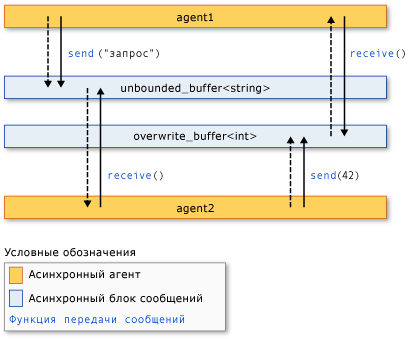

# <a name="asynchronous-agents-library"></a>библиотеку асинхронных агентов

Библиотека асинхронных агентов (или просто *Библиотека агентов*) предоставляет модель программирования, которая позволяет повысить надежность разработки приложений с поддержкой параллелизма. Библиотека агентов — это библиотека шаблонов C++, которое обеспечивает модель программирования на основе субъектов и в процессе передачи сообщений для недетализированного потока данных и задач по конвейеризации. Библиотека агентов сборки на компоненты управления планированием и ресурсов среды выполнения с параллелизмом.

## <a name="programming-model"></a>Модель программирования

Библиотека агентов предоставляет альтернативы общему состоянию, позволяя подключать изолированные компоненты через модель асинхронной передачи, основанный на потока данных, а не потока управления. *Поток данных* ссылается программирования доступна модель, в которой вычисления выполняются, когда все необходимые данные; *поток управления* ссылается на модель программирования, в которой вычисления выполняются в предопределенном порядке.

Модель программирования на основе потоков данных связана с понятием *передача сообщений*, так как в этой модели независимые компоненты программы взаимодействуют друг с другом посредством отправки сообщений.

Библиотека агентов состоит из трех компонентов: *асинхронных агентов*, *асинхронные блоки сообщений*, и *функции передачи сообщений*. Агенты сохраняют состояние и используют блоки сообщений и функции передачи сообщений для взаимодействия друг с другом и с внешними компонентами. Функции передачи сообщений позволяют агентов для отправки и получения сообщений из внешних компонентов. Асинхронные блоки сообщений содержат сообщения и включить агенты для обмена данными синхронизировано.

Ниже показан как два агента, используйте блоки сообщений и функции передачи сообщений для обмена данными. На этом рисунке `agent1` отправляет сообщение `agent2` с помощью [concurrency::send](reference/concurrency-namespace-functions.md#send) функции и [concurrency::unbounded_buffer](reference/unbounded-buffer-class.md) объекта. `agent2` использует [concurrency::receive](reference/concurrency-namespace-functions.md#receive) функция для чтения сообщения. `agent2` использует тот же метод для отправки сообщения `agent1`. Пунктирные стрелки показывают поток данных между агентами. Сплошные стрелки соединиться блоков сообщений, которые они записи или чтения из агентов.



Пример кода, который реализует на этом рисунке показан далее в этом разделе.

Модель программирования на основе агентов имеет несколько преимуществ, другие механизмы параллелизма и синхронизации, например, события. Одним из преимуществ — что, используя передачу сообщений для передачи изменений состояния между объектами, можно изолировать доступ к общим ресурсам и повысить масштабируемость системы. Преимущество для передачи сообщений состоит в том, что она связывает синхронизацию с данными, а не к внешнему объекту синхронизации. Это упрощает передачу данных между компонентами и позволяет избежать ошибок программирования в приложениях.

## <a name="when-to-use-the-agents-library"></a>Когда следует использовать библиотеки агентов

Используйте библиотеку агентов, при наличии нескольких операций, которые должны асинхронно взаимодействовать друг с другом. Блоки сообщений и функции передачи сообщений позволяют создавать параллельные приложения, не требуя механизмов синхронизации, такие как блокировки. Это позволяет сосредоточиться на логике приложения.

Модель программирования на основе агентов часто используется для создания *конвейеры данных* или *сетей*. Конвейер данных — это цепочка компонентов, каждый из которых выполняет конкретную задачу в более крупной цели. Каждый компонент конвейера потока данных выполняет работу, когда он получает сообщение из другого компонента. Результат этой работы передается на другие компоненты конвейера или сети. Компоненты можно использовать дополнительные функциональные возможности детально настраиваемый параллелизм от других библиотек, например, [библиотеки параллельных шаблонов (PPL)](../../parallel/concrt/parallel-patterns-library-ppl.md).

## <a name="example"></a>Пример

В следующем примере реализуется на рисунке выше в этом разделе.

[!code-cpp[concrt-basic-agents#1](../../parallel/concrt/codesnippet/cpp/asynchronous-agents-library_1.cpp)]

В этом примере выводятся следующие данные:

```Output
agent1: sending request...
agent2: received 'request'.
agent2: sending response...
agent1: received '42'.
```

Ниже описываются функциональные возможности, используемые в этом примере.

## <a name="related-topics"></a>См. также

[Асинхронные агенты](../../parallel/concrt/asynchronous-agents.md)<br/>
Описывает роль асинхронных агентов в решении более крупных вычислительных задач.

[Асинхронные блоки сообщений](../../parallel/concrt/asynchronous-message-blocks.md)<br/>
Описывает различные типы блоков сообщений, предоставляемых библиотекой агентов.

[Функции передачи сообщений](../../parallel/concrt/message-passing-functions.md)<br/>
Описывает различные процедуры передачи сообщений, предоставляемых библиотекой агентов.

[Практическое руководство. Реализация различных шаблонов "источник-приемник"](../../parallel/concrt/how-to-implement-various-producer-consumer-patterns.md)<br/>
Описываются способы реализации шаблона производитель получатель в приложении.

[Практическое руководство. Предоставление рабочих функций классам call и transformer](../../parallel/concrt/how-to-provide-work-functions-to-the-call-and-transformer-classes.md)<br/>
Приводится несколько способов предоставления рабочих функций [concurrency::call](../../parallel/concrt/reference/call-class.md) и [concurrency::transformer](../../parallel/concrt/reference/transformer-class.md) классы.

[Практическое руководство. Использование преобразователя в конвейере данных](../../parallel/concrt/how-to-use-transformer-in-a-data-pipeline.md)<br/>
Демонстрируется использование [concurrency::transformer](../../parallel/concrt/reference/transformer-class.md) класс в конвейере данных.

[Практическое руководство. Выбор среди завершенных задач](../../parallel/concrt/how-to-select-among-completed-tasks.md)<br/>
Демонстрируется использование [concurrency::choice](../../parallel/concrt/reference/choice-class.md) и [concurrency::join](../../parallel/concrt/reference/join-class.md) классы, чтобы выбрать первую задачу для завершения алгоритма поиска.

[Практическое руководство. Отправка сообщений через определенные интервалы](../../parallel/concrt/how-to-send-a-message-at-a-regular-interval.md)<br/>
Демонстрируется использование [concurrency::timer](../../parallel/concrt/reference/timer-class.md) класс для отправки сообщения с регулярным интервалом.

[Практическое руководство. Использование фильтра блоков сообщений](../../parallel/concrt/how-to-use-a-message-block-filter.md)<br/>
Показано, как использовать фильтр, чтобы позволить блоку асинхронное сообщение принимать или отклонять сообщения.

[Библиотека параллельных шаблонов (PPL)](../../parallel/concrt/parallel-patterns-library-ppl.md)<br/>
В этой статье описывается использование различных параллельных шаблонов, таких как параллельные алгоритмы в приложениях.

[Среда выполнения с параллелизмом](../../parallel/concrt/concurrency-runtime.md)<br/>
Описывает среду выполнения с параллелизмом, которая упрощает процесс параллельного программирования и содержит ссылки на соответствующие разделы.

