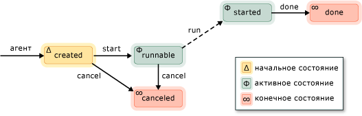

# Асинхронные агенты
*Асинхронный агент* (или просто *агента*) — это компонент приложения, который работает асинхронно с другими агентами, для решения более крупных вычислительных задач. Агент можно рассматривать как задачу, которая имеет заданный жизненный цикл. Например один агент может считывать данные из устройства ввода вывода (например, клавиатуры, в файл на диске или сетевого подключения), а другой агент может выполнять действия на этих данных, как они станут доступны. Первый агент передачи сообщений использует для информирования второго агента, что дополнительные данные недоступны. Планировщик задач среды выполнения с параллелизмом предоставляет эффективный механизм для включения агентов для совместного блокирования и без необходимости менее эффективным приоритетного прерывания.  
  

 Библиотека агентов определяет [concurrency::agent](../../parallel/concrt/reference/agent-class.md) класс, чтобы представлять асинхронный агент. `agent`Представляет абстрактный класс, объявляющий виртуальный метод [Concurrency::agent:: Run](reference/agent-class.md#run). `run` Метод выполняет задачу, которая выполняется агент. Поскольку `run` является абстрактным, необходимо реализовать этот метод в каждом классе, унаследованном от `agent`.  
  
## Жизненный цикл агента  
 Агенты имеют заданный жизненный цикл. [Concurrency::agent_status](reference/concurrency-namespace-enums.md#agent_status) перечисление определяет различные состояния агента. На следующем рисунке показан схема состояния, который показан переход агентов из одного состояния в другое. На этом рисунке сплошные линии представляют методы, которые вызываются из приложения; пунктирные линии представляют методы, вызываемые из среды выполнения.  
  
   
  
 В следующей таблице описаны каждое состояние `agent_status` перечисления.  
  
|Состояние агента|Описание:|  
|-----------------|-----------------|  
|`agent_created`|Агент не был запланирован для выполнения.|  
|`agent_runnable`|Среда выполнения планирует агент для выполнения.|  
|`agent_started`|Агент запущен и работает.|  
|`agent_done`|Выполнение агента завершено.|  
|`agent_canceled`|Агент был отменен до перехода `started` состояния.|  
  
 `agent_created`Начальное состояние агента, `agent_runnable` и `agent_started` активного состояния, состояний и `agent_done` и `agent_canceled` — конечные состояния.  
  
 Используйте [Concurrency::agent:: status](reference/agent-class.md#status) метод для извлечения текущего состояния `agent` объекта. Несмотря на то что `status` метод безопасен в режиме параллелизма, состояние агента может измениться к моменту `status` возвращает метод. Например, агент может быть в `agent_started` состояние при вызове `status` метод, но перемещен `agent_done` состояние сразу после `status` возвращает метод.  

  
## Методы и свойства  
 В следующей таблице показаны некоторые важные методы, принадлежащие `agent` класса. Дополнительные сведения обо всех `agent` методы класса см. в разделе [класс agent](../../parallel/concrt/reference/agent-class.md).  
  
|Метод|Описание:|  
|------------|-----------------|  
|[start](reference/agent-class.md#start)|Расписания `agent` объект для выполнения и назначает ей `agent_runnable` состояния.|  
|[run](reference/agent-class.md#run)|Выполняет задачу, которая должна быть выполнена путем `agent` объекта.|  
|[Договорились](reference/agent-class.md#done)|Переводит агент в `agent_done` состояние.|  
|[Отмена](../../parallel/concrt/cancellation-in-the-ppl.md#cancel)|Если агент не был запущен, этот метод отменяет выполнение агента и задает для него значение `agent_canceled` состояния.|  
|[status](reference/agent-class.md#status)|Получает текущее состояние `agent` объекта.|  
|[Ожидание](reference/agent-class.md#wait)|Ожидает `agent` перехода объекта `agent_done` или `agent_canceled` состояния.|  
|[wait_for_all](reference/agent-class.md#wait_for_all)|Для всех предоставленных `agent` объектов `agent_done` или `agent_canceled` состояния.|  
|[wait_for_one](reference/agent-class.md#wait_for_one)|Ожидает в течение по крайней мере один из указанных `agent` объектов `agent_done` или `agent_canceled` состояния.|  
  
 После создания объекта агента, вызовите [Concurrency::agent:: Start](reference/agent-class.md#start) метод, чтобы запланировать его выполнение. Среда выполнения вызывает метод `run` метод после планирования агента и задает для него значение `agent_runnable` состояния.  
  
 Среда выполнения не управляет исключения, вызванные асинхронными агентами. Дополнительные сведения об обработке исключений и агентах см. в разделе [обработка исключений](../../parallel/concrt/exception-handling-in-the-concurrency-runtime.md).  
  
## Пример  
 Пример, демонстрирующий способы создания приложения на основе агентов см. в разделе [Пошаговое руководство: Создание приложения на основе агентов](../../parallel/concrt/walkthrough-creating-an-agent-based-application.md).  
  
## См. также  
 [Библиотека асинхронных агентов](../../parallel/concrt/asynchronous-agents-library.md)

