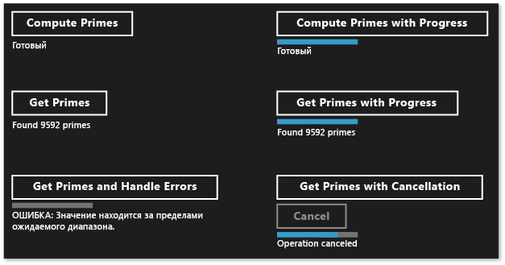

# Создание асинхронных операций в C++ для приложений UWP

В этом документе описываются некоторые ключевые моменты, которые следует учитывать при использовании класса Task для создания асинхронных операций на основе Windows ThreadPool в универсальном среда выполнения Windows (UWP).

Использование асинхронного программирования является ключевым компонентом в модели среда выполнения Windows приложений, так как позволяет приложениям сохранять реагирование на ввод данных пользователем. Можно запустить длительную задачу без блокировки потока ИП и получить результаты выполнения задачи позже. Можно также отменять задачи и получать уведомления о ходе выполнения задач, выполняемых в фоновом режиме. В документе [Асинхронное программирование на C++](/windows/uwp/threading-async/asynchronous-programming-in-cpp-universal-windows-platform-apps) представлен Обзор асинхронной модели, доступной в Visual C++ для создания приложений UWP. В этом документе описывается, как использовать и создавать цепочки асинхронных операций среда выполнения Windows. В этом разделе описывается, как использовать типы в из ppltasks. h для создания асинхронных операций, которые могут использоваться другим компонентом среда выполнения Windows и как управлять выполнением асинхронной работы. Также рекомендуется читать [Шаблоны асинхронного программирования и советы в Hilo (приложения для Магазина Windows с использованием C++ и XAML)](/previous-versions/windows/apps/jj160321(v=win.10)) , чтобы узнать, как мы использовали класс Task для реализации асинхронных операций в Hilo, среда выполнения Windows приложении, использующем C++ и XAML.

> [!NOTE]
> Вы можете использовать библиотеку [параллельных шаблонов](../../parallel/concrt/parallel-patterns-library-ppl.md) (PPL) и [библиотеку асинхронных агентов](../../parallel/concrt/asynchronous-agents-library.md) в приложении UWP. Однако невозможно использовать планировщик задач или диспетчер ресурсов. В этом документе описываются дополнительные возможности, предоставляемые PPL, которые доступны только для приложения UWP, а не для классического приложения.

## Ключевые моменты

- Используйте [concurrency::create_async](reference/concurrency-namespace-functions.md#create_async) для создания асинхронных операций, которые могут использоваться другими компонентами (которые могут быть написаны на языках, отличных от C++).

- Используйте [concurrency::progress_reporter](../../parallel/concrt/reference/progress-reporter-class.md) для передачи уведомлений о ходе выполнения компонентам, которые вызывают ваши асинхронные операции.

- Используйте токены отмены, чтобы обеспечить возможность отмены внутренних асинхронных операций.

- Поведение функции `create_async` зависит от передаваемого ей возвращаемого типа рабочей функции. Рабочая функция, которая возвращает задачу ( `task<T>` или `task<void>`) выполняется синхронно в контексте, который вызвал `create_async`. Рабочая функция, которая возвращает `T` или **`void`** выполняется в произвольном контексте.

- Можно использовать метод [concurrency::task::then](reference/task-class.md#then) для создания цепочки задач, выполняемых друг за другом. В приложении UWP контекст по умолчанию для продолжения задачи зависит от того, как была создана эта задача. Если задача была создана путем передачи асинхронного действия конструктору задачи, или путем передачи лямбда-выражения, возвращающего асинхронное действие, то контекстом по умолчанию для всех продолжений этой задачи будет текущий контекст. Если задача не строится на основе асинхронного действия, то по умолчанию для продолжения задачи используется произвольный контекст. Можно переопределить контекст по умолчанию с помощью класса [concurrency::task_continuation_context](../../parallel/concrt/reference/task-continuation-context-class.md) .

## Содержание документа

- [Создание асинхронных операций](#create-async)

- [Пример: создание компонента среды выполнения Windows на C++](#example-component)

- [Управление потоком выполнения](#exethread)

- [Пример. Управление выполнением в приложении среда выполнения Windows с помощью C++ и XAML](#example-app)

## Создание асинхронных операций

Можно использовать задачу и модель продолжения в библиотеке параллельных шаблонов (PPL) для определения фоновых задач, а также и дополнительных задач, выполняемых по завершении предыдущей задачи. Эта функциональность предоставляется классом [concurrency::task](../../parallel/concrt/reference/task-class.md) . Дополнительные сведения об этой модели и классе `task` см. в разделе [Task Parallelism](../../parallel/concrt/task-parallelism-concurrency-runtime.md).

Среда выполнения Windows — это программный интерфейс, который можно использовать для создания приложений UWP, работающих только в специальной среде операционной системы. Такие приложения используют разрешенные функции, типы данных и устройства и распространяются из Microsoft Store. Среда выполнения Windows представляется *двоичным интерфейсом приложения* (ABI). ABI является базовым бинарным контрактом, который делает среда выполнения Windows API доступными для языков программирования, таких как Visual C++.

С помощью среда выполнения Windows можно использовать лучшие функции различных языков программирования и объединить их в одно приложение. Например, можно создать ИП в JavaScript и выполнять трудоемкую вычислительную логику приложения в компоненте, написанном на C++. Возможность выполнять такие ресурсоемкие операции в фоновом режиме является ключевым фактором в обеспечении скорости реагирования ИП. Поскольку `task` класс относится только к C++, необходимо использовать интерфейс Среда выполнения Windows для обмена асинхронными операциями с другими компонентами (которые могут быть написаны на языках, отличных от c++). Среда выполнения Windows предоставляет четыре интерфейса, которые можно использовать для представления асинхронных операций:

[Windows::Foundation::IAsyncAction](/uwp/api/windows.foundation.iasyncaction) 
Представляет асинхронное действие.

[Windows:: Foundation:: IAsyncActionWithProgress\<TProgress>](/uwp/api/windows.foundation.iasyncactionwithprogress-1) 
Представляет асинхронное действие, сообщающее о ходе выполнения.

[Windows:: Foundation:: IAsyncOperation\<TResult>](/uwp/api/windows.foundation.iasyncoperation-1) 
Представляет асинхронную операцию, которая возвращает результат.

[Windows:: Foundation:: IAsyncOperationWithProgress\<TResult, TProgress>](/uwp/api/windows.foundation.iasyncoperationwithprogress-2) 
Возвращает асинхронную операцию, которая возвращает результат и отчитывается о ходе выполнения.

Понятие *действия* означает, что асинхронная задача не создает значение (Представьте функцию, которая возвращает **`void`** ). Понятие *операция* означает, что асинхронная задача создает значение. Понятие *ход выполнения* означает, что задача может отправить сообщение о ходе выполнения вызывающему объекту. Языки JavaScript, .NET Framework и Visual C++ предоставляют свои собственные способы создания экземпляров таких интерфейсов для использования с переходом через границы ABI. Для Visual C++ PPL предоставляет функцию [concurrency::create_async](reference/concurrency-namespace-functions.md#create_async) . Эта функция создает среда выполнения Windows асинхронное действие или операцию, представляющее завершение задачи. `create_async`Функция принимает рабочую функцию (обычно лямбда-выражение), внутренне создает `task` объект и заключает эту задачу в один из четырех асинхронных среда выполнения Windows интерфейсов.

> [!NOTE]
> Используйте `create_async` , только если необходимо создать функциональные возможности, к которым можно получить доступ с другого языка или с другого среда выполнения Windows компонента. Используйте класс `task` напрямую, если известно, что операция и создается, и используется кодом C++ в том же компоненте.

Возвращаемый тип `create_async` определяется типом аргументов. Например, если рабочая функция не возвращает значение и не сообщает о ходе выполнения, `create_async` возвращает `IAsyncAction`. Если рабочая функция не возвращает значение и сообщает о ходе выполнения, `create_async` возвращает `IAsyncActionWithProgress`. Чтобы сообщить о ходе выполнения, укажите объект [concurrency::progress_reporter](../../parallel/concrt/reference/progress-reporter-class.md) в качестве параметра рабочей функции. Возможность уведомления о ходе выполнения позволяет отчитываться о выполненном объеме работы и оставшемся объеме (например, в процентах). Это также позволяет сообщать о результатах, как только они становятся доступными.

Интерфейсы `IAsyncAction`, `IAsyncActionWithProgress<TProgress>`, `IAsyncOperation<TResult>`, `IAsyncActionOperationWithProgress<TProgress, TProgress>` предоставляют метод `Cancel` , позволяющий отменить асинхронную операцию. Класс `task` работает с токенами отмены. При использовании токена отмены, чтобы отменить работу, среда выполнения не запускает новую работу, которая подписывается на этот токен. Уже выполняющаяся работа может отслеживать свой токен отмены и останавливаться, когда имеет такую возможность. Этот механизм описан подробнее в документе [Cancellation in the PPL](cancellation-in-the-ppl.md). Можно соединить отмену задач с помощью `Cancel` методов среда выполнения Windows двумя способами. Во-первых, можно определить рабочую функцию, передаваемую `create_async` для получения объекта [concurrency::cancellation_token](../../parallel/concrt/reference/cancellation-token-class.md) . При `Cancel` вызове метода этот токен отмены отменяется, а обычные правила отмены применяются к базовому `task` объекту, который поддерживает `create_async` вызов. Если объект `cancellation_token` не предоставляется, базовый объект `task` определит его неявно. Определите объект `cancellation_token` при необходимости совместно реагировать на отмену в вашей рабочей функции. В разделе [пример. Управление выполнением в среда выполнения Windows приложении с C++ и XAML](#example-app) демонстрируется пример выполнения отмены в приложении универсальная платформа Windows (UWP) с помощью C# и XAML, использующего пользовательский компонент Среда выполнения Windows C++.

> [!WARNING]
> В цепочке продолжений задач всегда очищать состояние, а затем вызывать [Concurrency:: cancel_current_task](reference/concurrency-namespace-functions.md#cancel_current_task) при отмене токена отмены. Если возврат выполняется раньше вместо вызова `cancel_current_task`, операция переходит в состояние завершения вместо состояния отмены.

В следующей таблице приведены сочетания, которые можно использовать для определения асинхронных операций в приложении.

|Создание этого интерфейса среда выполнения Windows|Верните этот тип из `create_async`|Передайте эти типы параметров рабочей функции для использования неявного токена отмены|Передайте эти типы параметров рабочей функции для использования явного токена отмены|
|----------------------------------------------------------------------------------|------------------------------------------|--------------------------------------------------------------------------------------------|--------------------------------------------------------------------------------------------|
|`IAsyncAction`|**`void`** ни`task<void>`|(нет)|(`cancellation_token`)|
|`IAsyncActionWithProgress<TProgress>`|**`void`** ни`task<void>`|(`progress_reporter`)|(`progress_reporter`, `cancellation_token`)|
|`IAsyncOperation<TResult>`|`T` или `task<T>`|(нет)|(`cancellation_token`)|
|`IAsyncActionOperationWithProgress<TProgress, TProgress>`|`T` или `task<T>`|(`progress_reporter`)|(`progress_reporter`, `cancellation_token`)|

Можно вернуть значение или объект `task` из рабочей функции, которое было передано функции `create_async` . Эти различия обеспечивают различное поведение. Если возвращается значение, рабочая функция оборачивается в `task` , чтобы ее можно выполнить в фоновом потоке. Кроме того базовый объект `task` использует неявный токен отмены. И наоборот, если возвращается объект `task` , рабочая функция выполняется синхронно. Следовательно, если возвращается объект `task` , убедитесь, что все длительные операции в вашей рабочей функции выполняются как задачи, чтобы приложение быстро реагировало на действия пользователя. Кроме того базовый объект `task` не использует неявный токен отмены. Поэтому необходимо определить вашу рабочую функцию, чтобы она принимала объект `cancellation_token` , если необходима поддержка отмены при возврате объекта `task` из `create_async`.

В следующем примере показаны различные способы создания `IAsyncAction` объекта, который может использоваться другим компонентом Среда выполнения Windows.

[!code-cpp[concrt-windowsstore-primes#100](../../parallel/concrt/codesnippet/cpp/creating-asynchronous-operations-in-cpp-for-windows-store-apps_1.cpp)]

## Пример. Создание компонента среда выполнения Windows C++ и его использование из C\#

Рассмотрим приложение, которое использует XAML и C# для определения пользовательского интерфейса и компонента среда выполнения Windows C++ для выполнения операций, интенсивно использующих вычислительные операции. В этом примере компонент C++ обнаруживает простые числа в заданном диапазоне. Чтобы продемонстрировать различия между четырьмя среда выполнения Windows интерфейсами асинхронных задач, запустите в Visual Studio, создав **пустое решение** и назначайте ему имя `Primes` . Затем добавьте в решение проект **Компонент среды выполнения Windows** и назовите его `PrimesLibrary`. Добавьте следующий код в создаваемый файл заголовка C++ (в примере Class1.h переименовывается в Primes.h). Каждый **`public`** метод определяет один из четырех асинхронных интерфейсов. Методы, возвращающие значение, возвращают объект [Windows:: Foundation:: Collections \<int> :: IVector](/uwp/api/windows.foundation.collections.ivector-1) . Методы, сообщающие о ходе выполнения **`double`** , формируют значения, определяющие процент общей работы, которая была завершена.

[!code-cpp[concrt-windowsstore-primes#1](../../parallel/concrt/codesnippet/cpp/creating-asynchronous-operations-in-cpp-for-windows-store-apps_2.h)]

> [!NOTE]
> По соглашению имена асинхронных методов в среда выполнения Windows обычно заканчиваются на "Async".

Добавьте следующий код в сгенерированный файл с исходным кодом C++ (в примере Class1.cpp переименовывается в Primes.cpp). Функция `is_prime` определяет, является ли входное число простым. Остальные методы реализуют класс `Primes` . Каждый вызов `create_async` использует сигнатуру, которая совместима с методом, из которого он вызывается. Например, поскольку `Primes::ComputePrimesAsync` возвращает `IAsyncAction`, рабочая функция, переданная в `create_async` , не возвращает значение и не принимает объект `progress_reporter` в качестве параметра.

[!code-cpp[concrt-windowsstore-primes#2](../../parallel/concrt/codesnippet/cpp/creating-asynchronous-operations-in-cpp-for-windows-store-apps_3.cpp)]

Каждый метод сначала выполняет проверку, чтобы убедиться, что входные параметры не являются отрицательными. Если входное значение отрицательное, метод выдает исключение [Platform::InvalidArgumentException](../../cppcx/platform-invalidargumentexception-class.md). Обработка ошибок объясняется далее в этом разделе.

Чтобы использовать эти методы из приложения UWP, используйте шаблон **пустое приложение Visual C# (XAML)** , чтобы добавить второй проект в решение Visual Studio. В этом примере проект называется `Primes`. Затем из проекта `Primes` добавьте ссылку на проект `PrimesLibrary` .

Добавьте следующий код в MainPage.xaml. Этот код определяет пользовательский интерфейс, чтобы можно было вызвать компонент на С++ и вывести результат.

[!code-xml[concrt-windowsstore-primes#3](../../parallel/concrt/codesnippet/xaml/creating-asynchronous-operations-in-cpp-for-windows-store-apps_4.xaml)]

Добавьте следующий код в класс `MainPage` в файле MainPage.xaml. Этот код определяет объект `Primes` и обработчики событий для кнопки.

[!code-cs[concrt-windowsstore-primes#4](../../parallel/concrt/codesnippet/csharp/creating-asynchronous-operations-in-cpp-for-windows-store-apps_5.cs)]

Эти методы используют ключевые слова `async` и `await` для обновления пользовательского интерфейса после выполнения асинхронных операций. Сведения об асинхронном кодировании в приложениях UWP см. в разделе [многопоточное и асинхронное программирование](/windows/uwp/threading-async).

Методы `getPrimesCancellation` и `cancelGetPrimes` работают вместе, позволяя пользователю отменить операцию. Когда пользователь нажимает кнопку **Cancel (Отмена** ), `cancelGetPrimes` метод вызывает [IAsyncOperationWithProgress \<TResult, TProgress> :: Cancel](/uwp/api/windows.foundation.iasyncinfo.cancel) для отмены операции. Среда выполнения с параллелизмом, который управляет базовой асинхронной операцией, создает внутренний тип исключения, перехваченный среда выполнения Windows, чтобы сообщить о завершении отмены. Дополнительные сведения о модели отмены см. в разделе [Отмена](../../parallel/concrt/cancellation-in-the-ppl.md).

> [!IMPORTANT]
> Чтобы разрешить PPL правильно сообщать среда выполнения Windows о том, что операция была отменена, не перехватывайте этот тип внутреннего исключения. Это означает, что не нужно перехватывать все исключения (`catch (...)`). Если необходимо перехватить все исключения, вызовите исключение, чтобы убедиться, что среда выполнения Windows может завершить операцию отмены.

На следующем рисунке показано приложение `Primes` после выбора каждого параметра.

Пример, в котором используется `create_async` для создания асинхронных задач, которые могут использоваться другими языками, см [. в разделе Использование C++ в примере оптимизатора повторов Bing Maps](/previous-versions/windows/apps/hh699891(v=vs.140)).

## Управление потоком выполнения

В среда выполнения Windows используется COM-потоковая модель. В этой модели объекты размещаются в различных подразделениях в зависимости от того, как они обрабатывают свою синхронизацию. Потокобезопасные объекты размещаются в многопотоковых подразделениях (MTA). Объекты, которые должны быть доступны из одного потока, размещаются в однопотоковых подразделениях (STA).

В приложении с пользовательским интерфейсом поток ASTA (STA приложения) отвечает за перенос сообщений окна и является единственным потоком в процессе, который может обновить размещенные в STA элементы управления пользовательского интерфейса. Это имеет два последствия. Во-первых, для быстрого реагирования приложения на ввод пользователя все вычислительно сложные операции и операции ввода-вывода не должны выполняться в потоке ASTA. Во-вторых, результаты, полученные из фоновых потоков, должны маршалироваться обратно в ASTA для обновления пользовательского интерфейса. В приложении UWP C++ `MainPage` и других XAML-страницах выполняются на атса. Поэтому продолжения задачи, которые объявляются в ASTA, выполняются там по умолчанию, поэтому можно обновлять элементы управления напрямую в теле продолжения. Однако если вложить задачу в другую задачу, все продолжения в этой вложенной задаче выполняются в MTA. Поэтому необходимо рассмотреть, требуется ли явно указать, в каком контексте выполняются эти продолжения.

Задачи, которые создаются из асинхронной операции, такие как `IAsyncOperation<TResult>`, используют специальную семантику, которая поможет игнорировать детали многопоточной реализации. Хотя операция может выполняться в фоновом потоке (или может совсем не обеспечиваться потоком), гарантируется выполнение ее продолжений по умолчанию в подразделении, начавшем операции продолжения (другими словами, из подразделения, вызвавшего `task::then`). Можно использовать класс [concurrency::task_continuation_context](../../parallel/concrt/reference/task-continuation-context-class.md) для управления контекстом выполнения продолжения. Используйте эти статические вспомогательные методы для создания объектов `task_continuation_context` .

- Используйте [concurrency::task_continuation_context::use_arbitrary](reference/task-continuation-context-class.md#use_arbitrary) , чтобы указать, что продолжение выполняется в фоновом потоке.

- Используйте [concurrency::task_continuation_context::use_current](reference/task-continuation-context-class.md#use_current) , чтобы указать, что продолжение выполняется в потоке, который вызвал `task::then`.

Можно передать объект `task_continuation_context` в метод [task::then](reference/task-class.md#then) , чтобы явно управлять контекстом выполнения продолжения, или можно передать задачу в другое подразделение и затем вызвать метод `task::then` для неявного управления контекстом выполнения.

> [!IMPORTANT]
> Так как основной поток пользовательского интерфейса приложений UWP выполняется в режиме STA, продолжении, созданном в этом STA, по умолчанию выполняется в STA. Соответственно, продолжения, созданные в MTA, выполняются в MTA.

В следующем разделе показано приложение, которое считывает файл с диска, находит наиболее распространенные слова в этом файле, а затем отображает результаты в пользовательском интерфейсе. Последняя операция, обновление пользовательского интерфейса, происходит в потоке ИП.

> [!IMPORTANT]
> Это поведение характерно для приложений UWP. В приложениях для настольных систем не требуется контролировать, где выполняются продолжения. Вместо этого планировщик выбирает рабочий поток, в котором будет выполняться каждое продолжение.

> [!IMPORTANT]
> Не вызывайте [concurrency::task::wait](reference/task-class.md#wait) в теле продолжения, выполняемого в STA. В противном случае среда выполнения создает [concurrency::invalid_operation](../../parallel/concrt/reference/invalid-operation-class.md) так как этот метод блокирует текущий поток и может вызвать зависание приложения. Тем не менее можно вызвать метод [concurrency::task::get](reference/task-class.md#get) для получения результата из предшествующей задачи в потоке задач.

## Пример. Управление выполнением в приложении среда выполнения Windows с помощью C++ и XAML

Рассмотрим приложение C++ XAML, которое считывает файл с диска, находит наиболее распространенные слова в этом файле, а затем отображает результаты в пользовательском интерфейсе. Чтобы создать это приложение, запустите в Visual Studio, создав **пустой проект приложения (универсальное приложение для Windows)** и назвав его имя `CommonWords` . В манифесте приложения укажите возможность **Библиотека документов** , которая позволяет приложению обращаться к папке "Документы". Также добавьте текстовый тип файла (TXT) в раздел объявлений манифеста приложения. Дополнительные сведения о возможностях и объявлениях приложений см. в статье [Упаковка, развертывание и запрос приложений Windows](/windows/win32/appxpkg/appx-portal).

Обновите элемент `Grid` в MainPage.xaml для включения элемента `ProgressRing` и элемента `TextBlock` . `ProgressRing` показывает, что операция выполняется, а `TextBlock` отображает результаты вычислений.

[!code-xml[concrt-windowsstore-commonwords#1](../../parallel/concrt/codesnippet/xaml/creating-asynchronous-operations-in-cpp-for-windows-store-apps_6.xaml)]

Добавьте следующие `#include` инструкции в *PCH. h*.

[!code-cpp[concrt-windowsstore-commonwords#2](../../parallel/concrt/codesnippet/cpp/creating-asynchronous-operations-in-cpp-for-windows-store-apps_7.h)]

Добавьте следующие объявления методов в класс `MainPage` (MainPage.h).

[!code-cpp[concrt-windowsstore-commonwords#3](../../parallel/concrt/codesnippet/cpp/creating-asynchronous-operations-in-cpp-for-windows-store-apps_8.h)]

Добавьте следующие **`using`** инструкции в MainPage. cpp.

[!code-cpp[concrt-windowsstore-commonwords#4](../../parallel/concrt/codesnippet/cpp/creating-asynchronous-operations-in-cpp-for-windows-store-apps_9.cpp)]

В файле MainPage.cpp реализуйте методы `MainPage::MakeWordList`, `MainPage::FindCommonWords`и `MainPage::ShowResults` . `MainPage::MakeWordList` и `MainPage::FindCommonWords` выполняют ресурсоемкие вычислительные операции. Метод `MainPage::ShowResults` отображает результат вычисления в пользовательском интерфейсе.

[!code-cpp[concrt-windowsstore-commonwords#5](../../parallel/concrt/codesnippet/cpp/creating-asynchronous-operations-in-cpp-for-windows-store-apps_10.cpp)]

Измените конструктор `MainPage` для создания цепочки задач продолжения, которые будут отображать в пользовательском интерфейсе распространенные слова из книги Гомера *Илиада* . Первые две задачи продолжения, которые разделят текст на отдельные слова и найдут распространенные слова, могут занимать продолжительное время, поэтому для них явно задано выполнение в фоновом режиме. Последняя задача продолжения, которая обновляет пользовательский интерфейс, не определяет контекст продолжения, поэтому следует правилам потоковых подразделений.

[!code-cpp[concrt-windowsstore-commonwords#6](../../parallel/concrt/codesnippet/cpp/creating-asynchronous-operations-in-cpp-for-windows-store-apps_11.cpp)]

> [!NOTE]
> В этом примере показано, как определить контексты выполнения и как составить цепочку продолжений. Помните, что по умолчанию задача, созданная из асинхронной операции, выполняет свои продолжения в подразделении, которое вызвало `task::then`. Таким образом, в этом примере используется `task_continuation_context::use_arbitrary` для указания того, что операции, которые не используют пользовательский интерфейс, должны выполняться в фоновом потоке.

На следующем рисунке показаны результаты выполнения приложения `CommonWords` .

В этом примере можно поддерживать отмену, так как `task` объекты, поддерживающие, `create_async` используют неявный токен отмены. Определите свою рабочую функцию для приема объекта `cancellation_token` , если задачи должны отвечать на отмену в режиме совместной работы. Дополнительные сведения об отмене в PPL см. в разделе [Cancellation in the PPL](cancellation-in-the-ppl.md).

## См. также раздел

[Среда выполнения с параллелизмом](../../parallel/concrt/concurrency-runtime.md)
