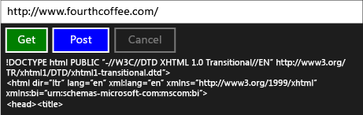

# Пошаговое руководство. Подключение с помощью задач и HTTP-запросов XML

В этом примере показано, как использовать интерфейсы [IXMLHTTPRequest2](/windows/win32/api/msxml6/nn-msxml6-ixmlhttprequest2) и [IXMLHTTPRequest2Callback](/windows/win32/api/msxml6/nn-msxml6-ixmlhttprequest2callback) вместе с задачами для отправки запросов HTTP GET и POST к веб-службе в приложении универсальная платформа Windows (UWP). Путем объединения `IXMLHTTPRequest2` с задачами, можно написать код, который объединяется с другими задачами. Например, можно использовать задачу загрузки в цепочке этих задач. Задача загрузки может также реагировать на отмену работы.

> [!TIP]
>  Для выполнения HTTP-запросов C++ из приложения UWP с помощью C++ приложения или из классического C++ приложения можно также использовать пакет SDK для RESTful. Дополнительные сведения см. в разделе [ C++ пакет SDK для RESTful (кодовое название "Касабланка")](https://github.com/Microsoft/cpprestsdk).

Дополнительные сведения о задачах см. в разделе [параллелизм задач](../../parallel/concrt/task-parallelism-concurrency-runtime.md). Дополнительные сведения об использовании задач в приложении UWP см. в статье асинхронное [программирование в C++ ](/windows/uwp/threading-async/asynchronous-programming-in-cpp-universal-windows-platform-apps) и [Создание асинхронных операций в C++ для приложений UWP](../../parallel/concrt/creating-asynchronous-operations-in-cpp-for-windows-store-apps.md).

В этом документе сначала показаны способы создания `HttpRequest` и его вспомогательных классов. Затем показано, как использовать этот класс из приложения UWP, которое использует C++ и XAML.

Пример, в котором используется `IXMLHTTPRequest2` , но не использует задачи, см [. в разделе Краткое руководство. Подключение с использованием HTTP-запроса XML (](/previous-versions/windows/apps/hh770550\(v=win.10\))IXMLHTTPRequest2).

> [!TIP]
>  `IXMLHTTPRequest2`и `IXMLHTTPRequest2Callback` — это интерфейсы, которые рекомендуется использовать в приложении UWP. Можно также адаптировать этот пример для использования в приложении для настольных систем.

## Предварительные требования

Поддержка UWP является необязательной в Visual Studio 2017 и более поздних версиях. Чтобы установить его, откройте Visual Studio Installer в меню "Пуск" Windows и выберите версию Visual Studio, которую вы используете. Нажмите кнопку **изменить** и убедитесь, что установлен флажок **Разработка UWP** . В разделе необязательные **компоненты** убедитесь, что  **C++ установлены средства UWP** . Используйте v141 для Visual Studio 2017 или v142 для Visual Studio 2019.

## Определение классов HttpRequest, HttpRequestBuffersCallback и HttpRequestStringCallback

В случае использования интерфейса `IXMLHTTPRequest2` для создания веб-запросов по протоколу HTTP необходимо реализовать интерфейс `IXMLHTTPRequest2Callback` для получения ответа сервера и реагирования на другие события. В этом примере определяется класс `HttpRequest` для создания веб-запросов и классы `HttpRequestBuffersCallback` и `HttpRequestStringCallback` для обработки ответов. Классы `HttpRequestBuffersCallback` и `HttpRequestStringCallback` поддерживают класс `HttpRequest`; пользователь работает только с классом `HttpRequest` из кода приложения.

Методы `GetAsync`, `PostAsync` класса `HttpRequest` позволяют запустить операции HTTP GET и POST, соответственно. Эти методы используют класс `HttpRequestStringCallback` для чтения ответа сервера в виде строки. Методы `SendAsync` и `ReadAsync` позволяют выполнять потоковую передачу большого содержимого в виде блоков. Каждый из этих методов возвращает [Concurrency:: Task](../../parallel/concrt/reference/task-class.md) для представления операции. Методы `GetAsync` и `PostAsync` создают значение `task<std::wstring>`, где часть `wstring` представляет ответ сервера. Методы `SendAsync` и `ReadAsync` генерируют значения `task<void>`; эти задачи завершаются по завершению операций отправки и чтения.

Поскольку интерфейсы работают асинхронно, в этом примере используется [Concurrency:: task_completion_event](../../parallel/concrt/reference/task-completion-event-class.md) для создания задачи, которая завершается после завершения объекта обратного вызова или отменяет операцию загрузки. `IXMLHTTPRequest2` Класс `HttpRequest` создает основанное на задаче продолжение из этой задачи, чтобы установить конечный результат. Класс `HttpRequest` использует основанное на задаче продолжение, чтобы убедиться, что задача продолжения выполняется, даже если предыдущая задача выдает ошибку или отменяется. Дополнительные сведения о продолжениях на основе задач см. в разделе [параллелизм задач](../../parallel/concrt/task-parallelism-concurrency-runtime.md) .

Чтобы поддерживать отмену, классы `HttpRequest`, `HttpRequestBuffersCallback` и `HttpRequestStringCallback` используют токены отмены. Классы `HttpRequestBuffersCallback` и`HttpRequestStringCallback` используют метод [Concurrency:: cancellation_token:: register_callback](reference/cancellation-token-class.md#register_callback) , чтобы событие завершения задачи отвечало на отмену. Этот обратный вызов отмены прерывает загрузку. Дополнительные сведения об отмене см. в разделе [Отмена](../../parallel/concrt/exception-handling-in-the-concurrency-runtime.md#cancellation).

#### Определение класса HttpRequest

1. В главном меню выберите **файл** > **создать** > **проект**. 

1. C++ Используйте шаблон **пустое приложение (универсальные приложения Windows)** для создания пустого проекта приложения XAML. В этом примере проект называется `UsingIXMLHTTPRequest2`.

1. Добавьте в проект файл заголовка с именем HttpRequest.h и файл исходного кода с именем HttpRequest.cpp.

1. В pch.h добавьте следующий код:

   [!code-cpp[concrt-using-ixhr2#1](../../parallel/concrt/codesnippet/cpp/walkthrough-connecting-using-tasks-and-xml-http-requests_1.h)]

1. В HttpRequest.h добавьте следующий код:

   [!code-cpp[concrt-using-ixhr2#2](../../parallel/concrt/codesnippet/cpp/walkthrough-connecting-using-tasks-and-xml-http-requests_2.h)]

1. В HttpRequest.cpp добавьте следующий код:

   [!code-cpp[concrt-using-ixhr2#3](../../parallel/concrt/codesnippet/cpp/walkthrough-connecting-using-tasks-and-xml-http-requests_3.cpp)]

## Использование класса HttpRequest в приложении UWP

В этом разделе показано, как использовать `HttpRequest` класс в приложении UWP. Приложение предоставляет окно ввода, определяющее ресурс URL-адреса, и кнопки команд, которые выполняют операции GET и POST, и команду кнопки, которая отменяет текущую операцию.

#### Использование класса HttpRequest

1. В MainPage. XAML определите элемент [StackPanel](/uwp/api/Windows.UI.Xaml.Controls.StackPanel) следующим образом.

   [!code-xml[concrt-using-ixhr2#A1](../../parallel/concrt/codesnippet/xaml/walkthrough-connecting-using-tasks-and-xml-http-requests_4.xaml)]

2. В MainPage.xaml.h добавьте эту директиву `#include`:

   [!code-cpp[concrt-using-ixhr2#A2](../../parallel/concrt/codesnippet/cpp/walkthrough-connecting-using-tasks-and-xml-http-requests_5.h)]

3. В MainPage.xaml.h добавьте следующие переменные-члены `private` в класс `MainPage`:

   [!code-cpp[concrt-using-ixhr2#A3](../../parallel/concrt/codesnippet/cpp/walkthrough-connecting-using-tasks-and-xml-http-requests_6.h)]

4. В MainPage.xaml.h объявите `private` метод `ProcessHttpRequest`:

   [!code-cpp[concrt-using-ixhr2#A4](../../parallel/concrt/codesnippet/cpp/walkthrough-connecting-using-tasks-and-xml-http-requests_7.h)]

5. В MainPage.xaml.cpp добавьте эти операторы `using`:

   [!code-cpp[concrt-using-ixhr2#A5](../../parallel/concrt/codesnippet/cpp/walkthrough-connecting-using-tasks-and-xml-http-requests_8.cpp)]

6. В MainPage.xaml.cpp реализуйте методы `GetButton_Click`, `PostButton_Click` и `CancelButton_Click` класса `MainPage`.

   [!code-cpp[concrt-using-ixhr2#A6](../../parallel/concrt/codesnippet/cpp/walkthrough-connecting-using-tasks-and-xml-http-requests_9.cpp)]

   > [!TIP]
   > Если приложение не требует поддержки отмены, передайте [Concurrency:: cancellation_token:: None](reference/cancellation-token-class.md#none) в `HttpRequest::GetAsync` методы и `HttpRequest::PostAsync` .

1. В MainPage.xaml.cpp реализуйте метод `MainPage::ProcessHttpRequest`.

   [!code-cpp[concrt-using-ixhr2#A7](../../parallel/concrt/codesnippet/cpp/walkthrough-connecting-using-tasks-and-xml-http-requests_10.cpp)]

8. В свойствах проекта в разделе **Компоновщик** `shcore.lib` введите и. `msxml6.lib`

Здесь приводится работающее приложение:

## Следующие шаги

[Пошаговые руководства по среде выполнения с параллелизмом](../../parallel/concrt/concurrency-runtime-walkthroughs.md)

## См. также

[Параллелизм задач](../../parallel/concrt/task-parallelism-concurrency-runtime.md) 
[Отмена в библиотеке параллельных шаблонов](cancellation-in-the-ppl.md) 
[Асинхронное программирование вC++](/windows/uwp/threading-async/asynchronous-programming-in-cpp-universal-windows-platform-apps) 
[Создание асинхронных операций на C++ для приложений UWP](../../parallel/concrt/creating-asynchronous-operations-in-cpp-for-windows-store-apps.md) 
[Краткое руководство Подключение с помощью класса задачи «XML-](/previous-versions/windows/apps/hh770550\(v=win.10\))запрос HTTP» (IXMLHTTPRequest2
)[(среда выполнения с параллелизмом)](../../parallel/concrt/reference/task-class.md) 
[Класс task_completion_event](../../parallel/concrt/reference/task-completion-event-class.md)
