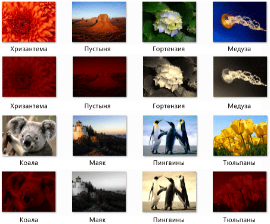

# Пошаговое руководство. Создание сети обработки изображений
В этом документе показано, как создавать сеть асинхронных блоков сообщений, выполняющих обработку изображений.  
  
 Сети определяет, какие операции для выполнения в зависимости от свойств изображения. В этом примере используется *потока данных* модели для перемещения изображений по сети. В модели потока данных независимые компоненты программы взаимодействуют друг с другом, отправляя сообщения. Когда компонент получает сообщение, он выполнения некоторых операций и затем передать результат этого действия другому компоненту. Сравните это с *поток управления* модели, в котором приложение использует структур управления, например, условные операторы, циклы и т. д., для управления порядком операций в программе.  
  
 Создает в сети, основанной на потоке данных *конвейера* задач. Каждый этап конвейера параллельно выполняет часть общей задачи. Можно сравнить это с линией сборки автомобилей. При продвижении автомобиля по сборочной линии, одна станция собирает раму, другая — устанавливает двигатель и так далее. Много автомобилей, можно собирать одновременно, линия сборки обеспечивает большую производительность, чем полная сборка автомобилей одна за другой.  
  
## Предварительные требования  
 Перед выполнением этого пошагового руководства, приведены в следующих источниках:  
  
-   [Асинхронные блоки сообщений](../../parallel/concrt/asynchronous-message-blocks.md)  
  
-   [Практическое руководство. Использование фильтра блоков сообщений](../../parallel/concrt/how-to-use-a-message-block-filter.md)  
  
-   [Пошаговое руководство. Создание агента потоков данных](../../parallel/concrt/walkthrough-creating-a-dataflow-agent.md)  
  
 Рекомендуется также, что вы понимаете основные принципы [!INCLUDE[ndptecgdiplus](../../parallel/concrt/includes/ndptecgdiplus_md.md)] перед выполнением этого пошагового руководства.  
  
##   Разделы  
 Это пошаговое руководство содержит следующие разделы:  
  
-   [Определение функции обработки изображений](#functionality)  
  
-   [Создание сети обработки изображений](#network)  
  
-   [Полный пример](#complete)  
  
##   Определение функции обработки изображений  
 В этом разделе представлены функции поддержки, которые использует сеть обработки изображений для работы с образами, которые считываются с диска.  
  
 Следующие функции `GetRGB` и `MakeColor`, извлекают и объединяют отдельные компоненты данного цвета соответственно.  
  
 [!code-cpp[concrt-image-processing-filter#2](../../parallel/concrt/codesnippet/cpp/walkthrough-creating-an-image-processing-network_1.cpp)]  
  

 Следующая функция `ProcessImage`, вызовы заданной [std::function](../../standard-library/function-class.md) объекта, чтобы преобразовать значение цвета каждого пикселя в [!INCLUDE[ndptecgdiplus](../../parallel/concrt/includes/ndptecgdiplus_md.md)] [растрового изображения](https://msdn.microsoft.com/library/ms534420.aspx) объекта. `ProcessImage` Функция использует [concurrency::parallel_for](reference/concurrency-namespace-functions.md#parallel_for) алгоритм для обработки каждой строки точечного рисунка в параллельном режиме.  

  
 [!code-cpp[concrt-image-processing-filter#3](../../parallel/concrt/codesnippet/cpp/walkthrough-creating-an-image-processing-network_2.cpp)]  
  
 Следующие функции `Grayscale`, `Sepiatone`, `ColorMask`, и `Darken`, вызовите `ProcessImage` функция, преобразующая значение цвета каждого пикселя в `Bitmap` объекта. Для определения преобразование цвета на один пиксель, каждая из этих функций используются лямбда-выражения.  
  
 [!code-cpp[concrt-image-processing-filter#4](../../parallel/concrt/codesnippet/cpp/walkthrough-creating-an-image-processing-network_3.cpp)]  
  
 Следующая функция `GetColorDominance`, также вызывает `ProcessImage` функции. Тем не менее, вместо изменения значения каждого цвета, эта функция использует [concurrency::combinable](../../parallel/concrt/reference/combinable-class.md) объектов для вычисления ли красного, зеленого и синего компонентов компонент какого цвета преобладает изображения.  
  
 [!code-cpp[concrt-image-processing-filter#5](../../parallel/concrt/codesnippet/cpp/walkthrough-creating-an-image-processing-network_4.cpp)]  
  
 Следующая функция `GetEncoderClsid`, Получает идентификатор класса для данного типа MIME кодировщика. Эта функция позволяет приложению получить кодировщик для растрового изображения.  
  
 [!code-cpp[concrt-image-processing-filter#6](../../parallel/concrt/codesnippet/cpp/walkthrough-creating-an-image-processing-network_5.cpp)]  
  
 [[В начало](#top)]  
  
##   Создание сети обработки изображений  
 Этот раздел описывает, как создавать сеть асинхронных блоков сообщений, выполняющих обработку изображений в каждом [!INCLUDE[TLA#tla_jpeg](../../parallel/concrt/includes/tlasharptla_jpeg_md.md)] изображений (расширение JPG) в данном каталоге. Сеть выполняет следующие операции обработки изображений.  
  
1.  Все изображения, созданные пользователем Tom преобразуйте в оттенках серого.  
  
2.  Все изображения, красный основной цвет удалите зеленый и синий компоненты и затем затемнить его.  
  
3.  Для любого другого изображения применяется тонирование сепией.  
  
 Сеть применяет только первой операции обработки изображений, соответствующий одному из этих условий. Например если изображение создано пользователем Tom и красный основного цвета, изображение только преобразуется в оттенках серого.  
  
 После сети каждой операции обработки изображений, он сохраняет изображение на диске как файл растрового изображения (.bmp).  
  
 Ниже показано, как создать функцию, которая реализует сеть обработки изображений и применяющую эту сеть для каждого [!INCLUDE[TLA#tla_jpeg](../../parallel/concrt/includes/tlasharptla_jpeg_md.md)] изображение в заданном каталоге.  
  
#### Создание сети обработки изображений  
  
1.  Создайте функцию, `ProcessImages`, который принимает имя каталога на диске.  
  
     [!code-cpp[concrt-image-processing-filter#7](../../parallel/concrt/codesnippet/cpp/walkthrough-creating-an-image-processing-network_6.cpp)]  
  
2.  В `ProcessImages` функции, создайте `countdown_event` переменной. `countdown_event` Показано далее в этом пошаговом руководстве.  
  
     [!code-cpp[concrt-image-processing-filter#8](../../parallel/concrt/codesnippet/cpp/walkthrough-creating-an-image-processing-network_7.cpp)]  
  
3.  Создание [std::map](../../standard-library/map-class.md) объект, который связывает `Bitmap` объект с исходным именем файла.  
  
     [!code-cpp[concrt-image-processing-filter#9](../../parallel/concrt/codesnippet/cpp/walkthrough-creating-an-image-processing-network_8.cpp)]  
  
4.  Добавьте следующий код для определения элементов сети обработки изображений.  
  
     [!code-cpp[concrt-image-processing-filter#10](../../parallel/concrt/codesnippet/cpp/walkthrough-creating-an-image-processing-network_9.cpp)]  
  
5.  Добавьте следующий код для подключения к сети.  
  
     [!code-cpp[concrt-image-processing-filter#11](../../parallel/concrt/codesnippet/cpp/walkthrough-creating-an-image-processing-network_10.cpp)]  
  
6.  Добавьте следующий код для отправки в начало сети полный путь к каждому [!INCLUDE[TLA#tla_jpeg](../../parallel/concrt/includes/tlasharptla_jpeg_md.md)] файл в каталоге.  
  
     [!code-cpp[concrt-image-processing-filter#12](../../parallel/concrt/codesnippet/cpp/walkthrough-creating-an-image-processing-network_11.cpp)]  
  
7.  Дождитесь `countdown_event` переменной достигнет нуля.  
  
     [!code-cpp[concrt-image-processing-filter#13](../../parallel/concrt/codesnippet/cpp/walkthrough-creating-an-image-processing-network_12.cpp)]  
  
 Следующая таблица описывает члены сети.  
  
|Член|Описание|  
|------------|-----------------|  
|`load_bitmap`|Объект [concurrency::transformer](../../parallel/concrt/reference/transformer-class.md) , загружающий `Bitmap` с диска и добавляющий запись `map` объекта, связывающую изображение с исходным именем файла.|  
|`loaded_bitmaps`|Объект [concurrency::unbounded_buffer](reference/unbounded-buffer-class.md) объект, отправляющий загруженные изображения фильтрам обработки изображений.|  
|`grayscale`|Объект `transformer` объект, который преобразует изображения, созданные пользователем Tom оттенки серого. Он использует метаданные образа, чтобы определить ее автора.|  
|`colormask`|Объект `transformer` объект, который удаляет компоненты зеленого и синего цветов из изображений, в которых красный основной цвет.|  
|`darken`|Объект `transformer` объект, который затемняет которых красный основной цвет изображения.|  
|`sepiatone`|Объект `transformer` объект, применяющий тонирование сепией к изображениям, не созданным пользователем Tom и не преобладает красный цвет.|  
|`save_bitmap`|Объект `transformer` объекта, сохраняющий обработанный `image` на диск как растровое изображение. `save_bitmap` Получает исходное имя файла из `map` объекта и изменяет расширение имени файла на BMP.|  
|`delete_bitmap`|Объект `transformer` объект, который освобождает память для изображений.|  
|`decrement`|Объект [concurrency::call](../../parallel/concrt/reference/call-class.md) объект, действующий как конечный узел сети. Он уменьшает `countdown_event` чтобы сообщить главному приложению, изображение было обработано.|  
  
 `loaded_bitmaps` Буфер сообщений важен, поскольку как `unbounded_buffer` объекта, он обеспечивает `Bitmap` объектов между несколькими получателями. Когда целевой блок принимает `Bitmap` объекта, `unbounded_buffer` объекта не предлагает этот `Bitmap` объектов для других целевых объектов. Таким образом, порядок связывания объектов `unbounded_buffer` важен. `grayscale`, `colormask`, И `sepiatone` блоки использовать фильтр для приема сообщений только для некоторых `Bitmap` объектов. `decrement` Буфер сообщений является важным целевым объектом `loaded_bitmaps` буфера сообщений, так как он принимает все `Bitmap` объекты, которые будут отклонены буферов сообщений. `unbounded_buffer` Объект обязательно должен передавать сообщения в порядке. Таким образом `unbounded_buffer` блокируется, пока новый целевой блок, связанного с ним и принимает сообщение, если нет текущей целевой блок не примет это сообщение.  
  
 Если приложение требует, что сообщение обрабатывалось несколькими блоками сообщений, а не только одним блоком, сначала принимает сообщение, можно использовать другой тип блока сообщений, например `overwrite_buffer`. `overwrite_buffer` Класс содержит одно сообщение за раз, но он передает сообщение для каждого из его целевых объектов.  
  
 На следующей иллюстрации сеть обработки изображений.  
  
   
  
 `countdown_event` Объект в этом примере включает сеть обработки изображений для информирования основного приложения после обработки всех образов. `countdown_event` Класс использует [concurrency::event](../../parallel/concrt/reference/event-class.md) объекта, чтобы сообщить, что значение счетчика достигло нуля. Основное приложение увеличивает счетчик каждый раз, чтобы он передает имя файла в сети. Конечный узел сети уменьшает счетчик после обработки каждого изображения. Когда основное приложение проходит через указанный каталог, он ожидает `countdown_event` объект указывают, что его счетчик достиг нуля.  
  
 В следующем примере показан `countdown_event` класса:  
  
 [!code-cpp[concrt-image-processing-filter#14](../../parallel/concrt/codesnippet/cpp/walkthrough-creating-an-image-processing-network_13.cpp)]  
  
 [[В начало](#top)]  
  
##   Полный пример  
 Ниже приведен полный пример кода. `wmain` Управляет функция [!INCLUDE[ndptecgdiplus](../../parallel/concrt/includes/ndptecgdiplus_md.md)] библиотеку и вызывает `ProcessImages` функции к процессу [!INCLUDE[TLA#tla_jpeg](../../parallel/concrt/includes/tlasharptla_jpeg_md.md)] файлы в `Sample Pictures` каталога.  
  
 [!code-cpp[concrt-image-processing-filter#15](../../parallel/concrt/codesnippet/cpp/walkthrough-creating-an-image-processing-network_14.cpp)]  
  
 Ниже показан пример выходных данных. Исходные изображения расположены над соответствующими измененными изображениями.  
  
   
  
 `Lighthouse` созданные пользователем Tom Alphin и поэтому преобразуется в оттенках серого. `Chrysanthemum`, `Desert`, `Koala`, и `Tulips` красный основной цвет и таким образом удалить компоненты сине-зеленый цвет и они затемнены. `Hydrangeas`, `Jellyfish`, и `Penguins` соответствующие критериям по умолчанию и, следовательно, toned цвета.  
  
 [[В начало](#top)]  
  
### Компиляция кода  
 Скопируйте код примера и вставьте его в проект Visual Studio или вставить его в файл с именем `image-processing-network.cpp` , а затем запустите следующую команду в окне командной строки Visual Studio.  
  
 **CL.exe /DUNICODE/EHsc/Link image-processing-network.cpp gdiplus.lib**  
  
## См. также  
 [Пошаговые руководства по среде выполнения с параллелизмом](../../parallel/concrt/concurrency-runtime-walkthroughs.md)
