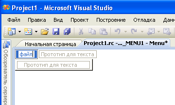

# Создание меню
> [!NOTE]
>  Окно ресурсов недоступно в выпусках Express.  
  
### Создание стандартного меню  
  
1.  В меню **Вид** выберите пункт **Представление ресурсов** , а затем щелкните правой кнопкой мыши заголовок **Меню** и выберите команду **Добавить ресурс**. Выберите **Меню**.  
  
2.  Выберите в строке меню поле **Новый элемент** (прямоугольник с надписью "Прототип для текста").  
  
       
Поле "Новый элемент"  
  
3.  Введите название нового меню, например "Файл".  
  
     Введенный текст отображается в редакторе **меню** и в поле **Заголовок** [окна свойств](/visualstudio/ide/reference/properties-window). Вы можете изменять свойства нового пункта меню в любом из этих мест.  
  
     Как только вы присвоите название новому меню в строке меню, поле нового элемента сдвинется вправо (чтобы вы могли добавить еще одно меню), а другое поле нового элемента откроется под первым меню, чтобы вы могли добавить в него команды.  
  
       
Поле нового элемента со смещенным фокусом после ввода названия меню  
  
    > [!NOTE]
    >  Чтобы создать меню с одним пунктом в строке меню, установите значение свойства "Контекстное меню" равным False.  
  
 Сведения о добавлении ресурсов в управляемые проекты см. в разделе [ресурсы в классических приложениях](/dotnet/framework/resources/index) в *руководства разработчика .NET Framework.* Сведения о вручную добавлять файлы ресурсов в управляемые проекты, осуществлять доступ к ресурсам, отображать статические ресурсы и присваивать строки ресурсов свойствам см. в разделе [Создание файлов ресурсов для приложений рабочего стола](/dotnet/framework/resources/creating-resource-files-for-desktop-apps). Сведения о глобализации и локализации ресурсов в управляемых приложениях см. в разделе [Globalizing и локализация приложений .NET Framework](/dotnet/standard/globalization-localization/index).  
  
 **Требования**  
  
 Win32  
  
## См. также  
 [Редактор меню](../windows/menu-editor.md)