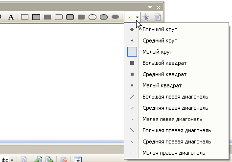

# Редактор изображений для значковC++()

При выборе файла изображения (например, ICO, BMP, PNG) в **Обозреватель решений**изображение открывается в **редакторе изображений** таким же образом, как файлы кода, открываемые в **редакторе кода**. Когда вкладка **Редактор изображений** активна, вы увидите панели инструментов со многими инструментами для создания и редактирования изображений. Вместе с точечными рисунками, значками и курсорами можно редактировать изображения в формате GIF или JPEG с помощью команд меню **изображение** и средств на панели инструментов **редактора изображений** .

Графические ресурсы — это образы, определяемые для приложения. Можно рисовать FreeHand или рисовать с помощью фигур. Можно выбрать части изображения для редактирования, зеркального отображения или изменения размера, а также создать пользовательскую кисть на основе выбранной части изображения и рисовать с этой кистью. Можно определять свойства изображения, сохранять изображения в разных форматах и преобразовывать изображения из одного формата в другой.

> [!NOTE]
> С помощью **редактора изображений**можно просматривать 32-разрядные изображения, но нельзя изменять их.

Для работы с файлами ресурсов в управляемых проектах также можно использовать **Редактор изображений** и [двоичный редактор](binary-editor.md) . Все управляемые ресурсы, которые нужно редактировать, должны быть связанными ресурсами. Редакторы ресурсов Visual Studio не поддерживают изменение внедренных ресурсов.

Помимо создания новых графических ресурсов можно [импортировать существующие изображения](../windows/how-to-copy-resources.md#import-and-export-resources) для редактирования, а затем добавить их в проект. Можно также открывать и изменять образы, не являющиеся частью проекта, для [редактирования автономных изображений](../windows/editing-an-image-outside-of-a-project-image-editor-for-icons.md).

Сведения о **редакторе изображений**см. в разделах [Создание значка или другого изображения](../windows/creating-an-icon-or-other-image-image-editor-for-icons.md), [изменение изображения](../windows/selecting-an-area-of-an-image-image-editor-for-icons.md), [Использование инструмента рисования](../windows/using-a-drawing-tool-image-editor-for-icons.md), [Работа с цветом](../windows/working-with-color-image-editor-for-icons.md)и сочетания [клавиш](../windows/accelerator-keys-image-editor-for-icons.md).

> [!NOTE]
> Бесплатно загрузите **библиотеку изображений Visual Studio** , содержащую множество анимаций, точечных рисунков и значков, которые можно использовать в приложениях. Дополнительные сведения о загрузке библиотеки см. в разделе [Библиотека изображений Visual Studio](/visualstudio/designers/the-visual-studio-image-library).

## Меню "Изображение"

Меню **изображение** , которое появляется только при активном **редакторе изображений** , содержит команды для редактирования изображений, управления цветными палитрами и настройки параметров окна **редактора изображений** . Кроме того, команды для использования образов устройств доступны при работе со значками и курсорами.

|Get-Help|Description|
|---|---|
|**Обратить цвета**|Инвертирует цвета.|
|**Отразить по-горизонтали**|Горизонтальное зеркальное отражение изображения или выбранного фрагмента.|
|**Отразить по-вертикали**|Вертикальное зеркальное отражение изображения или выделенного фрагмента.|
|**Поворот на 90 градусов**|Поворот изображения или выделенного фрагмента на 90 градусов.|
|**Отображение окна "цвета"**|Открывает окно **цвета** , в котором можно выбрать цвета, используемые для изображения.|
|**Использовать выделенный фрагмент в качестве кисти**|Позволяет создать пользовательскую кисть на основе части изображения.  Выбранный фрагмент превращается в пользовательскую кисть, которая распределяет цвета по выделенному фрагменту изображения. Копии выделенного фрагмента остаются вдоль пути перетаскивания. Чем замедляется перетаскивание, тем больше копий выполняется.|
|**Копирование и выбор структуры**|Копирование текущего выделенного фрагмента и формирование его контура.  Если цвет фона содержится в текущем выделенном фрагменте, он будет исключен, если выбран прозрачный.
|**Настройка цветов**|Открывает **настраиваемый селектор цвета**, позволяющий настраивать цвета, используемые для изображения.|
|**Загрузить палитру**|Открывает диалоговое окно **Загрузка палитры цветов** , которое позволяет загрузить цвета палитры, сохраненные ранее в файл. PAL.|
|**Сохранить палитру**|Сохраняет цвета палитры в PAL-файле.|
|**Непрозрачный вывод**|Если этот флажок установлен, текущее выделение становится непрозрачным.  Если флажок не установлен, текущий выделенный фрагмент становится прозрачным.|
|**Редактор панелей инструментов**|Открывает [диалоговое окно Создание ресурса панели инструментов](../windows/new-toolbar-resource-dialog-box.md).|
|**Параметры сетки**|Открывает диалоговое окно **Параметры сетки** , в котором можно указать сетки для изображения.|
|**Новый тип изображения**|Открывает [диалоговое окно новое \<устройство > тип образа](../windows/new-device-image-type-dialog-box-image-editor-for-icons.md).  Один ресурс значка может содержать несколько изображений разного размера, и Windows может использовать соответствующий размер значка в зависимости от того, как он будет отображаться. Новый тип устройства не изменяет размер значка, а создает новое изображение в значке. Применяется только к значкам и курсорам.|
|**Текущий тип изображения значка или курсора**|Открывает подменю, в котором перечислены первые девять доступных изображений курсора или значков. Последняя команда в подменю **Дополнительно**открывает [диалоговое окно открытие \<устройство > изображение](../windows/open-device-image-dialog-box-image-editor-for-icons.md).|
|**Удалить тип изображения**|Удаляет выбранный образ устройства.|
|**Инструменты**|Запускает подменю, которое содержит все средства, доступные на панели инструментов **редактора изображений** .|

Диалоговое окно **Параметры сетки** позволяет задать параметры сетки для изображения и отобразить линии сетки над редактируемым изображением. Строки полезны для редактирования изображения, но не сохраняются как часть изображения.

|Свойство|Description|
|---|---|
|**Точечная сетка**|Если флажок установлен, отображает сетку вокруг каждого пикселя в **редакторе изображений**.  Сетка отображается только с разрешением 4 x и выше.|
|**Мозаичная сетка**|Если этот флажок установлен, выводится сетка вокруг блоков пикселей в **редакторе изображений**, определяемых значениями интервала сетки.|
|**Width**|Задает ширину каждого блока мозаики.  Это свойство полезно при рисовании точечных рисунков, содержащих несколько изображений, упорядоченных с регулярными интервалами.|
|**Height**|Задает высоту каждого блока мозаики.  Это свойство полезно при рисовании точечных рисунков, содержащих несколько изображений, упорядоченных с регулярными интервалами.|

## Панель инструментов

Панель инструментов **редактора изображений** содержит инструменты для рисования, рисования, ввода текста, стирания и управления представлениями. Он также содержит селектор параметров, с помощью которого можно выбрать параметры для использования каждого средства. Например, можно выбрать различные значения ширины кисти, коэффициенты увеличения и стили линий.

Все средства, доступные на панели инструментов **редактора изображений** , также доступны из **изображения** меню > **инструментов**. Чтобы использовать панель инструментов **редактора изображений** и селектор **параметров** , выберите нужный инструмент или параметр.

 
Панель инструментов **редактора изображений**

> [!TIP]
> Всплывающие подсказки отображаются при наведении курсора на кнопку панели инструментов. Эти советы помогут определить функцию каждой кнопки.

Поскольку многие инструменты рисования доступны с [клавиатуры](../windows/accelerator-keys-image-editor-for-icons.md), иногда бывает полезно скрыть панель инструментов **редактора изображений** .

- Чтобы отобразить или скрыть панель инструментов **редактора изображений** , перейдите в **представление** меню > **панели инструментов** и выберите **Редактор изображений**.

> [!NOTE]
> Элементы этой панели инструментов будут отображаться как недоступные, если файл изображения из текущего проекта или решения не открыт в **редакторе изображений**.

### Селектор параметров

С помощью селектора **параметров** можно указать ширину линии, мазка кисти и т. д. Значок на кнопке селектора **параметров** меняется в зависимости от выбранного инструмента.

 
Селектор **параметров** на панели инструментов **редактора изображений**

### Инструмент "текст"

Используйте диалоговое окно « **текст** » для добавления текста в ресурс, Растровое изображение или значок.

Чтобы открыть это диалоговое окно, откройте **Редактор изображений** и перейдите в меню ** > ** **инструменты**, а затем выберите команду **инструмент "текст** ".

> [!TIP]
> Можно щелкнуть правой кнопкой мыши диалоговое окно « **текст»** , чтобы открыть контекстное меню по умолчанию, содержащее список стандартных команд Windows.

Откройте диалоговое окно **Шрифт текстового инструмента** , чтобы изменить шрифт, стиль или размер шрифта курсора. Изменения применяются к тексту, отображаемому в области **текста** .

Чтобы открыть это диалоговое окно, нажмите кнопку **Font (шрифт** ) в диалоговом окне « **текст»** . Доступны следующие свойства:

|Свойство|Description|
|---|---|
|**Шрифт**|Список доступных шрифтов.|
|**Стиль шрифта**|Перечисляет доступные стили для указанного шрифта.|
|**Размер**|Список доступных размеров точек для указанного шрифта.|
|**Образец**|Показывает пример того, как будет выглядеть текст с указанными параметрами шрифта.|
|**Скрипт**|Список доступных языковых скриптов для указанного шрифта.  При выборе другого языкового сценария набор символов для этого языка станет доступным для создания многоязычных документов.|

#### Изменение шрифта текста на изображении

Ниже приведен пример того, как можно добавить текст в значок в приложении Windows и управлять шрифтом текста.

1. Создание приложения C++ Windows Forms. Дополнительные сведения см. [в разделе инструкции. создание Windows Forms приложений](/previous-versions/visualstudio/visual-studio-2008/s69bf10x(v%3dvs.90)). Файл *app. ico* добавляется в проект по умолчанию.

1. В **Обозреватель решений**дважды щелкните файл *app. ico*. Откроется **Редактор изображений** .

1. Последовательно выберите пункты **изображение** > **инструменты** и **инструмент "текст**".

1. В диалоговом окне **текст** введите *C++* в области пустое текстовое поле. Этот текст будет отображаться в поле с изменяемым размером, расположенном в левом верхнем углу файла *app. ico* в **редакторе изображений**.

1. Чтобы улучшить удобочитаемость текста, в **редакторе изображений**перетащите поле Изменяемый размер в центр файла *app. ico* .

1. В диалоговом окне " **текст** " нажмите кнопку **Шрифт** .

1. В диалоговом окне **Шрифт текстового инструмента** :

   - Выберите **Times New Roman** из списка доступных шрифтов, перечисленных в поле список **шрифтов** .

   - Выберите **полужирный** шрифт в списке доступных стилей шрифтов, перечисленных в списке **стиль шрифта** .

   - Выберите **10** из списка доступных размеров, перечисленных в списке **Размер** .

   - Нажмите кнопку **ОК**. Диалоговое окно **Шрифт текстового инструмента** закроется, а новые параметры шрифта будут применены к тексту.

1. Нажмите кнопку **Закрыть** в диалоговом окне **текстовый инструмент** . Поле изменяемого размера вокруг текста исчезнет из **редактора изображений**.

В текстовой области отображается текст, который отображается как часть ресурса. Изначально эта область пуста.

> [!NOTE]
> Если задан **прозрачный фон** , в изображение будет помещен только текст. Если задан параметр **непрозрачный фон** , за текстом будет помещаться ограничивающий прямоугольник, заполненный цветом фона.

## Области окна

В окне **редактора изображений** отображаются два представления изображения, а полоса разбиения отделяет две панели. Чтобы изменить соотношение областей, переместите разделитель в нужную сторону. Активная панель окружена границами, как выделенная область.

Одно представление имеет фактический размер, а другое увеличивается на коэффициент увеличения 6. Представления в этих двух панелях обновляются автоматически, любые изменения, внесенные в одной панели, сразу же отображаются в другой. Две панели позволяют легко работать с увеличенным представлением изображения, в котором можно различать отдельные пиксели и одновременно наблюдать за результатом работы над представлением изображения в реальном масштабе.

В левой области используется столько места, сколько требуется (до половины окна **изображения** ) для отображения представления изображения по умолчанию 1:1. На правой панели отображается изображение по умолчанию с увеличением масштаба 6:1. Можно изменить масштаб в каждой панели с помощью инструмента **увеличения** на панели инструментов **редактора изображений** или с помощью сочетаний клавиш.

Можно увеличить область меньшего размера окна **редактора изображений** и использовать две панели для отображения различных областей крупного изображения. Выберите внутри области, чтобы выбрать ее.

Можно изменить относительные размеры панелей, наведя указатель мыши на линию разделения и переместив линию разделения вправо или влево. Полоса разбиения может перемещаться на любую сторону, если вы хотите работать только с одной панелью.

Если область **редактора изображений** увеличена с коэффициентом 4 или выше, можно отобразить пиксельную сетку, ограничивающую отдельные пиксели в изображении.

### Изменение коэффициента увеличения

По умолчанию **Редактор изображений** отображает представление в левой области с фактическим размером, а представление на правой панели — в 6 раз. Коэффициент увеличения (видимый в строке состояния в нижней части рабочей области) — это отношение между фактическим размером изображения и отображаемым размером. Коэффициент по умолчанию равен 6, а диапазон — от 1 до 10.

1. Выберите область **редактора изображений** , коэффициент увеличения которой требуется изменить.

1. На панели инструментов **редактора изображений** щелкните стрелку справа от инструмента **лупы** и выберите масштабный коэффициент в подменю: **1x**, **2x**, **6X**или **8X**.

   > [!NOTE]
   > Чтобы выбрать коэффициент увеличения, отличный от перечисленных в средстве **увеличения** , используйте сочетания клавиш.

### Отображение или скрытие точечной сетки

Для всех панелей **редактора изображений** с коэффициентом увеличения, равным 4 или выше, можно отобразить сетку, которая разделяет отдельные пиксели в изображении.

1. Последовательно выберите пункты **изображение** меню > **Параметры сетки**.

1. Установите флажок **Пиксельная сетка** , чтобы отобразить сетку, или снимите флажок, чтобы скрыть сетку.

## Требования

None

## См. также раздел

[Редакторы ресурсов](../windows/resource-editors.md) 
[Значки](/windows/win32/menurc/icons)
