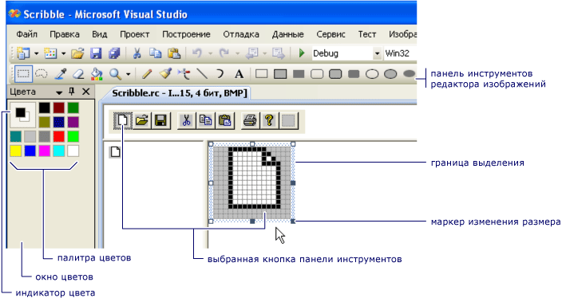

# Редактор панелей инструментов (C++)

**Редактор панелей инструментов** позволяет создавать ресурсы панели инструментов и преобразовывать точечные рисунки в ресурсы панели инструментов. **Редактор панелей инструментов** использует графическое отображение. В нем отображаются панель инструментов и кнопки, которые точно похожи на то, как они будут выглядеть в готовом приложении.

В окне **редактора панелей инструментов** отображаются два представления изображения кнопки, то же, что и окно **редактора изображений** . Две области разделены разделителем. Чтобы изменить относительные размеры панелей, можно перетащить линию разбивки из стороны в сторону. В активной области отображается граница выделения, а над двумя представлениями изображения — панель инструментов темы.

 
**Редактор панелей инструментов**

**Редактор панелей инструментов** аналогичен **редактору изображений** в функциональных возможностях. Элементы меню, графические инструменты и сетка точечных рисунков между ними одинаковы. В меню **изображение** есть команда меню для переключения между **редактором панелей инструментов** и **редактором изображений**. Дополнительные сведения об использовании **графических** панелей инструментов, палитр **цветов** и меню **изображений** см. в разделе [Редактор изображений](../windows/image-editor-for-icons.md).

Вы можете создать новую панель инструментов в проекте C++, преобразовав растровое изображение. Рисунок из растрового изображения преобразуется в изображения кнопок для панели инструментов. Обычно точечный рисунок содержит несколько изображений кнопок на одном растровом изображении с одним изображением для каждой кнопки. Изображения могут иметь любой размер, так как по умолчанию ширина 16 пикселей и высота изображения. Размер изображений кнопки можно указать в диалоговом окне **Создание ресурса панели инструментов** . Чтобы указать размеры, выберите **Редактор панели инструментов** в меню **изображение** в **редакторе изображений**.

Диалоговое окно **Создание ресурса панели инструментов** позволяет указать ширину и высоту кнопок, добавляемых к ресурсу панели инструментов в проекте C++. Значение по умолчанию — 16 × 15 пикселей.

Максимальная ширина точечного рисунка, используемая для создания панели инструментов, равна 2048. Если установить **ширину кнопки** равным *512*, то можно будет иметь только четыре кнопки. Если задать ширину *513*, можно использовать только три кнопки.

Диалоговое окно **Создание ресурса панели инструментов** имеет следующие свойства.

|Свойство|Описание|
|---|---------------|
|**Ширина кнопки**|Поле ввода ширины кнопок панели инструментов, которые преобразуются из ресурса точечного рисунка в ресурс панели инструментов.|
|**Высота кнопки**|Поле ввода высоты кнопок панели инструментов, которые преобразуются из ресурса точечного рисунка в ресурс панели инструментов.|

> [!NOTE]
> Изображения обрезаются до заданной ширины и высоты, а цвета корректируются для использования стандартных цветов панели инструментов (16 цветов).

По умолчанию на панели инструментов в правой части панели инструментов отображается новая или пустая кнопка. Эту кнопку можно переместить перед редактированием. При создании новой кнопки справа от нее появляется другая пустая кнопка. При сохранении панели инструментов пустая кнопка не сохраняется.

Кнопка панели инструментов имеет следующие свойства.

|Свойство|Описание|
|--------------|-----------------|
|**Идентификатор**|Определяет идентификатор кнопки. В раскрывающемся списке содержатся общие имена **идентификаторов** .|
|**Width**|Задает ширину кнопки. рекомендуется 16 пикселей.|
|**Height**|Задает высоту кнопки. Высота одной кнопки изменяет высоту всех кнопок на панели инструментов. рекомендуется использовать 15 пикселей.|
|**Командная строка**.|Определяет сообщение, отображаемое в строке состояния. Добавление *\n* и имени добавляет **подсказку** к этой кнопке панели инструментов. Дополнительные сведения см. [в разделе Создание всплывающей подсказки для кнопки на панели инструментов](#to-create-a-tool-tip-for-a-toolbar-button).|

**Ширина** и **Высота** применяются ко всем кнопкам. Максимальная ширина точечного рисунка, используемая для создания панели инструментов, равна 2048. Это означает, что если задать ширину кнопки равным *512*, то можно будет иметь только четыре кнопки. Если задать ширину *513*, можно использовать только три кнопки.

## Практическое руководство

**Редактор панелей инструментов** позволяет:

### Создание новых панелей инструментов

1. В **представление ресурсов**щелкните правой кнопкой мыши *RC* -файл и выберите **Добавить ресурс**. Если в *RC* -файле уже есть панель инструментов, щелкните правой кнопкой мыши папку **панели инструментов** и выберите пункт **Вставить панель инструментов**.

1. В диалоговом окне **Добавление ресурса** выберите **панель инструментов** в списке **тип ресурса** , а затем нажмите кнопку **создать**.

   Если **+** рядом с типом ресурса **панели инструментов** отображается знак «плюс» (), это означает, что доступны шаблоны панели инструментов. Щелкните знак «плюс», чтобы развернуть список шаблонов, выберите шаблон и нажмите кнопку **создать**.

### Преобразование точечных рисунков в ресурсы панели инструментов

1. Откройте существующий ресурс Bitmap в [редакторе изображений](../windows/image-editor-for-icons.md). Если точечный рисунок еще не находится в файле *. RC* , щелкните правой кнопкой мыши *RC* -файл и выберите пункт **Импорт**. Затем перейдите к точечному рисунку, который необходимо добавить в *RC* -файл, и выберите **Открыть**.

1. Перейдите в меню **Image**  >  **Редактор панелей инструментов**изображений.

   Откроется диалоговое окно « **Создание ресурса панели инструментов** ». Можно изменить ширину и высоту изображений значков, чтобы они совпадали с точечным рисунком. Затем изображение панели инструментов отобразится в **редакторе панелей инструментов**.

1. Чтобы завершить преобразование, измените **идентификатор** команды для кнопки с помощью [окно свойств](/visualstudio/ide/reference/properties-window). Введите новый *идентификатор* или выберите **идентификатор** из раскрывающегося списка.

   > [!TIP]
   > Окно **Свойства** содержит кнопку канцелярской кнопки в заголовке окна и выбирает этот параметр включает или отключает **Автоматическое скрытие** для этого периода. Чтобы циклически пройти все свойства кнопки панели инструментов без необходимости повторно открывать отдельные окна свойств, отключите **Автоматическое скрытие** , чтобы окно **свойств** оставалось стационарным.

   Можно также изменить идентификаторы команд кнопок на новой панели инструментов с помощью [окно свойств](/visualstudio/ide/reference/properties-window).

### Управление кнопками панели инструментов

#### Создание кнопки на панели инструментов

1. В [представление ресурсов](how-to-create-a-resource-script-file.md#create-resources) разверните папку ресурсов (например, *проект1. RC*).

1. Разверните папку **панели инструментов** и выберите панель инструментов для редактирования, а затем выполните одно из следующих действий.

   - Назначьте идентификатор пустой кнопке в правом конце панели инструментов. Это можно сделать, отредактировав свойство **ID** в [окне свойства](/visualstudio/ide/reference/properties-window). Например, может потребоваться назначить кнопке панели инструментов тот же идентификатор, что и в меню. В этом случае используйте раскрывающийся список, чтобы выбрать **идентификатор** пункта меню.

   - Нажмите кнопку пусто в правом конце панели инструментов на панели **представления панели инструментов** и начните рисование. Идентификатор команды по умолчанию назначен (ID_BUTTON \<n> ).

#### Добавление изображения на панель инструментов в качестве кнопки

1. В [представление ресурсов](how-to-create-a-resource-script-file.md#create-resources)откройте панель инструментов, дважды щелкнув ее.

1. Затем откройте образ, который вы хотите добавить на панель инструментов.

   > [!NOTE]
   > Если открыть образ в Visual Studio, он откроется в **редакторе изображений**. Вы также можете открыть образ в других графических программах.

1. Последовательно выберите пункты меню **изменить**  >  **копию**.

1. Переключитесь на панель инструментов, выбрав ее вкладку в верхней части окна исходного кода.

1. Последовательно выберите пункты **Правка**  >  **Вставить**.

   Изображение появится на панели инструментов в виде новой кнопки.

#### Перемещение кнопки панели инструментов

В панели **представление панели инструментов** перетащите кнопку, которую нужно переместить, в новое место на панели инструментов.

- Чтобы скопировать кнопки с панели инструментов, удерживайте нажатой клавишу **CTRL** . На панели **вид панели инструментов** перетащите кнопку в новое место на панели инструментов. Или перетащите его в нужное место на другой панели инструментов.

- Чтобы удалить кнопку на панели инструментов, нажмите кнопку на панели инструментов и перетащите ее за пределы панели инструментов.

- Чтобы вставить или удалить пробел между кнопками на панели инструментов, перетащите их с другого элемента управления на панель инструментов.

|Действие|Шаг|
|------|------|
|Вставка пробела перед кнопкой, за которой следует пробел|Перетащите кнопку вправо или вниз, пока она не перекроет следующую кнопку около половины.|
|Вставка пробела перед кнопкой, за которой следует пробел, и сохранение конечного пробела|Перетащите кнопку, пока правый или нижний край не покасается кнопки "Далее" или просто перекрывает ее.|
|Вставка пробела перед кнопкой, за которой следует пробел, и закрытие следующего пространства|Перетащите кнопку вправо или вниз, пока она не перекроет следующую кнопку около половины.|
|Удаление пробела между кнопками на панели инструментов|Нажмите кнопку на одной стороне пробела. Перетащите его к кнопке на другой стороне пространства, пока она не пересекается со следующей кнопкой около половины.|

> [!NOTE]
> Если на боковой кнопке нет пробела и вы перетаскивайтее кнопку более чем на середине после соседней кнопки, **Редактор панели инструментов** вставляет пробел на противоположную сторону перетащив кнопки.

#### Изменение свойств кнопки панели инструментов

1. В проекте C++ нажмите кнопку на панели инструментов.

1. Введите новый идентификатор в свойстве **ID** в [окне свойства](/visualstudio/ide/reference/properties-window)или используйте раскрывающийся список, чтобы выбрать новый **идентификатор**.

#### Создание всплывающей подсказки для кнопки на панели инструментов

1. Нажмите кнопку панели инструментов.

1. В [окне "свойства](/visualstudio/ide/reference/properties-window)" в поле " **запрос** " добавьте описание кнопки для строки состояния и после сообщения, добавьте `\n` и имя подсказки.

Например, чтобы увидеть подсказку для кнопки **Печать** в **WordPad**, сделайте следующее:

1. Откройте программу **WordPad**.

1. Наведите указатель мыши на кнопку панели инструментов **Печать** и обратите внимание, что слово `Print` теперь находится под указателем мыши.

1. Взгляните на строку состояния в нижней части окна **WordPad** и обратите внимание, что теперь текст отображается `Prints the active document` .

`Print` — Имя подсказки, а `Prints the active document` — Описание кнопки для строки состояния.

Если вы хотите использовать этот результат в **редакторе панелей инструментов**, задайте для свойства **Prompt** значение `Prints the active document\nPrint` .

## Требования

MFC или ATL

## См. также раздел

[Редакторы ресурсов](../windows/resource-editors.md)\
[Меню и другие ресурсы](/windows/win32/menurc/resources)
